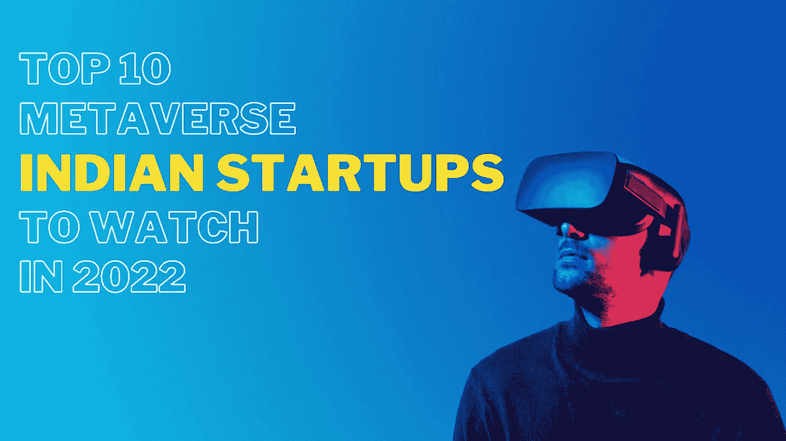

# 2022 年值得关注的 10 大元宇宙印度创业公司

> 原文：<https://medium.com/coinmonks/top-10-metaverse-indian-startups-to-watch-in-2022-2eb8e4978020?source=collection_archive---------36----------------------->

这种新发现的对元宇宙的热爱不仅仅局限于西方世界。同样，印度组织也在有效地向元宇宙投入资源。以下是在元宇宙工作的 10 家最好的印度新公司，它们将会腾飞。

## IKonz

培育了一个不断增长的长期金融稳定平台，有望通过 NFTs 将社会最伟大的象征和臭名昭著的知识产权带入元宇宙。该组织在探索创新的复杂性和掌握适应和升级的各种方法方面有一些专业知识，授权知识产权所有者、工匠和其他设计好的符号来制作、销售和采用先进的资源。该组织在 2022 年 3 月 7 日由 Village Global 和 Woodstock Fund 推动的一项安排中筹集了一项未披露的种子融资措施。Polygon 工作室也参与了这一轮。这些资产将用于提高全球范围内的创新能力，并招募顶级技术人才来制定其元宇宙，并从其不同的知识产权同伙处撤销非专利技术。

## Invact

一个生动的大学阶段的管理者计划通过素质教育来提高就业能力。该组织的基金会将虚拟世界与目前的现实结合起来，提供另一个 MBA 项目，该项目侧重于中心业务工作和职业能力，如促进、项目管理人员等，使新生和专家能够从舒适的沙发中受益于生动的社会增长机会。2022 年 2 月 7 日，该组织在 Arkam Ventures 的推动下筹集了 500 万美元的种子融资，使该组织的现金前估值达到 2800 万美元。Horn India 和 68 家不同的金融支持者也参加了这轮融资。

## 洛卡

一个元宇宙应用程序的工程师被期望授权给客户与从地球的一端到另一端的各种个人进行交互。该组织的基金会提供了一个元宇宙多人游戏应用程序，为客户提供真实的区域和体验，旨在用于社会承诺、游戏、电子商务、内容和娱乐，使客户能够获得游戏和社会承诺的真实体验。该组织于 2022 年 3 月 2 日从 Anupam Mittal 获得了 133 万印度卢比的天堂信使融资，使该组织的现金前估值达到 1530 万印度卢比。

## Atirath 游戏技术

游戏舞台的设计者计划以印度民俗为主题。该组织的基金会制定愚蠢和基于方法论的游戏，专注于手机带来具有全球吸引力的新的次大陆社会组件/主题，帮助玩家、内容制作者和游戏发行商相互交流。该组织于 2022 年 2 月 7 日从 Kalaari Capital 筹集了一笔未披露的种子融资。这些资产将用于加强该组织的项目，发展其团队，并为元宇宙做好准备。

## 墙应用程序

一个社会披露阶段的管理员计划在区块链的社交网络中提供通信。该组织的基金会提出加入跨链练习、计算机化收藏品、允许制造商和工匠进入以及 NFTs 和 DAOs 中的启示练习，使客户能够克服制造商和当地地区之间的任何问题，使他们能够在没有外来者的促销和收入削减的情况下相互交流。该组织于 2022 年 1 月 3 日从伍德斯托克基金、Arcanum Capital 和 Lancer Capital 筹集了 100 万美元的种子融资。此外，Tushar Aggarwal、Deepanshu Tripati、Ahmed Al-Balaghi、Aniket Jindal、Sachin Tomar、Prabhakar Reddy、Raghu Yarlagadda 和 Lumos labs 也参加了这一轮。这些资产将用于自然和无机开发和升级项目创新、展示和客户获取。

## 工藤钱

培养了一项区块链创新，旨在颠覆链上角色对元宇宙和迪菲的作用。该组织的创新为收购、空投和培育以太坊、polygon、BSC 和 Solana 生物系统打开了大门，使环境合作伙伴能够参与公约管理。2021 年 12 月 28 日，该组织从 Bitcoin.com、马格努斯风险投资公司和黑龙资本公司筹集了 500 万美元的 a 轮投资。Lumo Labs、Insignius Capital、R8 资本和其他金融投机者、加密网络、媒体金融支持者以及来自世界各地的分散会议也参与了这一轮。

## 一个罕见的

培养了一个面向全球食品和饮料行业的元宇宙。该组织已经组装了 web3 中庆祝食物的主要标记化层，使客户能够获得生动和游戏化的体验。该组织于 2021 年 11 月 17 日从袋鼠资本、Maven Capital 和 Tag Ventures 筹集了 200 万美元的种子补贴。另外还有 20 家不同的金融支持者参与了这轮融资。这些资产将用于项目改进、展示，以及为 NFTs 建造设施，这些设施将用于交换真正的晚餐。

## 确认账目

培育了一个基于网络的货币平台，用于 NFT 和区块链交易。该组织支持在游戏、metaverses 和 NFT 商业中心订购 NFT，是一个全球联盟，在所有 metaverses 和游戏 NFT 中指导、调整和分散 Web 3.0 计算机化资源，以这种方式为客户提供明智导航体验。2021 年 10 月 16 日，该组织从 Mahadao、Nord Finance 和 Kangaroo Capital 筹集了 153 万美元的种子补贴。Supra Oracles、Oasis Capital、Amesten Capital 和 24 家不同的金融支持者也参与了这轮融资。这些资产将用于扩展、发展和与更多金融科技组织合作，并在 2021 年 10 月摆脱隐蔽模式。

## Revirt。空间

元宇宙舞台的设计者应该在虚拟的场地和空间中工作。该组织提供可调整的空间，根据需要和口味制作和构建虚拟土地，在没有预订聚会的情况下漫步讨论，共同研究，并使用共同努力的设备工作，允许协会和网络在他们自己的虚拟生物系统中工作。该组织于 2021 年 8 月 15 日从 Multiple Ventures 和 Better Capital(印度)筹集了一笔未披露的冒险融资。

## Doss 游戏

位于印度卡纳塔克邦的元宇宙创作应用程序的设计师。该组织的 web 3.0 便携式元宇宙应用程序为客户提供办公室，以铸造他们自己的社交令牌，构建游戏并举办定制的“从游戏到采购”多人游戏比赛，以及更多简单易用的无代码设备，帮助制造商吸引他们的实际粉丝/网络，并以独一无二的方式调整他们的能力/时间。2021 年 7 月 6 日，在 Titan Capital 的推动下，该组织筹集了 2500 万印度卢比的种子前补贴。Maninder Gulati、Varun Alagh、Abhinav Sinha 和其他未披露的金融支持者也参与了这一轮。该资产将用于加强其项目、计划和区块链能力。

## 德希登

无代码阶段的工程师，打算访问和发送生动的 NFT(不可伪造的令牌)。该组织的基金会允许客户发送完全可视化材料的精明的 NFT 遭遇，没有代码，帮助制造商有效地到达 NFT，并进一步为他们提供一致的遭遇，以打开 NFT 的公用事业。该组织在 2021 年从 Musha Ventures 和 Alvin Tse 那里筹集了一项未披露的种子补贴措施。