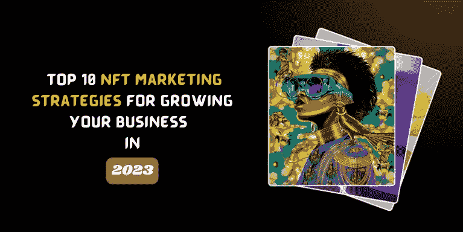

# 2023 年发展业务的十大 NFT 营销策略

> 原文：<https://medium.com/coinmonks/top-10-nft-marketing-strategies-for-growing-your-business-in-2023-eb405b845d0c?source=collection_archive---------5----------------------->

**NFT Marketing Strategies**

FT 营销是一种无与伦比的成功方式。这已经成为许多成功项目的口头禅。它创造了许多成功的故事。它可以把你带到顶峰，也可以把你带下来。在任何项目中，无论是数字领域还是非数字领域，营销都是炒作的对象。因此，利用那些为你的项目成功陈述等式的领先公司。为了及时到达目的地，以下是 2023 年的最佳营销策略。

> [***【NFT 营销服务:打造最符合您受众的战略！***](https://bit.ly/3Vca1JY)

## 【2023 年十大品牌和 NFT 销售战略

## **1。构建 NFT 未来发展的路线图**

这应该是你的第一个行动。“实现特定目标的计划或策略”是路线图的定义。该路线图概述了您的 NFT 业务的未来目标，并显示了您对透明度的贡献。你可以从一个主要 NFT 品牌的路线图中获得洞察力。

## **2。组织关于你的 NFTs 的 AMA 会议。**

定期的“问我任何问题”( AMA)会议是一个很好的方法，可以通过使用你的 NFT 项目的论点来锁定潜在用户，并传播你的项目。允许 AMA 组织者提出最相关和最紧急的问题，你将提供详细的答复。

## **3。为 NFT 上市使用正确的市场**

在适当的市场列出你的 NFT 是第一个也是最简单的销售方法之一。如果你想让人们购买你的 NFT，把它列在合适的市场上。**例如，塔可钟**就有一个众所周知的 NFT 项目。基于他们的品牌，他们创作了几件 NFT 艺术品。不到 30 分钟，它们就卖光了。

## **4。电子邮件营销**

作为艺术家或内容创作者，您可以使用电子邮件营销策略向客户或社区成员发送有洞察力的电子邮件。MailChimp 是许多营销公司用来向目标受众发送自动电子邮件的平台。感兴趣的团体会收到针对他们的偏好和选择而个性化的消息。通过选择原创设计、模板和内容与目标受众分享，你可以建立一个相当大的用户群来关注你的品牌活动。

## **5。把你的钱花在网络论坛推广上**

参加不同加密论坛上的 NFT 讨论，并利用它们在 Reddit、Bitcointalk、Telegram、CryptoTalk、Discord 和 Twitter 等网站上推广您的内容。有了这个 NFT 项目营销计划，你就获得了免费的口碑推广。这也可能导致投资者对你的作品感兴趣，并开始购买你的产品或内容。

## **6。选择付费广告的加密网络**

点击成本和千次展示成本是 NFT 广告平台中 NFT 付费推广最有效的两种方法。

尽管谷歌限制其广告服务用于基于加密的项目，但接触特定的加密货币目标受众是书中最古老的内容之一。对于你的 NFT 项目，在著名的硬币跟踪网站上有针对性的营销活动通常会产生显著和适度的投资回报率以及大量的印象。

## **7。新闻稿**

通过定期在各种媒体和网站上发布新闻稿，数字艺术家和平面设计师可以增加他们的可信度。他们可以利用这个论坛来宣传购买他们的非功能性食物的好处和优势。这是书中最古老的营销技巧之一，这种方法有一群忠实的追随者是有原因的。

## **8。搜索引擎优化**

你可以推广你的 NFT 艺术，并在 NFT 营销搜索引擎优化服务的帮助下，在谷歌和必应等搜索引擎中获得较高的排名。他们将从目标受众那里获得免费流量。页面上和页面外的优化都可以通过雇佣 NFT 营销公司来实现。

## **9。社交媒体影响者营销**

目前市场上有 100 多万个 NFT，并且每天都在增加。关于 NFT 的新闻和新闻稿经常出现在 Cointelegraph、脸书、Discord、Reddit、Instagram、LinkedIn 和 Twitter 等网站上。

如果你想在网上获得更多的关注，你可以付钱给 NFT 营销专家来发布关于你的品牌 NFTs 的新闻。此外，他们开发独特的网页和帐户，只为你增加销售。有影响力的人说的话很有分量。许多消费者根据 NFT 影响者对产品的想法做出购买选择。大多数社交媒体用户认为影响者是值得信赖的，当一个影响者推荐一个产品时，观众对它的能力充满信心。有多少人购买你的 NFT 将取决于谁是你在 NFT 的影响者。

## **10。赠品/空投/NFT 奖金**

NFT 收藏品和你作品的实物样本都可以分发。以下是艺人办比赛的常用方式:任何想参赛的人都必须有条件地在 Twitter 或 Instagram 上关注该艺人，在评论中标记好友，在 Instagram Stories 上分享帖子，转发等。它增加了人们对你的 NFT 收藏的兴趣，使你能够获得新的追随者，并取悦现有的追随者。

## **包装完毕！**

[**【NFT 营销服务】**](https://bit.ly/3Vca1JY) 可以成为你在加密领域创业的绝佳方式。它帮助你在竞争中脱颖而出。它决定了项目或你的企业的成功。即将到来的未来是一个生存的好地方。你可以使用顶级的 NFT 营销策略来巩固你在这个领域的地位。，做好你的基本工作，并以此为基础做生意。

> 交易新手？尝试[加密交易机器人](/coinmonks/crypto-trading-bot-c2ffce8acb2a)或[复制交易](/coinmonks/top-10-crypto-copy-trading-platforms-for-beginners-d0c37c7d698c)