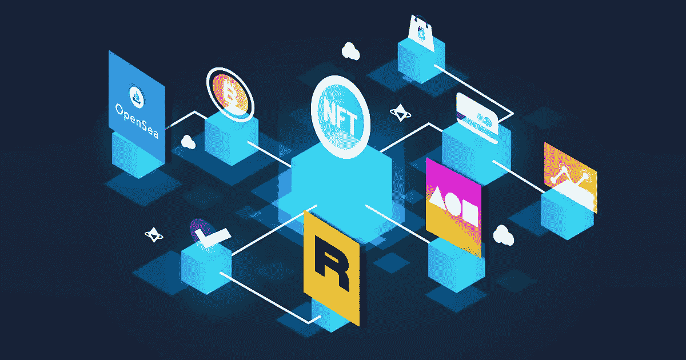
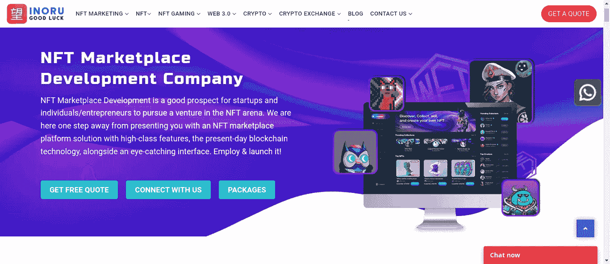
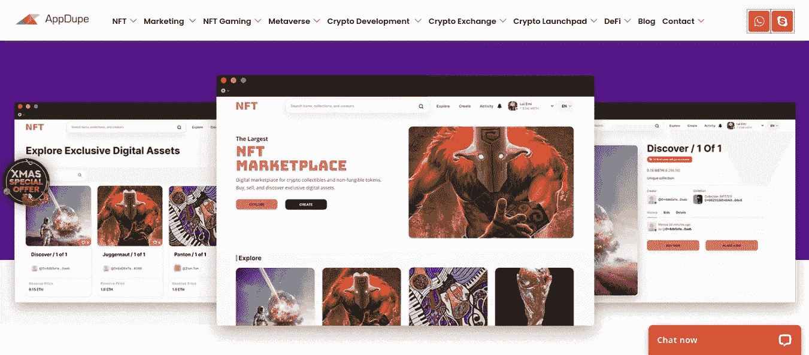
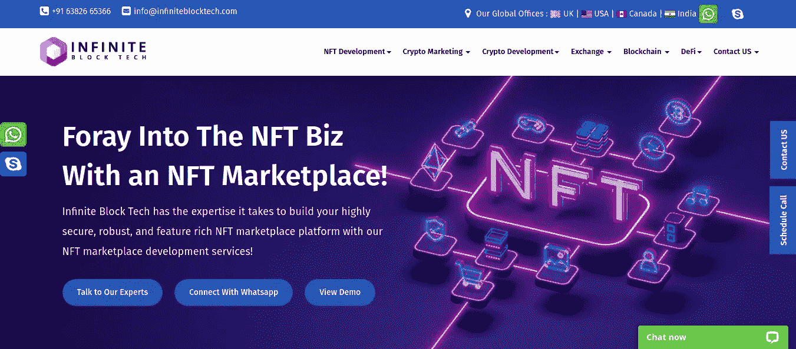
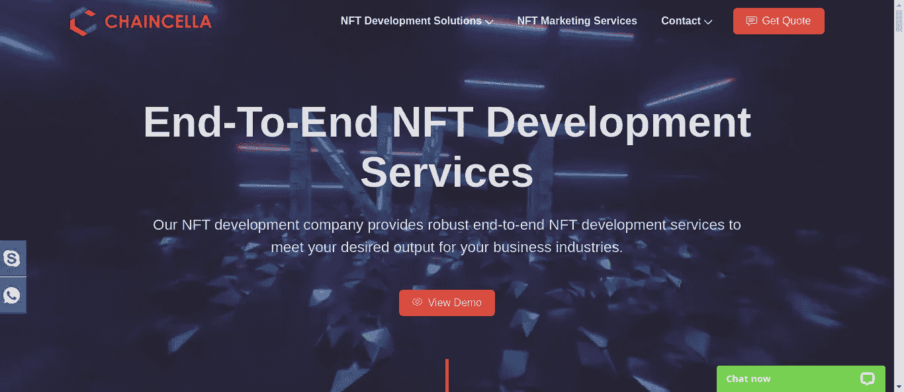
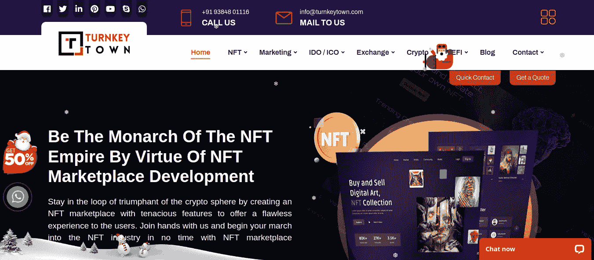
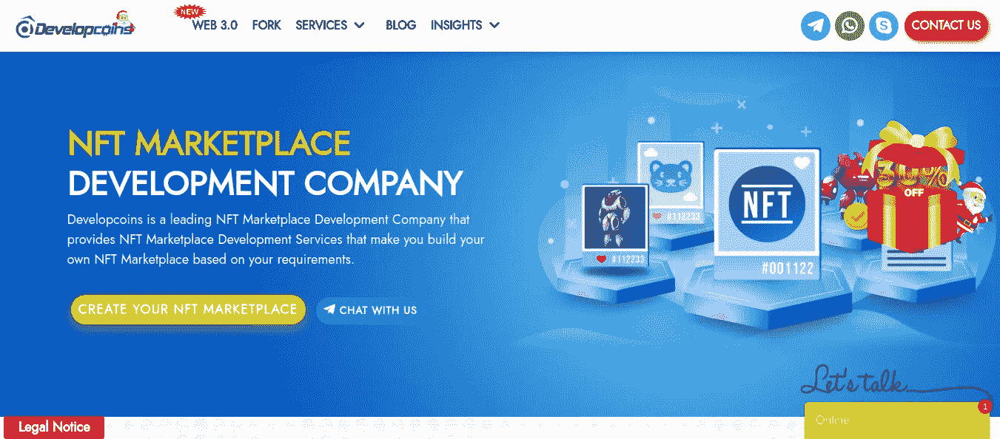
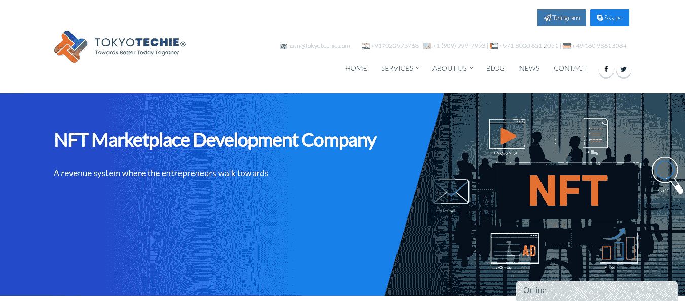
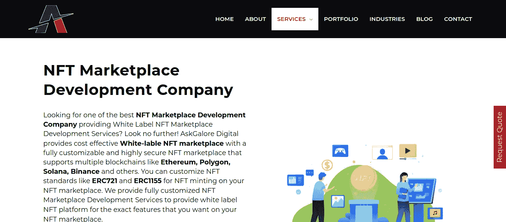
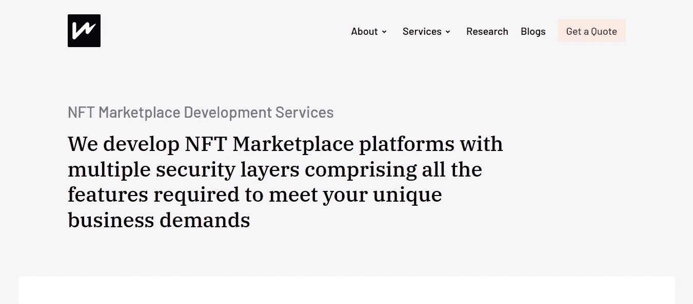

# 美国十大 NFT 市场发展公司[更新-2023]

> 原文：<https://medium.com/coinmonks/top-10-nft-marketplace-development-companies-in-usa-updated-2023-73e38d59d4b8?source=collection_archive---------27----------------------->

密码空间已经被证明在每一个边缘与多种商业机会的惊人成果。也就是说，加密领域可以将数字资产伪装成收入模式。

不可替代的令牌是我们所说的风险，它为重要的数字资产获得商业模式和可信的收入来源铺平了道路。让企业家宣称非功能性交易是产生 NFT 市场的巨大商业方面，是更具催化作用的商业选择的一个理想选择。因此，了解美国顶级的 NFT 市场开发公司，这些公司在数字时代一直闪耀着最大的影响力。

## **NFT 市场-概述**

各种数字资产，如艺术、音乐、迷因、照片、游戏设备等，都被铸造成非功能性数字资产，并进行交易出售。他们从哪里得到 NFT 的尺寸？在区块链技术上开发的一个综合交易空间叫做 NFT 市场，在这里非功能性交易被创造出来，并根据需要进行交易。这个综合空间对买家和卖家开放，这意味着，作为创作者或艺术家，个人可以在市场上发布他们的作品。

来自不同领域的企业家和投资者可以在市场上注册，并获得他们想要的非功能性技术。由于 NFT 市场是基于区块链技术开发的，它们按照智能合约运行，智能合约是预先设计的协议，使平台工作流可行且有组织。

NFT 市场具有某些实用程序，这些实用程序负责令人印象深刻的用户体验，从而增强更好的平台功能。

具体来说，加密钱包是市场中任何交易的重要元素。这些位于区块链的交易场所为用户展示了加密的安全界面，并将每条数据存储在块中，使其高度安全。

有了这样一个封闭的空间，NFT 的销售以两种方式进行。拍卖或固定出售，这取决于代币所有者的决定，他们可以以任何一种方式出售代币。

## **NFT 市场发展——序**

结构提升的综合过程就是 NFT 市场的发展。在加密领域表现出临界成功率的著名 NFT 市场是 OpenSea 和 Rarible。虽然名单上还有很多，但这两家公司的成功率很高，证明了每笔象征性销售的可信度。

谈论这两个问题的原因是，当一个企业家想要开发一个 NFT 市场时，他们会提到一个指数交易空间。因此，我们开放，他们可以开发一个 NFT 市场类似于任何著名的 NFT 市场。例如，如果想开发像 OpenSea 这样的 NFT 市场，可以持有一个。

NFT 市场开发公司是开发区块链交易平台的可靠来源。他们使用白标 NFT 市场解决方案来开发市场。这种现成的解决方案更适合用来消除从头开始开发时的开发成本和时间。此外，开发者 100%地定制平台，使其更有利于更好的业务。

## **美国最佳 NFT 市场发展公司**

正如我们提到的 NFT 市场开发和支持开发著名企业的组织，我们借此机会推荐市场中的顶级 NFT 市场开发公司。我们提供的列表在开发的每个阶段都被证明是杰出的，甚至在 NFT 市场推出后也保持了可信度。

## **1。** [**INORU**](https://www.inoru.com/nft-marketplace-development)

虽然在过去的十年中，INORU 的神童一直在密码领域默默无闻，但他在重要的发展历史中表现出了明显的统治地位。这家开发公司拥有丰富的开发头脑和丰富的区块链开发经验，提供顶级空间。

他们不仅因其市场开发服务而闻名，而且他们可以通过广泛的 NFT 营销服务做更多的事情，使代币进入全球范围。INORU 以平台定制著称；在了解业务需求后，他们提供 100%的广泛定制，使平台比原始的 NFT 市场更独特。

因此，我们提出了 INORU 的专业知识的原因

*   熟练的区块链开发者
*   开发前的广泛分析
*   端到端定制
*   门阶支持(虚拟)
*   上市后营销服务

## **2。** [**AppDupe**](https://www.appdupe.com/nft-marketplace-development)

AppDupe 是一家理想的 NFT 市场开发公司，通过提供卓越的区块链开发服务而彰显其卓越地位。AppDupe 的 NFT 市场开发让企业家和重要的商业爱好者肃然起敬，因为这家公司提供了商业需求的各个方面。

## **3。** [**无限闭塞技术**](https://www.infiniteblocktech.com/nft-marketplace-development-company)

当谈到使不可想象的区块链方面成为现实时，无限块技术通过重视每个区块链节点证明了这种合法性。这样一家令人印象深刻的公司为 NFT 市场的发展提供了服务。该公司的交易单元开发已被证明是最受欢迎的商业场所。

## **4。**

****

**作为 NFT 市场开发公司的先驱之一，Chaincella 提供了重要的 NFT 开发服务，特别是他们公司的 NFT 市场开发具有重要的特点。凭借 NFTs 的典型知识，他们开发了具有迷人用户界面的平台。**

## ****5。**[**TurnkeyTown**](https://www.turnkeytown.com/)**

****

**在一个空间里如此突出；这就是 TurnkeyTown 的全部。这家公司通过提供主要的开发服务，在区块链的开发中起着关键作用。凭借在区块链和 NFT 的丰富经验，他们开发了许多 NFT 服务，并在 NFT 市场发展中大放异彩。该公司开发的交易单元在 NFT 的销售业绩喜人。**

## ****6。** [**开发硬币**](https://www.developcoins.com/)**

****

**顾名思义，这家公司是区块链发展服务领域的一个突破。Developcoins 通过扩大其与 NFT 市场发展的服务增加了其可信度，并通过提出具有多种收入来源的重要商业机会而在这方面表现出色。**

## ****7。** [**东京技术人员**](https://tokyotechie.com/)**

****

**通过展示区块链关键技术的清晰开发服务，Tokyo Techie 将自己定位为 NFT 市场上最可靠、最顶尖的开发公司之一。从集中的 NFT 市场开发到广泛的营销服务，该公司排除了每一个细微差别背后的意识形态，使骑手业务达到了典范的距离。**

## **8。[**ask galore**](https://www.askgalore.com/)**

****

**Askgalore 为区块链的改进提供了令人难以置信的帮助。也就是说，该公司的理想 NFT 市场开发已被证明是最指数化的服务，并为不同的商业爱好者拓宽了多种创业方式。广泛的区块链知识是他们的积极性；以此，他们建立了价值观和可信的 NFT 市场。**

## ****9。** [**小雨**](https://lightrains.com/)**

****

**根据当前的市场价值，NFT 是最受欢迎的垂直业务，构建交易基础设施可以获得重要的商业机会。也就是说，Lightrains 的 NFT 市场开发通过根据业务要求定制场地，为业务提供了无可挑剔的价值观。**

## **10。 [**Pixelplex**](https://pixelplex.io/)**

****

**发展区块链公司时，Pixelplex 希望将业务像素化。NFT 市场的发展从这个组织建立了理由，以采用他们的营养与惊人的交易场所的发展。**

## ****结论****

**当我们谈到结束语时，很明显，NFT 市场的发展对创收方案有更大的潜在影响。提出一个具有可行性和钱包支持等重要功能的加密交易空间，可以吸引更多社区前往该场所，并加速创收。正如我们所提到的，顶尖的 NFT 市场开发公司与兼容的组织建立联系，并为帝国 NFT 市场的发展奠定基础。**

> ***交易新手？试试* [*密码交易机器人*](/coinmonks/crypto-trading-bot-c2ffce8acb2a) *或* [*复制交易*](/coinmonks/top-10-crypto-copy-trading-platforms-for-beginners-d0c37c7d698c)**
> 
> ***分散加密持股，了解* [*币安替代品*](https://coincodecap.com/binance-alternatives)**
> 
> ***加入 Coinmonks* [*电报频道*](https://t.me/coincodecap) *和* [*Youtube 频道*](https://www.youtube.com/c/coinmonks/videos) *获取每日* [*加密新闻*](http://coincodecap.com/)**

# **另外，阅读**

*   **[复制交易](/coinmonks/top-10-crypto-copy-trading-platforms-for-beginners-d0c37c7d698c) | [加密税务软件](/coinmonks/crypto-tax-software-ed4b4810e338)**
*   **[网格交易](https://coincodecap.com/grid-trading) | [加密硬件钱包](/coinmonks/the-best-cryptocurrency-hardware-wallets-of-2020-e28b1c124069)**
*   **[密码电报信号](/coinmonks/top-3-telegram-channels-for-crypto-traders-in-2021-8385f4411ff4) | [密码交易机器人](/coinmonks/crypto-trading-bot-c2ffce8acb2a)**
*   **[最佳加密交易所](/coinmonks/crypto-exchange-dd2f9d6f3769) | [印度最佳加密交易所](/coinmonks/bitcoin-exchange-in-india-7f1fe79715c9)**
*   **[面向开发人员的最佳加密 API](/coinmonks/best-crypto-apis-for-developers-5efe3a597a9f)**
*   **最佳[密码借贷平台](/coinmonks/top-5-crypto-lending-platforms-in-2020-that-you-need-to-know-a1b675cec3fa)**
*   **[免费加密信号](/coinmonks/free-crypto-signals-48b25e61a8da) | [加密交易机器人](/coinmonks/crypto-trading-bot-c2ffce8acb2a)**
*   **杠杆代币的终极指南**