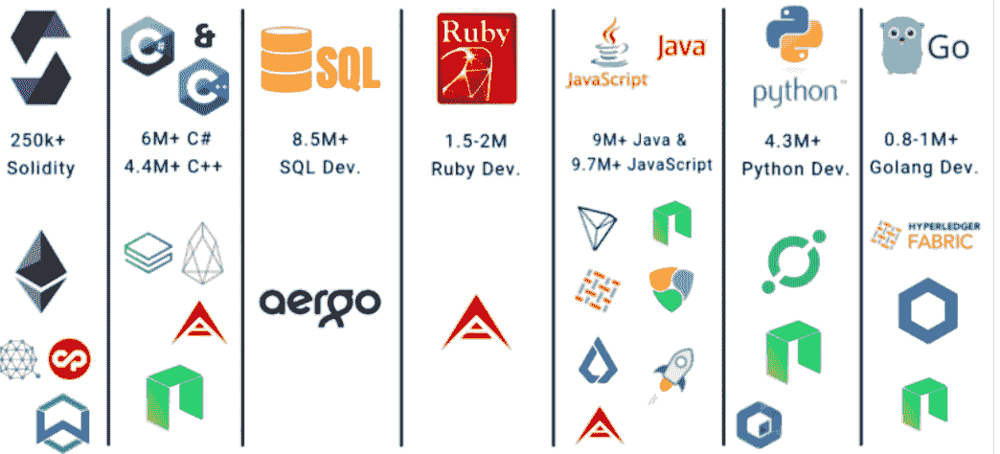

# 区块链开发可以学习的 10 大编程语言。

> 原文：<https://medium.com/coinmonks/top-10-programming-languages-you-can-learn-for-blockchain-development-aa06dea5747a?source=collection_archive---------7----------------------->

> 自从使用区块链实现第一种数字货币以来，对能够跨不同用例及领域(如银行、金融、物流等)创建应用程序和解决方案的开发人员的需求不断增长。
> 
> 区块链开发可以学习的一些编程语言包括 Solidity、C++、Java、Python、Javascript 等。
> 
> 先学哪个不重要，但是一定要了解这个行业，了解你感兴趣的项目，才能指导你做出选择。

# 介绍

[freecodecamp.org](https://cdn-media-1.freecodecamp.org/images/0*NAV5EQqx0pxMr1tb)

作为一名开发人员，学习一门区块链应用程序的编程语言不仅仅是给你增添了新的光彩。这是从 Web 2 升级到 Web 3 开发者的标志。区块链是推动新革命(统称为 Web 3.0)的技术，在这场革命中，你可以挑战限制，重现现实。自从使用区块链实现第一种数字货币比特币以及随后的广泛接受以来，对能够跨不同用例和领域(如银行、金融、物流等)创建应用程序和解决方案的开发人员的需求不断增长。

如果你正开始成为一名区块链开发人员，或者你想从 Web 2.0 开发转型，这里有一个十大编程语言的精选列表，可以给你一个良好的开端:

## [坚固度](https://soliditylang.org/)

以太坊区块链及其产品 Defi 和 Dapps 的爆炸式增长促进了 Solidity 作为其母语的流行。Solidity 是一种编程语言，带有静态类型的花括号，用于创建在以太坊虚拟机(EVM)上运行的智能合约。Christian Reitwiessner 和 Alex Beregszaszi 等人是 Solidity 开发背后的聪明大脑，Solidity 受 Java、C++和 PowerShell 的影响，由 Gavin Wood 在 2014 年提出。可靠性与 ECMAScript 语法(web 应用程序的核心语言之一)的相似性使得它相对容易掌握。因此，如果你想专攻区块链开发，Solidity 是一门很好的语言。Solidity 项目的例子包括以太坊、雪崩、创、币安智能链等。

## [C++](https://cplusplus.com/doc/tutorial/operators/)

C++是第一个实现区块链比特币的语言。C++面向对象的特性允许它有条不紊地绑定数据，也使它适合区块链开发。学习 C++为您提供了一种高级编程语言技能，经常用于游戏开发、创建钱包、矿工自动化和用户交互等。使用 C++的区块链项目的例子有 Bitcoin、Monero、Rippled、Wallet-Core 等等。

## [Java](https://www.java.com/)

Java 也用于构建一些最著名的区块链编程，如以太坊、Hyperledger Fabric、IOTA、NEO 等。Java 的可移植性是一个在区块链中特别有用的特性。由于其 WORA(“一次编写，随处运行”)功能，Java 程序可以跨平台移植。这些程序不依赖于特定于系统的体系结构，因为它们运行在通用 JVM (Java 虚拟机)上。这种可移植性，加上 Java 的其他众所周知的特性，使其非常适合区块链。基于 Java 的区块链项目包括 BitcoinJ、FundRequest、Corda 和 Pantheon。如果你只知道 Java，你可以试试 [Corda](https://www.corda.net/) ，它展示了如何开始你的第一个区块链应用程序。

## [巨蟒](https://www.python.org/)

Python 非常适合构建区块链，因为它比大多数编程语言更容易学习和使用。此外，Python 包括几个第三方包，可以帮助用户通过 API 或 web 应用程序访问您的区块链。如果你是一个有 Python 经验的新开发者，它可能是你最好的区块链语言。Python 的一个问题是，它是一种解释型语言，这导致了区块链中复杂加密操作的问题。另一方面，Python 是一种面向对象的语言，有助于管理许多与性能相关的开销。此外，Python 允许作为开发人员的你快速原型化你的想法，而不需要冗长的编码。Python 还有一个相当大的开源社区，非常适合区块链。一些基于 python 的区块链项目有 Chia 区块链、Doge-chia、Sonar-Qube 等。

## [JavaScript](https://www.javascript.com/)

JavaScript 一直是占主导地位的 web 语言，由于 NodeJS 这种 JavaScript 运行时环境，它在区块链开发人员中也很受欢迎。因为 JavaScript 已经安装在大多数系统上，他们可以创建有能力和创造性的区块链应用程序。与其他编程语言相比，JavaScript 有一个显著的优势，因为每个 web 系统都使用 JavaScript。因此，开发人员在使用 JavaScript 时不需要担心集成，而是可以专注于区块链应用逻辑。Lisk side chain Development Kit(SDK)就是一个例子，因为它允许开发人员创建、发布和分发基于 JavaScript 的区块链应用程序，如 eattheblock、embark-framework 等。

## [戈朗](https://go.dev/)

Golang，也称为 Go，是一种开发快速高效的区块链系统的优秀编程语言。它用于创建 hyper-ledger fabric，这是开发区块链应用的基础。因为 Go 是一种静态类型和编译的编程语言，非常适合区块链开发。其他增强性能的特性包括泛型、类、继承、构造函数、注释、异常等。Go 也是一种简单易学的语言。Limechain 是区块链项目中使用 Go 的一个例子。

## [红宝石](https://www.bing.com/ck/a?!&&p=efee2554f1ab7386JmltdHM9MTY2NDY2ODgwMCZpZ3VpZD0zMGFkMjc1My0wODJhLTY2MjctMGIwYy0zNmQxMDk1NTY3MjEmaW5zaWQ9NTIzMg&ptn=3&hsh=3&fclid=30ad2753-082a-6627-0b0c-36d109556721&psq=ruby+based+crypto+projects&u=a1aHR0cHM6Ly9naXRodWIuY29tL1J1YnlDcnlwdG8&ntb=1)

Ruby 是一种多范例语言，具有出色的内存分配能力。这种语言的主要焦点是简单和高效，这使得它对开发人员友好且简单明了。它还支持跨平台开发。

通过第三方 API 和插件，Ruby 允许你以开发者的身份框定区块链编程。它支持多范式，这意味着开发人员可以在多个平台上创建区块链编程。Peatio 是一个开源资产交易所，是基于 Ruby 的区块链项目的一个例子。

## C#

[C#](https://learn.microsoft.com/en-us/dotnet/csharp/) 是微软最流行的开源编程语言之一。根据 Visual Studio 杂志，全世界有 500 万到 800 万开发人员使用 C#。Stratis、NEO 和 IOTA 是使用 C#的流行区块链编程的例子。没有开发人员的帮助，C#采用简单的面向对象和可扩展的标记语言或方法。

## [简约](https://github.com/ElementsProject/simplicity)

Simplicity 是一种为智能合约设计的高级区块链编程语言。它是创建智能契约的首选编程语言之一，适合专业和开源开发人员。简单性还与降低比特币脚本的复杂性和低级理解有关。Simplicity 是一种基于组合子的类型化函数语言，不支持循环或递归，旨在用于加密货币和区块链应用。它旨在改进现有的加密货币语言，如比特币脚本和以太坊的 EVM，同时避免它们面临的一些问题。区块链中简单性的使用包括改进现有的加密货币语言，如比特币脚本和以太坊的 EVM。

## [罗朗](https://rholang.github.io/tutorials/)

Rholang 也是一种创建智能契约的极好的编程语言。这种语言采用函数式而不是面向对象的方法，这有利于解决许多区块链问题。Rholang 应用程序将整个程序作为一系列函数进行评估和求解。这与语言形成了鲜明的对比，语言使用变量来存储数据，并随时间改变变量的值。因此，这一类别中最受欢迎的区块链开发语言 Rholang 具有函数式编程范式，而不是面向对象的编程范式。Rchain 是基于 Rholang 的区块链项目的一个例子。

# 结论

要与任何区块链平台交互，你需要一种编程语言。以太坊用 Solidity，EOS 用 C，RChain 用 Rholang。由于早期语言如 Java、Solidity 和 C 出现的一些问题，新的程序是专门为区块链设计的。它不应该让你困惑于从哪里开始或者学什么。先学哪个不重要；但是，你必须了解你感兴趣的行业和项目。这可能会引导你做出选择。

> 交易新手？试试[密码交易机器人](/coinmonks/crypto-trading-bot-c2ffce8acb2a)或者[复制交易](/coinmonks/top-10-crypto-copy-trading-platforms-for-beginners-d0c37c7d698c)