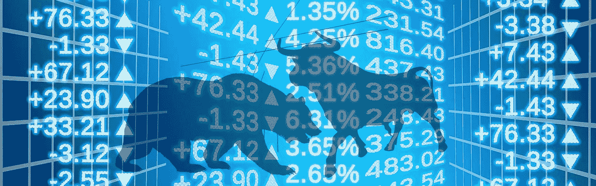

# 我在 2022 年 11 月买入的前 10 只股票

> 原文：<https://medium.com/coinmonks/top-10-stocks-that-i-bought-in-november-2022-ead5b759b313?source=collection_archive---------19----------------------->

Source photo [Stock Exchange World Economy Bull — Free image on Pixabay](https://pixabay.com/illustrations/stock-exchange-world-economy-bull-913982/)

# 苹果公司(AAPL)

不出任何人所料，苹果公司(纳斯达克股票代码:AAPL)又创造了一个第一。季度收入的增加让投资者对未来感到乐观。

由于经济疲软和消费者对经济进一步萎缩的担忧，苹果的竞争对手销量下降，苹果继续取得成功。全球最有价值公司的收入…