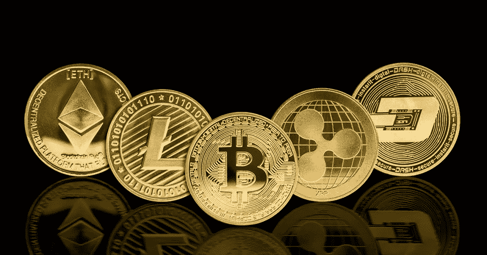

# 2022 年用加密货币赚钱的 10 大优势方式

> 原文：<https://medium.com/coinmonks/top-10-superior-ways-to-make-money-with-cryptocurrency-in-2022-b8bcad51e63a?source=collection_archive---------14----------------------->

用 crypto 带来现金的最简单的方法是通过 BlockFi。存储 [**crypto**](https://bit.ly/CryptoQuantumOfficial) 并从今天开始获取自动收入！

假设你问一个普通人如何用加密形式的货币带来现金，他们很可能会同意“就像你对待股票一样”。你买下它们，并相信价格会上涨，这样你就可以卖掉它们获利。

许多个人对用数字货币带来现金的各种机会一无所知。假设这听起来像你，继续阅读。Benzinga 在这里谨慎地记录任何数字，并随时总结每一扇有价值的敞开的门。

请记住，所有的贡献和交换都包含一些赌博，有些资源类别比其他资源类别更危险。 [**Crypto**](https://bit.ly/CryptoQuantumOfficial) 是范围内比较危险的一方。更重要的是，你还有与贡献或交换方式相关的机会。当日交易或倒票很可能是最不安全的交易方式。不管怎样，从 MoneyLion 到 Celsius 和 past 都有一些阶段可以帮助你到达密码陈列柜并带来现金。你基本上需要总结你需要如何花你的现金。

**传统买入并持有投资**

购买并持有，只要做得准确，长期贡献是有益的。然而，你真的想完成你的工作；你不能简单地购买任何数字货币，并希望带来现金。最少的赌博头寸是将资源投入比特币或以太币，并在很长一段时间内将美元成本正常化。
看一下上面的表格，你会发现在过去的 5 到 6 年里，持有比特币或以太坊确实是富有成效的。向前推进，没有认证，但是利用一元成本平均程序应该给你一个适当的头寸成本标准。

美元成本平均法是一种投机程序，试图减少市场不可预测性对大宗购买的影响。买入不是在同一时间进入一个位置，而是在一段很长的时间内分散进行。时间跨度可以是一周接一周，一个月接一个月，或者任何适合你的技术的时间。最基本的部分是在每一个区间买入相似的美元。

使用这种技术，当成本较高时，你将购买更适度的任何投入资源的硬币或代币。每当成本较低时，你就会购买更大的硬币或代币。这套系统一般会低于正常成本。Gemini 和 eToro 是一些不错的地方，可以将所有的滚动美元成本平均化为数字货币。

看一下下面的表格，你会发现，与购买等量的比特币相比，购买等量的美元可以让你获得一个更好的头寸。

**兑换加密货币**

**交易风格#1:** 日内交易:日内交易是一种你猜测成本会上升或下降的交易风格。根据你对成本变动的接受程度，你可以买入(做多)或卖出(做空)。一天交换的等待时间可能只有几分钟到几个小时。努力期待这种瞬间价值的发展是困难的，这就是为什么日内交易是最不安全的交易方式之一。
**交易风格#2:** 摇摆交易:当进行摇摆交易时，你会期望与日交易相当的成本发展。主要区别是你将管理更长的时间。持仓时间会相当长，甚至几周。
**交易风格#3:** 自动化机器人交易:一个机器人化的加密机器人是一个产品程序，它会根据你预先设定的交易条件进入和离开交易所。交换机器人比人工交换占优势，它们可以在每天的每一分钟进行交换，并且它们消除了人类的倾向，反应更快。

**标记加密货币**

货币加密形式的标记基本上与将法定货币存入投资账户相同。做标记的最大区别是你可以理解更好的回报。假设你运气好，通常银行会付给你 1%左右的保费。一些银行只支付 0.01%，包括美国最大的银行摩根大通。标记收益率会随着你所下注的硬币或代币而波动，但达到 15%至 20%或更高并不奇怪。

许多交易和阶段提供标记，有集中和分散的选择。你可能真的从一些设备钱包里拿走了密码。危险性最小的标记选择是桩钉。当你持有稳定的货币时，你就放弃了绝大多数与数字货币价值波动相关的赌博。此外，如果可能，标记时应远离锁定期。

**高产养殖**

产量的培育就像用风做标记。收益分支由许多流动性池组成，每个池需要将几个数字货币标记到一个池中。你只需选择一个你需要培养的池，并购买每个预期硬币或代币的同等措施。购买硬币或代币后，你真的想把它们储存在一起。这种相互作用发生在阶段的流动性部分。您实际输入想要存储的适当密码，并进行快照以增加流动性。

当硬币或代币组合在一起时，您打开您需要加入的家园，并下注您的流动性对。您的奖金将以一种匹配的数字货币形式支付。看一看 Raydium yield ranch 的屏幕截图，您可以看到预期的货币对是 USDC 稳定币和弗拉克币(FRKT)。同样，您可以看到奖金是用 FRKT 代币支付的。

标记和产量培养的另一个对比是你得到的产量。你可以看到这个牧场每年的收益超过 393%。通常新的牧场会有大量的收益。随着 TVL(完全价值锁定)的建立，收益率将下降。

与标记一样，您真的想观察 LP 对的成本。最好是你在培养的时候需要一个稳定的市场。换句话说，你损失的现金可能会超过你从任何一种有标记的数字货币形式的价值下跌中获得的报酬。

**加密贷款平台**

你可以借出你的加密形式的钱，并利用集中和分散的贷款阶段获得收入。在任何情况下，了解他们工作方式的区别。

将贷款阶段整合在一起，更像是一家传统银行。你在他们的基础上储存密码，他们会付给你平衡的利息。在保存你的**密码之前，它肯定应该验证他们是否支付建筑利息。建筑利息是在第一个点上你被支付利息和收集的利息。有些贷款阶段只是补偿第一笔贷款的利息。这两者的区别会影响你的绝对回报。你应该同样检查以确保他们支付加密的利息，以及你的加密是否在特定时期内是安全的。BlockFi 和 Celsius 是两个重要的统一贷款阶段。**

**分散融资贷款在几个方面与集中贷款形成对比。首先，没有法人代表；信用是在一个分布式的前提下处理的，优秀的协议取代了中介。此外，借款人应存储密码作为担保；信用还清了，就还回来。Aave、Maker 和复合金融通常是顶级的违约贷款阶段。**

****数字货币挖掘****

**用 crypto 赚钱的另一种方法是挖掘它。然而，这种选择确实需要直接的资本支出。你需要购买一台挖掘机或自己组装。不管怎样，对所需的装备会有很大的兴趣。由于挖掘机会产生大量热量，你同样会增加办公室成本，所以你不能简单地把它们放在房间里，不进行某种冷却就打开它们。**

**如果你能直接投入资金，采矿可以依赖于经济形势而富有成效。whattomine.com 是一个很好的地方，人们可以从中发现什么可以开采，有多大的好处。你需要哪种挖掘机取决于你选择开采什么。**

**要挖掘比特币，你真的要一个像蚂蚁矿工 S19 Pro 这样的 ASIC 挖掘机。尽管如此，假设你要挖掘各种加密形式的钱，你需要一个 GPU 挖掘机。**

****加密空投****

**数字货币空投是加密企业向当地传播免费硬币的一种方式。加密项目使用空投来增加可感知性，增加硬币供应和活跃交流。要对空投感兴趣，通常需要你在钱包里放一枚特定的硬币或代币。一些企业要求在空投前将硬币或代币放在钱包里一段时间。假设你有资格，免费的密码将被存入你的钱包，或者你可能需要保证它。CoinMarketCap 有一个部分会减少即将到来的空投。**

****将资源投入 NFT 或自己造币厂。****

**NFT 贡献可能不会引起每个人的兴趣，除了它可能是获取密码的一个很好的方法。购买和收集非功能性食物会形成习惯。当你第一次购买时，你可能会寻找更多的来购买。**

**在某种程度上来说，加盖你自己的印章，大多数 NFT 阶段使铸造你自己的 NFT 变得简单，所以几乎任何人都可以完成它。一些更著名的 NFT 舞台包括 OpenSea(区块链以太坊)、Solanart(区块链索拉纳)和 NFTrade(区块链雪崩)。**

**用加密货币赚钱的利弊**

**在分析了几种你可以用 crypto 赚钱的方法之后，这里有一些优点和缺点。**

**专家:**

**增加额外的收入来源一直是值得感激的事情。这项创新是未来的趋势。你对它了解得越多越好。
有一部分丰裕从菲亚特脱离出来真是太好了。
缺点:**

**这可能会混淆充电准备。你冒着失去投机的风险。
货币的加密形式是不可预测的。**

**用加密货币赚钱还来得及吗？**

**一点也不。在这个资源类中，它仍然是现成的。毫无疑问，密码领域将会有我们目前无法想象的进步。这些新的轴承将很有可能提供更多的用加密形式的货币带来现金的方式。**

**[**发现用加密货币赚钱和被动收入的最有效方法**](https://bit.ly/CryptoQuantumOfficial)**

**此信息不打算作为投资建议。因为加密货币是一个如此不稳定的市场，你应该进行自己的研究，只投资你能承受的损失。**

> **交易新手？尝试[加密交易机器人](/coinmonks/crypto-trading-bot-c2ffce8acb2a)或[复制交易](/coinmonks/top-10-crypto-copy-trading-platforms-for-beginners-d0c37c7d698c)**