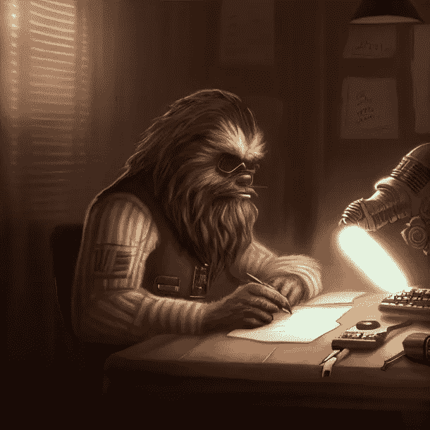
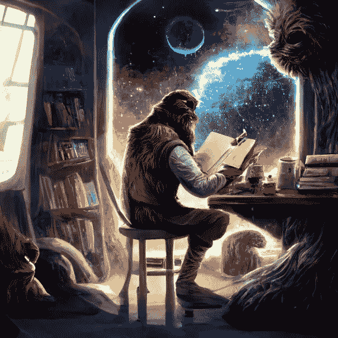
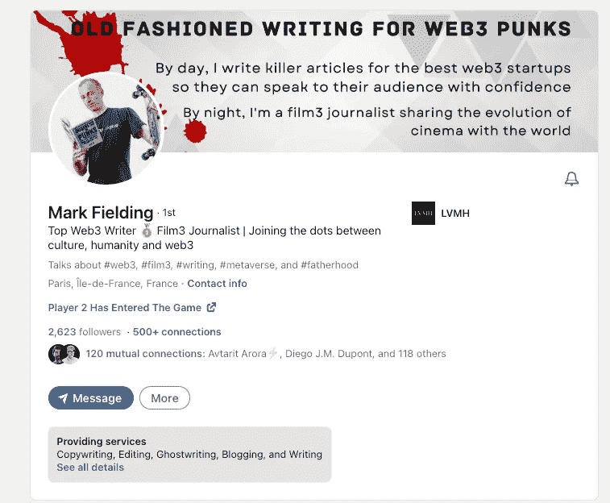
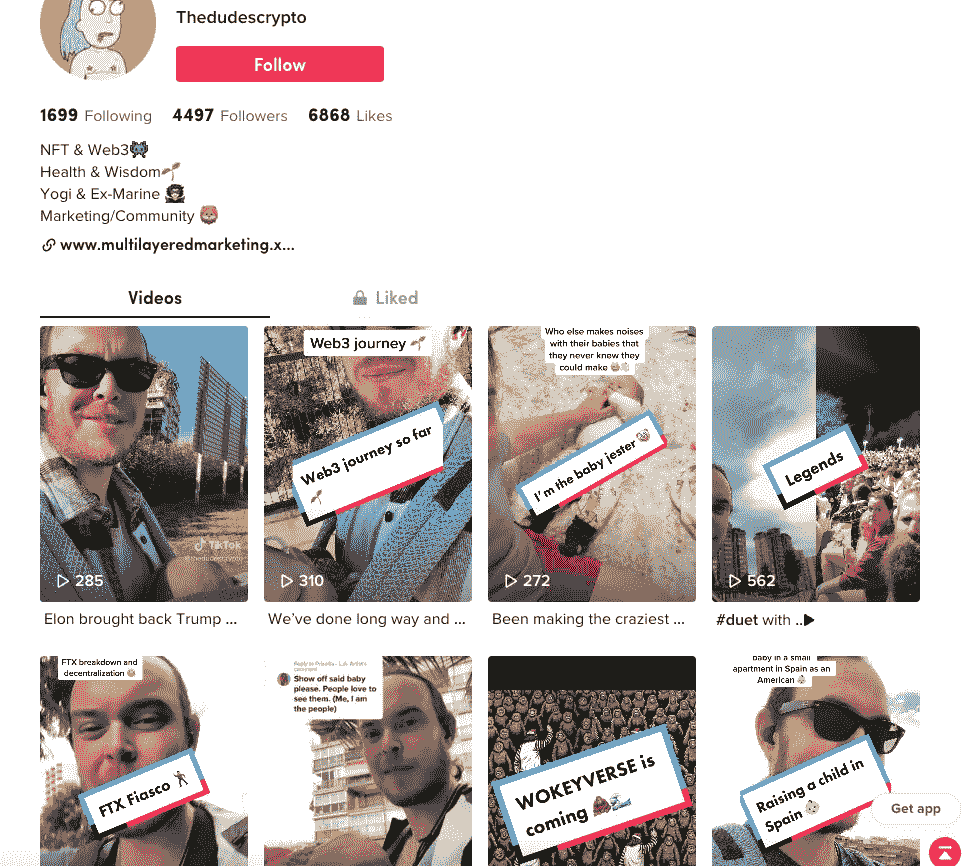
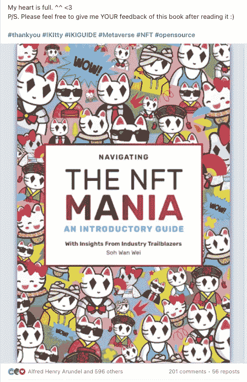
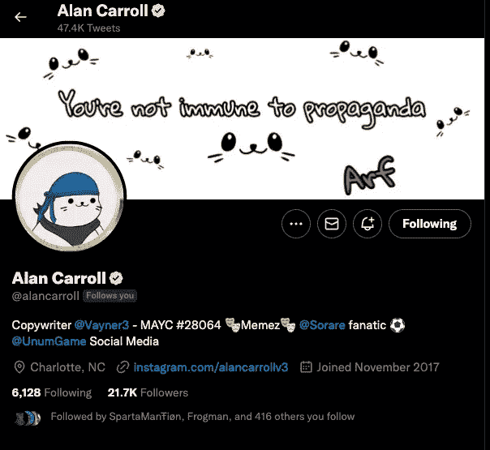
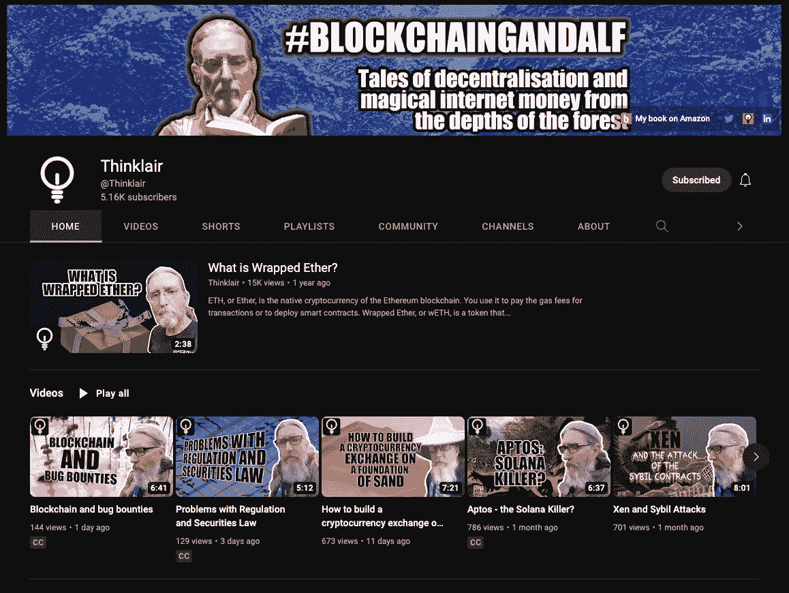
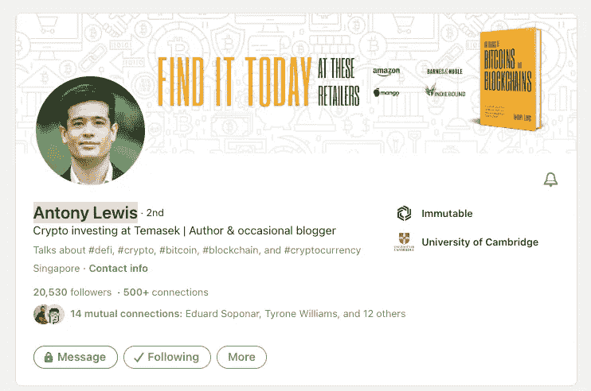
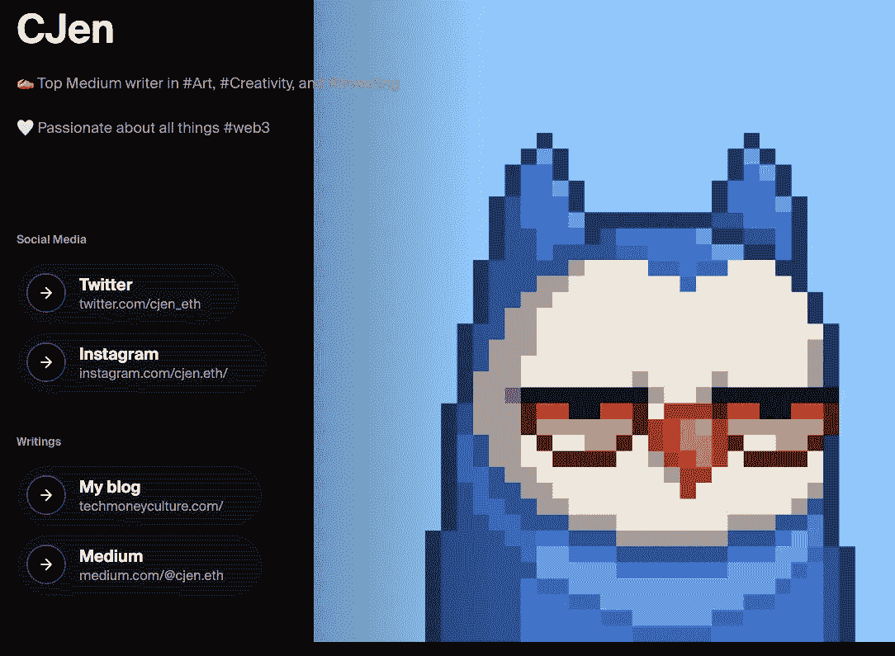
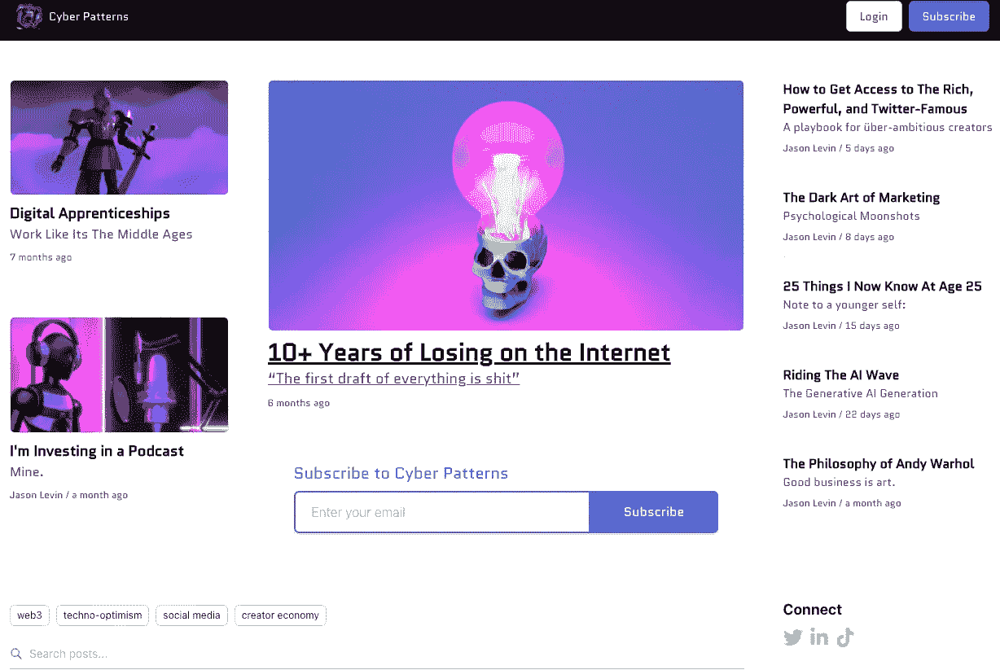

# 十大 Web3 作者👨🏻‍💻

> 原文：<https://medium.com/coinmonks/top-10-web3-writers-ca995689c17f?source=collection_archive---------5----------------------->

在 2 周的时间内，通过所有社交媒体渠道和搜索，从 100 名 web3 作家中进行搜索和选择，并在社交帖子上寻找顶级作家……以下是选出的“前 10 名 Web3 作家”

_ _ _ _ _ _ _ _ _ _ _ _ _ _ _ _ _ _ _ _ _ _ _ _ _ _ _ _ _ _ _ _ _ _ _ _
_ _ _ _ _ _ _ _ _ _ _ _ _ _ _ _ _ _ _ _ _ _ _ _ _ _ _ _ _ _ _

# 马克·菲尔丁

[https://www.linkedin.com/in/markfieldingweb3copywriter/](https://www.linkedin.com/in/markfieldingweb3copywriter/)

“更酷”的 web3 作者之一！马克有一种傻乎乎的、友好的、朋克式的前进精神，这种精神往往会使他参与的所有谈话活跃起来。

如果马克不是 web3 领域最活跃的作家，我不知道谁是！

他的 [Linktree](https://linktr.ee/markfielding) 在 web3 空间中充满了无数关于他工作的文章和著述。

# 拉米·詹姆斯

[https://www.linkedin.com/in/rami-james/](https://www.linkedin.com/in/rami-james/)

1k [中型](/@ramijames)关注者， [Ultra.io](https://www.ultra.io) 的作者，他在 [Twitter](https://twitter.com/ultra_io) 上有 86k，在 [YouTube](https://www.youtube.com/@Ultra_io) 上有将近 5k。

拉米显然是一个经验丰富、高素质的区块链支持者，拥有一个由志同道合的人组成的良好网络，在 LinkedIn 上有近 6000 名粉丝，在 Twitter 上有 65000 名粉丝。

他主要谈论区块链空间中的游戏，但也几乎涵盖了大多数话题，如市场趋势、区块链的进步和一般的 web3 相关新闻。他充当有价值信息的传播者。

> “我主要试图利用我的技术背景(开发人员和产品设计师)，以一种平易近人、易于理解的方式解释区块链的硬性概念”
> ——Rami James

# 泰·史蒂文森

[https://www.linkedin.com/in/stevensonty/](https://www.linkedin.com/in/stevensonty/)

前美国海军陆战队员、前酿酒师、瑜伽老师、哲学家、后来的 web3 建设者，泰在 LinkedIn 上有近 2000 名粉丝，在抖音上有 45000 名粉丝，在推特上有 2000 多名粉丝，在 NFT 和元宇宙也有迅速上升的粉丝，他的目的是向世界传播爱和真理。

他在 web3 领域写了 40 多篇博客，在其他领域写了 100 多篇，比如 Defi，homebrewing，self-development 和 brewing。

Ty 最近成立了一家营销机构，通过营销、写作和社区建设帮助客户发展他们的 web3 存在，名为[多层营销](https://www.multilayeredmarketing.xyz/)

在过去的两年里，Ty 为许多 web3 项目工作和写作，最终成为 NFT 顶级公用事业项目([代谢学会](https://www.metabrewsociety.com/)——见博客[此处](/coinmonks/metabrewsociety-is-the-best-utility-nft-project-out-there-6ab96db5cdcd))的联合创始人，并将很快启动他自己的“人工智能启发的”NFT 项目，称为 WOKEYS(唤醒 Wookies)，以帮助在 web3 多元宇宙中激发“wokeness”，于 2023 年在 Q1-Q2 发布。

# 万伟，Soh

[https://www.linkedin.com/in/sohwanwei/](https://www.linkedin.com/in/sohwanwei/)

居住在万伟新加坡的 Soh 是“未来 100 强女性”之一，在 LinkedIn[上拥有超过 9000 名粉丝，她写了 T10 本书 T11，并积极将人们带入 web3 空间。](https://www.linkedin.com/in/sohwanwei/)

她在 LinkedIn 上非常活跃和友好，肯定有很多人关注她的出色工作。

大多数读者会为她感到骄傲并支持她，就像一个朋友支持另一个朋友一样。

感谢你对生活和网络的热情！

# 艾伦·卡罗尔

[https://www.linkedin.com/in/alan-carroll-857b919a/](https://www.linkedin.com/in/alan-carroll-857b919a/)

艾伦是加里·维纳查克众多冒险项目之一的 V3 的文案。V3 专门针对 NFT 领域的用户，并为他们提供指导。

艾伦利用迷因的力量、巧妙的文案和诙谐的笑话来吸引他的众多频道中的数千名观众，同时还为该领域的一家顶级公司工作。

他在推特上有超过 21，000 名粉丝，在李和 IG 上有更多粉丝，参与度极高。

肯定是 web3 中更有趣的作家之一，因为他相当年轻，我期待这个时尚弄潮儿事业蒸蒸日上！

# 凯尔·芬洛-贝茨博士

[https://www.linkedin.com/in/keirf/](https://www.linkedin.com/in/keirf/)

凯尔，也被称为区块链甘道夫，是一位杰出的作家，他决定集中精力推动区块链行业的发展，他的书(《[邪恶的令牌学](https://www.amazon.es/dp/B0BKWSHW9K?geniuslink=true)》和《[超越经纪人，区块链来了](https://www.amazon.es/dp/1688289976?geniuslink=true)》等)。

他在 LinkedIn 上非常活跃，拥有超过 22，000 名粉丝和很高的参与度。他还有一个强大的 YouTube 频道，拥有超过 5000 名用户和数百个视频，他在自己的芬兰住所讨论区块链的所有事情。他还有一个活跃的 Twitter 账户，经常在那里发帖。

他的每日帖子极具教育性、娱乐性和人情味。

作为一名啤酒酿造商，很难不去欣赏这位了不起的人通过他的视频发表的讲话。你很可能会迷失在他的作品中，因为它们确实是神秘的。

# 安东尼·刘易斯

[https://www.linkedin.com/in/lewisantony/](https://www.linkedin.com/in/lewisantony/)

Antony Lewis 是畅销书《比特币和区块链基础知识》的作者，他无疑是 web3 领域的顶级作家之一。这本书评论超过 2k，排名 4.5/5！！！

他有一个最新的博客，你可以在他的[网站](https://bitsonblocks.net/basics-bitcoins-blockchains-book/)上找到，在那里他触及了 web3 的所有要点，包括加密货币、NFT 和区块链理工大学。

他在 Twitter 上有近 7000 名粉丝，在 LinkedIn(T21)上有超过 20000 名粉丝，他在 LinkedIn 非常活跃。

强烈建议跟随他的旅程，因为他潜到了元宇宙兔子洞的更深处。

# 克里斯蒂安·詹森

[https://www.linkedin.com/in/studiobycj/](https://www.linkedin.com/in/studiobycj/)

这位丹麦人在过去的几年里一直在撰写和谈论 web3，并在他的[博客](https://techmoneyculture.com/)、他的 2k 会员[媒体](/@cjen.eth)和超过 2k 的 Twitter 粉丝以及 LinkedIn 上的类似数量的粉丝之间发展了一个小而专注的粉丝群体。

Christian 撰写了许多关于 web3 的主题，如加密、元宇宙和 NFT。你可能会找到诸如“四月份 NFT 五大项目”或“如何在元宇宙投资”的文章

毫无疑问，在未来的几年里，他将会因为其强有力的作品、热情的态度和创造性的专业知识而得到更多的认可。

# 杰森·莱文

[https://linktr.ee/iamjasonlevin](https://linktr.ee/iamjasonlevin)

Podcaster & Web3 博客作者 Jason Levin 在 Twitter 上有超过 11.3 千的点击量，并从他的时事通讯和博客中获得了很多关注。

他每隔几天就用同样流行的“粉色/蓝色”赛博朋克风格艺术写作，他在推特上最活跃。

一个人肯定会加入他的时事通讯，因为大部分流量都是被推送到那里的，这意味着他的时事通讯" [Cyberpatterns.xyz](http://cyberpatterns.xyz/) "一定值得一读！

观看杰森在这次熊市中挑战抖音世界和 LinkedIn 世界！

# 乔西恩民族

[https://josiennation.com/](https://josiennation.com/)

这个令人敬畏的荷兰人是一个特殊的人，在过去的 5 年多时间里，她经营并管理着自己的国际 SEO 业务，帮助企业和项目优化从博客帖子到社交帖子的各种文章的 SEO。

乔西恩写了许多关于 web3 和整个去中心化运动的博客，在此之前，她有一个旅行博客。

她的风格似乎是善良的，聪明的，技术熟练的，看看她的专长是如何通过精确/恰当的词来提高你的有机流量，从而提高你的搜索排名(SEO)。

Josien 提供 SEO 服务以及配备了一个作家团队的写作服务，以确保工作顺利完成。

你可以在这里看到她的账号。

_ _ _ _ _ _ _ _ _ _ _ _ _ _ _ _ _ _ _ _ _ _ _ _ _ _ _ _ _ _
_ _ _ _ _ _ _ _ _ _ _ _ _ _ _ _ _ _ _ _ _ _ _ _ _

**时刻小心！！！⚠️**

> 我怎么强调都不为过！保持高度警惕，留意你点击的每一个链接、你做的每一笔交易和你接触的每一个人，因为这个领域骗子很多，即使是最好看的项目也会被撤下。
> 
> 在你点击所有链接之前，反复检查，确保它们是你正在寻找的官方链接。此外，在给自己或他人发送任何有价值的东西之前，要再三检查所有的钱包地址。

关注我的新营销代理公司**，在未来几年获得更多关于营销、写作和社区建设的技巧/建议！**

> **[*推特*](https://www.twitter.com/metadadsxyz)[*不和*](https://discord.gg/mchzhDCwhF)[*YouTube*](https://www.youtube.com/channel/UC7pbtSBs9nRJHK6coMhCR8g)[*抖音*](https://www.tiktok.com/@thedudescrypto)[*insta gram*](https://www.instagram.com/metadadsxyz)[*Spotify 播客*](https://open.spotify.com/episode/5U8vXE9HDAsGbSbebw9p62?si=2rZIigw-Tw2pCxjxmkbYzQ)**
> 
> **请通过发送 Polygon Matic 到这个 Eth 地址或 Eth Tokens 来支持我和我的家庭🙏🏼**
> 
> *****0xb 53b 3978333 e 11 c 382 ab 619 f 02 f 469 A8 c 70750 af*****
> 
> ***或***
> 
> *****从我们这里买一辆 NFT***[***OpenSea***](https://opensea.io/collection/dudelvillegenesis)**(报价)更多即将推出****

***_________________________________________________________________***

******

# ***干杯，
泰***

*****我的一些其他博文:**
[5 个没落的 Web3](/coinmonks/5-downfalls-of-web3-cd5dc8ade4fd)
[5 + 5 个不和谐的战术](/coinmonks/5-tips-for-a-better-discord-nft-crypto-edition-ff9b039d0359)
[Crypto 101:一个初学者指南](/coinmonks/crypto-101-a-beginners-guide-345d440bd163)
[NFT 最佳实践(营销&社区成长)](/coinmonks/top-5-nft-best-practices-marketing-and-community-growth-7025e26eb50c)
[Web3 基础知识](/coinmonks/web3-basics-252121357f33)
[替代效用案例对于 NFT 的](/coinmonks/alternative-nft-crypto-real-life-use-cases-b7c0b08d99ef)
[什么是营销&为什么](/coinmonks/what-is-marketing-why-everyone-should-be-a-marketer-6173b8dffd61)***

> ***交易新手？尝试[加密交易机器人](/coinmonks/crypto-trading-bot-c2ffce8acb2a)或[复制交易](/coinmonks/top-10-crypto-copy-trading-platforms-for-beginners-d0c37c7d698c)***