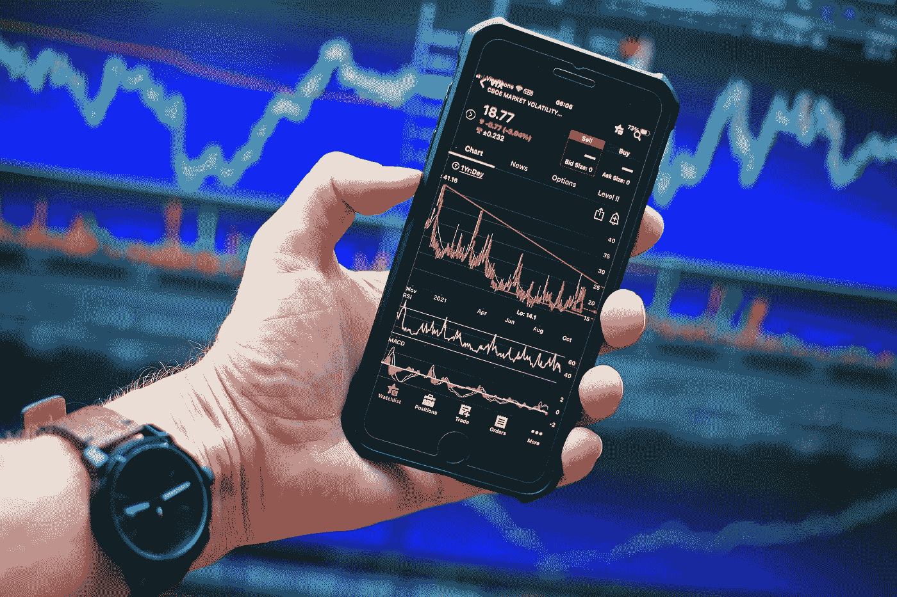

# 你必须记下的 15 大交易点…第二部分

> 原文：<https://medium.com/coinmonks/top-15-trading-points-you-must-note-down-part-2-b7a19ee5fcb8?source=collection_archive---------19----------------------->

1.  交易意味着当别人试图抢劫你的时候，你也试图抢劫别人。
2.  相信自己，你不仅会做正确的事情，还会避免错误的事情。
3.  一个好的交易者的目标不是赚钱。他的目标是做好交易。如果他交易正确，钱几乎是事后才想到的。成功的交易者尊重他们的技能。对他们来说，努力达到个人最佳状态比赚钱更重要。
4.  为了改变，你必须找到你的弱点。写交易日记。写下你每天进出的理由。寻找成功和失败的重复模式。
5.  你要为你做的每一笔交易负责。当你决定进入市场时，交易就开始了，只有当你决定退出时，交易才结束。有好的交易系统是不够的。大多数有好系统的交易者都被市场淘汰了，因为从生理上来说，他们没有做好赢的准备。
6.  交易者获得了一些知识，他们赢了，他们的情绪爆发了，他们自毁了。
7.  不要在交易时间做任何决定。计划交易&交易计划。
8.  不要带着任何先入为主的想法进入市场。当市场变化时，改变你的计划。
9.  少数幸存者意识到主要问题不在于他们的方法，而在于他们的思维。他们可以改变，成为成功的交易者。
10.  成功的交易者如果连续亏损几次，他们会认为有问题。是时候停止&反思他们的分析或方法了。**失败者** >无法停止。他们继续交易，因为他们沉迷于游戏的刺激，希望能大获全胜。
11.  输家有交易的冲动，就像酗酒者有喝酒的冲动一样。他们是冲动的交易者，继续交易&试图用自己的方式交易。
12.  你永远无法控制市场，但你可以控制自己。
13.  出于愤怒、恐惧或得意洋洋的行为会破坏你成功的机会。你必须分析你在市场上的行为，而不是表现出你的感觉。
14.  如果市场行为在你看来很神秘，那是因为你自己的行为很神秘，难以驾驭。当你甚至不知道自己下一步会做什么时，你就无法真正确定市场下一步可能会做什么。
15.  不要贪心，急于交易。慢慢学。在未来的几个月和几年里，市场将会有更多的好机会。

> 交易新手？试试[密码交易机器人](/coinmonks/crypto-trading-bot-c2ffce8acb2a)或[复制交易](/coinmonks/top-10-crypto-copy-trading-platforms-for-beginners-d0c37c7d698c)

*   [https://its adiee . medium . com/top-15-trading-points-you-must-note-down-7a 2 ba 21 fa 0d 7](https://itsadiee.medium.com/top-15-trading-points-you-must-note-down-7a2ba21fa0d7)

看看我的网站~[https://itsadiee1.blogspot.com/](https://itsadiee1.blogspot.com/)

捐款~【paypal.me/itsadiee 

*感谢阅读…*

> 加入 Coinmonks [电报频道](https://t.me/coincodecap)和 [Youtube 频道](https://www.youtube.com/c/coinmonks/videos)了解加密交易和投资

# 另外，阅读

*   [Bookmap 评论](https://coincodecap.com/bookmap-review-2021-best-trading-software) | [美国 5 大最佳加密交易所](https://coincodecap.com/crypto-exchange-usa)
*   [加密交易机器人](/coinmonks/crypto-trading-bot-c2ffce8acb2a) | [造币评论](https://coincodecap.com/coingate-review)
*   最佳加密[硬件钱包](/coinmonks/hardware-wallets-dfa1211730c6) | [Bitbns 评论](/coinmonks/bitbns-review-38256a07e161)
*   [新加坡十大最佳加密交易所](https://coincodecap.com/crypto-exchange-in-singapore) | [购买 AXS](https://coincodecap.com/buy-axs-token)
*   [红狗赌场评论](https://coincodecap.com/red-dog-casino-review) | [Swyftx 评论](https://coincodecap.com/swyftx-review)