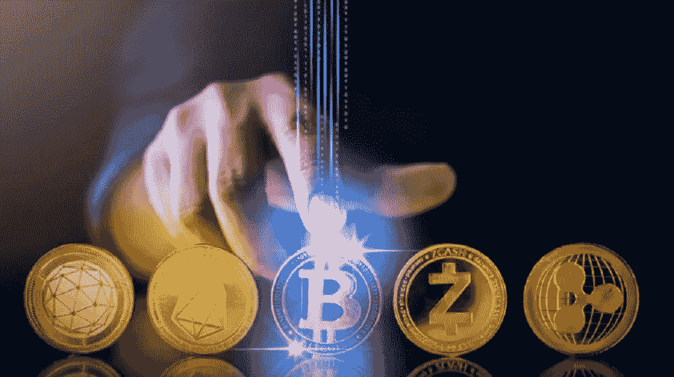
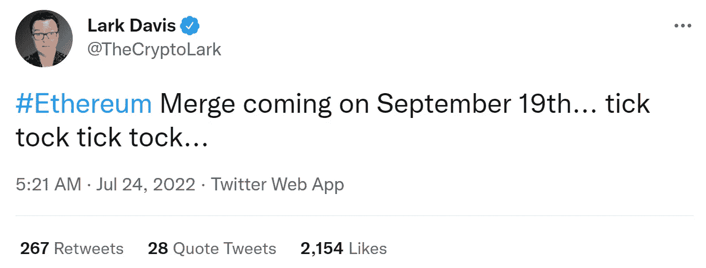
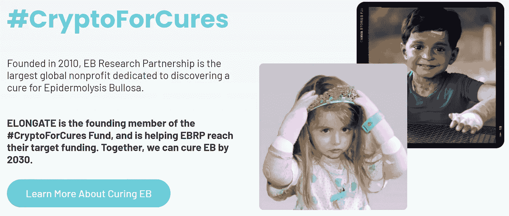
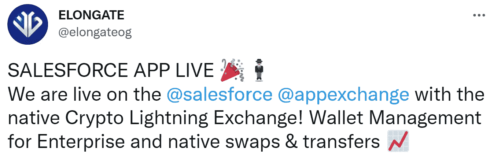

# 现在最值得购买的两种加密货币

> 原文：<https://medium.com/coinmonks/top-2-cryptocurrencies-to-buy-right-now-51cbe3397cba?source=collection_archive---------5----------------------->

七月即将过去，而**加密市场**仍在**血战**。尽管上周出现小幅反弹，但所有加密硬币仍远低于历史高点。不管令人沮丧的 T4 图表，我们看到了隧道尽头的光明。

许多分析师预计美联储将停止像全年一样大幅提高利率，因为预计通货膨胀会下降。如果这种情况发生，密码市场将很可能进入一个更大的上升趋势。这就是为什么我们非常密切地关注着 **2 枚硬币**，并稳定地向它们注入 DCA。

# 1.以太坊

Since Ethereum’s developers announce a date for “**The Merge**”, $ETH has gained +40% in price

以太坊在我们现在所处的这个残酷的熊市中也未能幸免。然而，最近围绕万众期待的**合并**(从 ETH 到 ETH 2.0)的乐观情绪导致了**过去两周以太坊上涨 **+40%** 。**

在过去的几年里，合并在某种程度上已经成为了一个**迷因**，因为它已经被推迟了几次，这让许多人感到沮丧。然而，两周前，以太坊的开发者在日历上为合并定了一个日期。那一天是九月十九日。声明发布后，以太坊在接下来的 3 天内上涨了 30%。

The dream of many Ethereum maximalists might come true on September 19th

“**合并**”非常重要，因为以太坊可能会成为**通货紧缩**，这意味着随着时间的推移，供应将会减少，这将自动导致$ETH 价格上涨(以太坊最大主义者将这一特征称为“**超声波货币**)。

此外，由于共识机制将从**工作证明**变为**利益证明**，以太坊将变得更加环保。这很可能会吸引许多机构投资者，因为他们在投资前会寻找 ESG 授权。

# 2.拉长

ELONGATE is a blockchain-based tech company which focuses on changing the world for the better with the help of their products.

**ELONGATE** 是一个加密货币项目，最初是作为 **memecoin** 创建的，后来发展成为一家备受尊敬的**科技公司**，拥有庞大的合作伙伴，如 **Salesforce** 、 **Chainlink** 等。

拉长的主要理念是利用区块链技术来帮助我们星球上的不幸者。他们向“儿童国际”、“团队海洋”、“大绿色”、“马拉拉基金”等慈善公司捐赠了超过**400 万**美元，证明了这一点。

ELONGATE is the leading blockchain project which focuses on philantrophic actions

除了慷慨的捐赠，他们还在为 Salesforce 这样的大型科技公司开发基于区块链的产品。他们的下一个目标是**通过建立一个名为 **Spark** 的社交媒体平台来分散社交媒体**。 **Spark** 将通过让算法推荐“积极的”、“无毒的”内容，消除目前存在于 Twitter 和脸书等平台上的毒性。此外，平台赚的所有钱都将分配给它的用户，而慈善内容将获得最大份额。

ELONGATE is building sophisticated crypto products for clients like Salesforce

由于我们在 **Crypto Hub** 的团队过去一直与 [**ELONGATE**](https://www.elongate.cc/) 合作，我们可以说，尽管疯狂的熊市影响了 ELONGATE 的代币价格，但社区非常强大和支持，团队一直在创新。

👋业务请求: [**电报:联系@cryptohubtiktok**](https://t.me/cryptohubtiktok)

💰欢迎关注我们的 获取更多此类分析

🐦也可以查看我们的 [**推特账号**](https://twitter.com/CryptoHub210?s=20&t=ts3bUBYtX7g0s5_ClYnL_A) 获取更简短的分析

🤑加入我们的 [**电报频道**](https://t.me/officialcryptohub) 与志同道合者互动

🌟订阅我们的 [**YouTube 频道**](https://www.youtube.com/channel/UCprIoxgUXQ0OwXUEBnstpkQ) 获取每日加密相关视频

> 交易新手？试试[加密交易机器人](/coinmonks/crypto-trading-bot-c2ffce8acb2a)或[复制交易](/coinmonks/top-10-crypto-copy-trading-platforms-for-beginners-d0c37c7d698c)