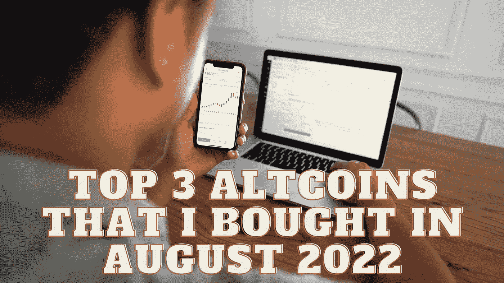

# 我在 2022 年 8 月购买的前 3 个备用硬币

> 原文：<https://medium.com/coinmonks/top-3-altcoins-that-i-bought-in-august-2022-4fe0e4669e11?source=collection_archive---------26----------------------->

Source photo Unsplash.com

# 近似协议(NEAR)

如果你正在寻找一个顶级的 dApp 平台，那就去看看 Near Protocol (NEAR)吧，它使用一种利益证明(PoS)共识机制来验证其区块链上的交易。这是一个用于分发和管理分布式应用程序的云基础设施，由社区运营。它就像是基于服务器的数据库和