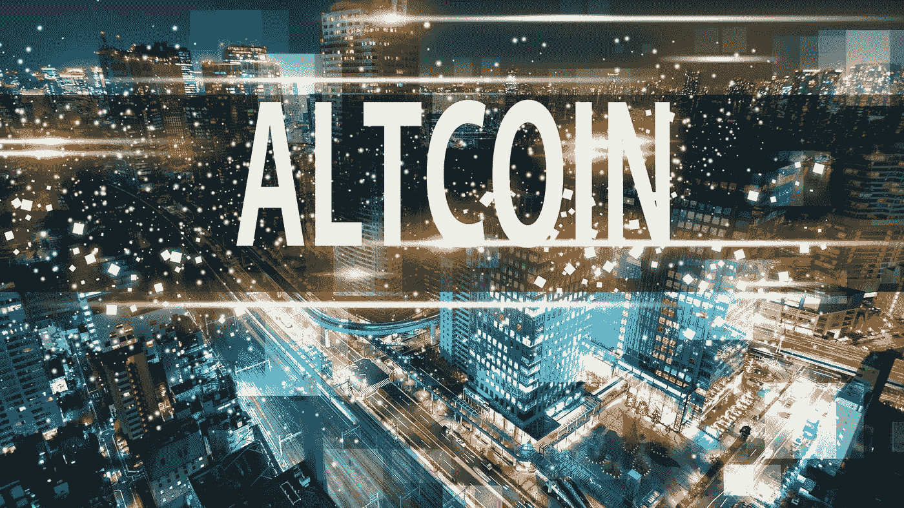

# 2022 年 7 月最值得购买的 3 种替代硬币

> 原文：<https://medium.com/coinmonks/top-3-altcoins-to-buy-in-july-2022-d81fea10c66d?source=collection_archive---------14----------------------->

Source photo [altcoin season — Bing images](https://www.bing.com/images/search?view=detailV2&ccid=WfdoWQRa&id=5F377B835AFFB8F87BDDB247F484E4907E612D18&thid=OIP.WfdoWQRah_4-mjF8DwEHJwHaEK&mediaurl=https%3a%2f%2fen.cryptonomist.ch%2fwp-content%2fuploads%2f2019%2f12%2faltcoin-season-1.jpg&cdnurl=https%3a%2f%2fth.bing.com%2fth%2fid%2fR.59f76859045a87fe3e9a317c0f010727%3frik%3dGC1hfpDkhPRHsg%26pid%3dImgRaw%26r%3d0&exph=1080&expw=1920&q=altcoin+season&simid=608038103884897044&FORM=IRPRST&ck=F6F62297AF9509ADEBEAF09C7D2D4275&selectedIndex=10&ajaxhist=0&ajaxserp=0)

# 沙箱(沙子)

总部位于元宇宙的分散式区块链游戏《沙盒》( SAND)巧妙地整合了虚拟土地所有权、社区参与和 NFTs。他们提供的主要软件是 VoxEdit，这有助于导入 NFT、电影和其他相关材料。此外，这些资产可以在沙盒的市场中被交易为沙盒代币。