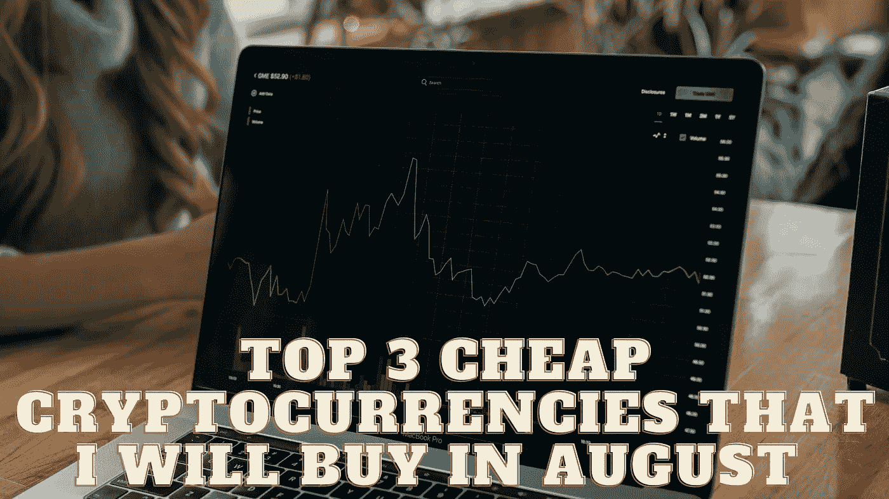

# 我将在 8 月购买的 3 种最便宜的加密货币

> 原文：<https://medium.com/coinmonks/top-3-cheap-cryptocurrencies-that-i-will-buy-in-august-b64b77281e91?source=collection_archive---------19----------------------->

Source photo Unsplash.com

# 涟漪(XRP)

许多人认为 XRP，涟漪网络的本地货币，是一个可靠的便士加密投资。在 2022 年的“加密冬天”期间，其价值暴跌超过 62%。然而，其交易价格从未低于 3 美元的事实使其更具吸引力，尤其是考虑到一些行业专家预测它可能…