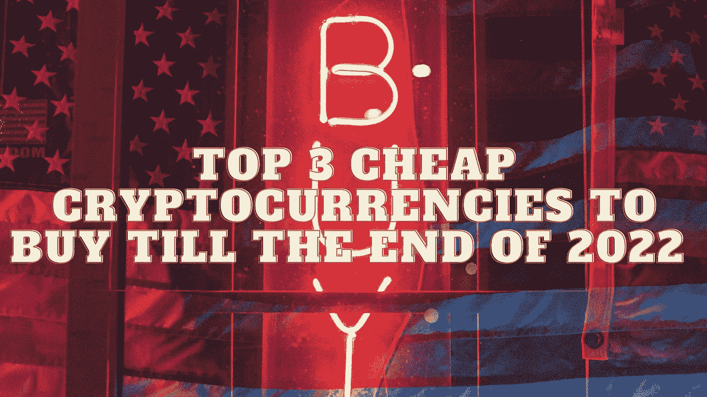

# 2022 年底前三大廉价加密货币

> 原文：<https://medium.com/coinmonks/top-3-cheap-cryptocurrencies-to-buy-till-the-end-of-2022-47858e290f1?source=collection_archive---------14----------------------->

Source photo Unsplash.com

# 涟漪(XRP)

为了确保 XRP 交易的完整性，建立了一个共识机制。要处理一个交易，验证者之间需要达成一致。Ripple 利用这项技术以低廉的成本和很少的能源消耗在几秒钟内完成交易。