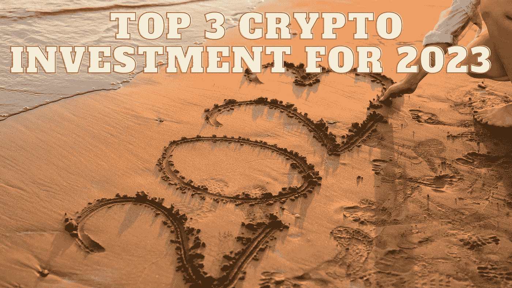

# 2023 年前三大加密投资

> 原文：<https://medium.com/coinmonks/top-3-crypto-investment-for-2023-6d806118baf7?source=collection_archive---------24----------------------->

Source photo Unsplash.com

# 卡尔达诺

卡尔达诺网络是以太坊的一个主要对手，因为它是为了修复以太坊的所有缺陷而开发的。当今业内最杰出的人物之一查尔斯·霍金森是这两个网络的联合创始人。由于他的领导，Cardano 网络正在发展成为 PoW-PoW-PoW-PoW-PoW-PoW-PoW-PoW-PoW-PoW-PoW-PoW-PoW-PoW-PoW-PoW-PoW-PoW-PoW-PoW-PoW-PoW-PoW-PoW-PoW-PoW-PoW-PoW-PoW-PoW-PoW-PoW-PoW-PoW-PoW-PoW-DeFi 生态系统。