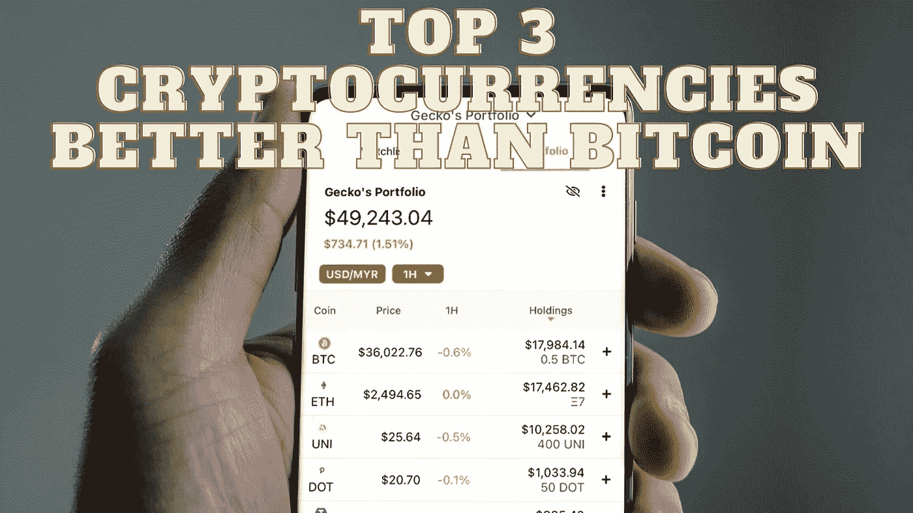

# 比比特币更好的三大加密货币

> 原文：<https://medium.com/coinmonks/top-3-cryptocurrencies-better-than-bitcoin-76f18d46fb77?source=collection_archive---------29----------------------->

Source photo Unsplash.com

# 以太坊

以太坊被广泛认为是智能合约的先驱区块链平台，因为它拥有尖端的区块链技术。专家预测，最初的智能合约区块链能够经受住这段时间的考验，而加密货币已经证明了这一预测的正确性。