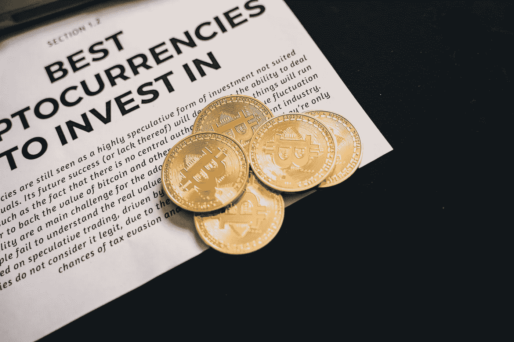

# 你的投资组合中不能错过的三大加密货币

> 原文：<https://medium.com/coinmonks/top-3-cryptocurrencies-that-cannot-miss-from-your-portfolio-fc054c873921?source=collection_archive---------19----------------------->

Source photo [Photo of Bitcoins · Free Stock Photo (pexels.com)](https://www.pexels.com/photo/photo-of-bitcoins-6771613/)

# 比特币(BTC)

中本聪创造了比特币，一种数字货币和支付系统。网络中的节点使用密码术来验证交易，然后交易被添加到被称为区块链的公共分布式账本中。比特币的特殊之处在于，它永远只有 2100 万枚。