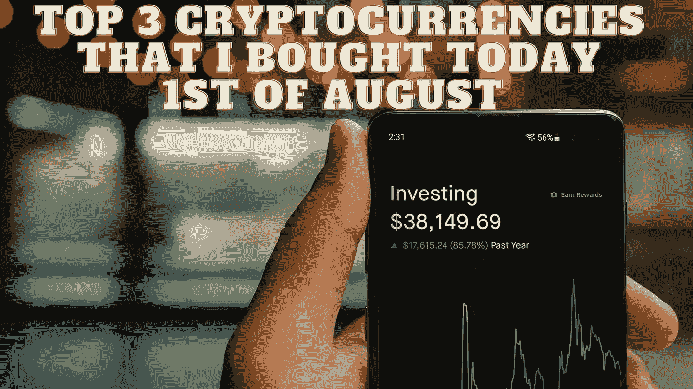

# 我今天 8 月 1 日购买的前 3 种加密货币

> 原文：<https://medium.com/coinmonks/top-3-cryptocurrencies-that-i-bought-today-1st-of-august-73f4c425902e?source=collection_archive---------4----------------------->

Source photo Unsplash.com

# 柴犬(SHIB)

排在第二位的是一种流行的笑话硬币。因此，它已被列入我们的 2022 年最值得购买的一分钱加密货币名单。当 SHIB 在 2021 年的最初几年价值上涨 5，000，000%时，许多加密投资者变得富有。