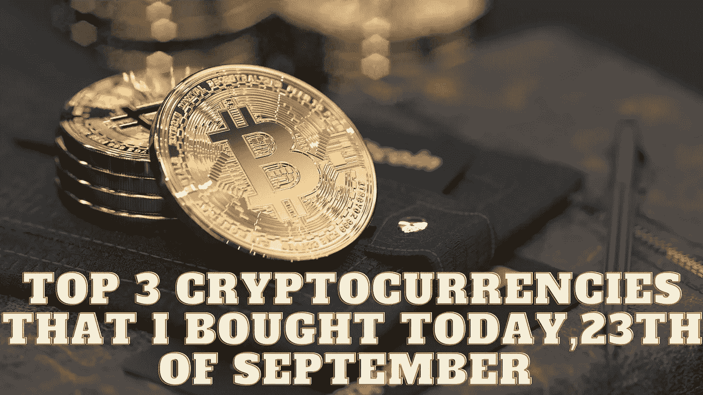

# 我今天(9 月 23 日)购买的前三种加密货币

> 原文：<https://medium.com/coinmonks/top-3-cryptocurrencies-that-i-bought-today-23th-of-september-a601eccc9cff?source=collection_archive---------20----------------------->

Source photo Unsplash.com

# 以太坊

在真正的转变之前，以太坊为合并事件制造了大量的宣传，吸引了投资者。由加密交换、不可替代的令牌(NFT)市场、贷款组织和其他应用组成的网络生态系统中拥有超过 600 亿美元的价值。