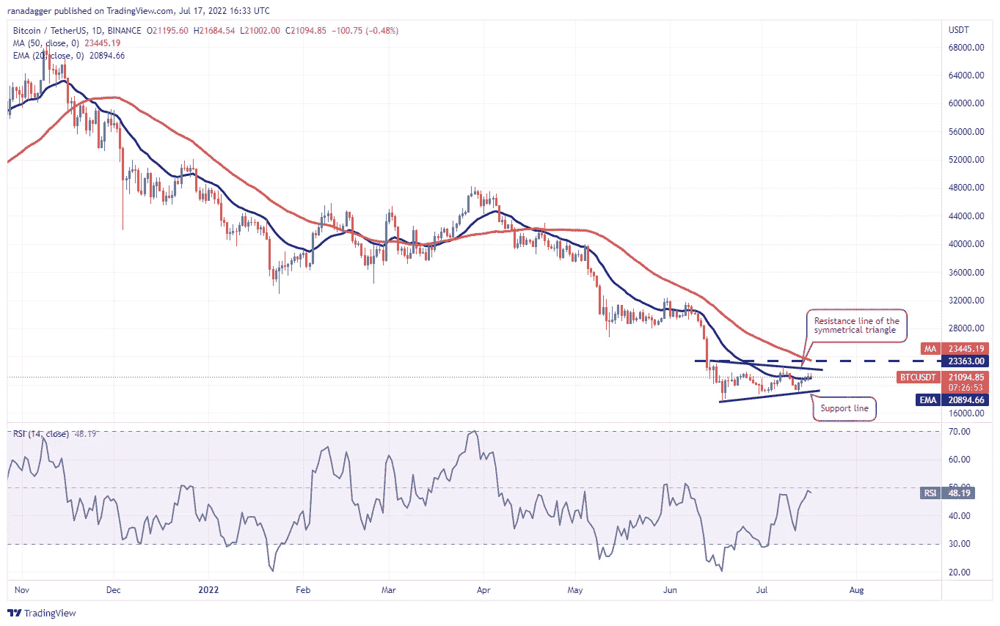
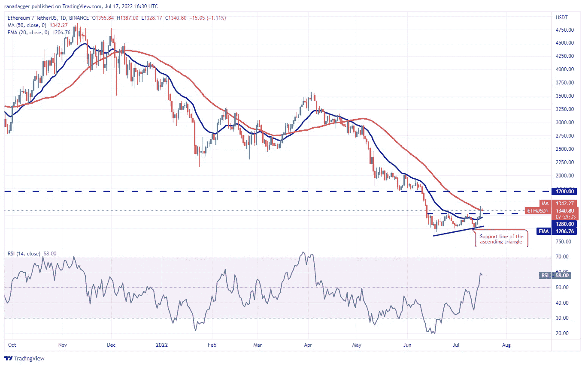

# 本周值得关注的三大加密货币

> 原文：<https://medium.com/coinmonks/top-3-cryptocurrencies-to-look-out-for-this-week-5c2b6e9da7f8?source=collection_archive---------49----------------------->

本周，比特币出现了一些复苏迹象。在撰写本文时，世界上最受欢迎的加密货币目前的交易价格为 22，447 美元。

然而，一些分析师和投资者仍然认为上涨是一个牛市陷阱，而其他人则认为这是一个重新测试 200 周关键阻力的举措。从加密的恐惧和贪婪指数可以看出，熊市打击了情绪，让投资者对复苏失去了希望。

链上分析平台 LookIntoBitcoin 的创始人表示，市场在“极度恐惧”类别中度过的时间比 2018 年比特币熊市还要长。

我们列出了本周最值得关注的三种加密货币。排名前 3 的加密货币包括比特币、以太坊和以太坊经典。让我们研究一下他们的图表，看看这些情绪能否扭转市场，进而推高密码价格。

*   比特币(BTC)/USDT
*   以太坊/USDT
*   以太坊经典(ETC)/USDT

# 比特币(BTC)/USDT

7 月 15 日，比特币涨至 20894 美元，升至 20 日指数移动平均线(EMA)上方。然而，多头交易者没能利用这次上涨，而是空头。

请看下面[交易视图](https://www.tradingview.com/)的日线图:

相对强弱指数(RSI)能够抬高中点，而 20 日均线已经走平。这清楚地表明了供求之间的平衡。

如果在 50 天简单移动平均线(SMA)23，445 美元上方出现突破并收盘，那么这将是走强的第一个迹象。这可能为反弹至 28，171 美元的目标扫清道路。

另一方面，如果移动并跌破 20 日均线，BTC/USDT 停留在三角形的时间可能会延长。三角形内部可能会出现随机和波动的价格行为。空头领先的标志是当跌破三角形收盘时。

如果空头设法将价格拉至移动平均线以下，那么 BTC/USDT 组合可能会跌至 20，000 美元。或者，如果价格在移动平均线上掉头，那么它将显示多头交易者正在逢低买入，这可能会改善市场，并将这对货币反弹至 23，363 美元的顶部阻力。

# 以太坊/USDT

7 月 16 日，多头将以太坊价格推至 1280 美元以上，完成了一个上升的三角形形态。与此同时，空头交易员正试图将价格拉回到突破水平以下。

1280 美元是一个关键的下跌水平。如果价格反弹到这一水平，这仅仅意味着多头交易者已经将 1280 美元转化为支撑，这可能增加牛市的希望。这带来了 ETH/USDT 对可能升至 1700 美元的可能性。

然而，如果情况相反，跌破 20 天均线 1，206 美元，这可能会使货币对向三角形的支撑线下跌。

> 交易新手？试试[加密交易机器人](/coinmonks/crypto-trading-bot-c2ffce8acb2a)或者[复制交易](/coinmonks/top-10-crypto-copy-trading-platforms-for-beginners-d0c37c7d698c)

# 以太坊经典(ETC)/USDT

以太坊经典从 12.50 美元涨到 18 美元，过去几天一直保持在这个价位。这表明多头交易者试图形成双底形态。

其 20 日均线 15.87 美元已经开始上涨，相对强弱指数也有所上升，显示多头交易者占据了前座。18 美元是下跌时要小心的关键水平。如果多头交易者将价格保持在这一支撑位之上，那么这对货币可能开始向 23.50 美元，然后 25 美元的牛市。

与这一假设相反，走向相反的方向，跌破 18 美元，那么这一对也可能下降到移动平均线。任何低于 20 日均线的突破都可能意味着空头交易者在更高的水平保持强势。

免责声明:*本文代表撰写这篇博文的作者的观点。我们不会把任何想法强加给你，也不打算定义你的经历。因此，我们建议，无论你对这篇博文做什么，无论你对作者的观点作何反应，都应该纯粹基于你自己的研究和个人信念——你对这些信息做什么完全是你自己的决定。*