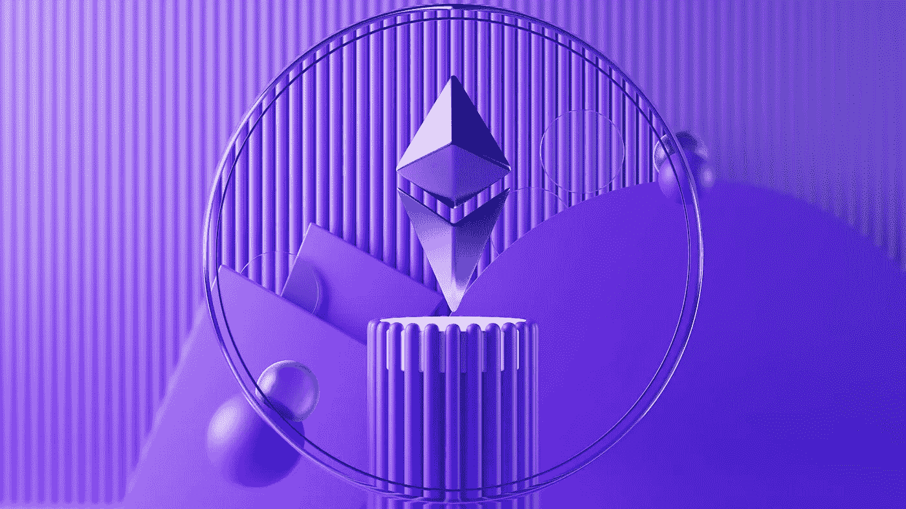

# 应该被置于镜头下的三大加密货币

> 原文：<https://medium.com/coinmonks/top-3-cryptocurrencies-which-should-be-kept-under-the-lens-40df2f741847?source=collection_archive---------32----------------------->

Source photo [Free Render Image on Unsplash](https://unsplash.com/photos/qxPBRC3HcX8)

# 以太坊

2021 年初涉及 ETH(以太坊)的“合并”事件引起了数字资产行业的极大兴趣。一种被称为工作证明(PoW)的共识技术首先在网络中实现。然而，当加密货币的受欢迎程度飙升时，电力集成的区块链需要过多的电力。结果是…