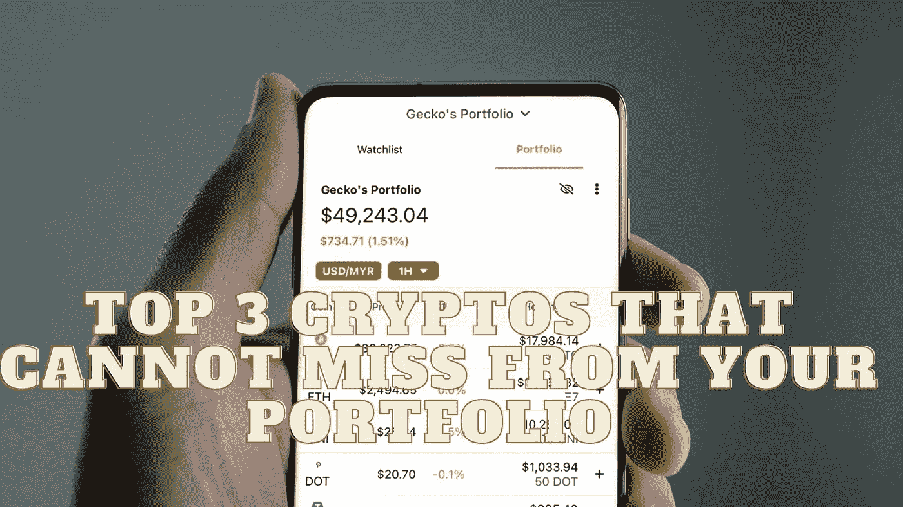

# 你的投资组合中不能错过的三大密码

> 原文：<https://medium.com/coinmonks/top-3-cryptos-that-cannot-miss-from-your-portfolio-8c97a1db29f1?source=collection_archive---------18----------------------->

Source photo Unsplash.com

# 以太坊

以太坊是一个分布式账本系统(区块链)平台，用于促进用户之间的 dApp 创建和价值转移。以太是该平台自己的数字货币，用于其应用程序(ETH)。与比特币相反，这种加密货币背后的动机是完全分散互联网，而不是彻底改变货币在…