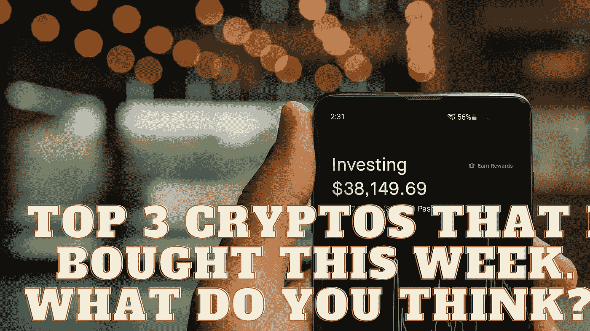

# 我这周买的前三个密码。你怎么想呢?

> 原文：<https://medium.com/coinmonks/top-3-cryptos-that-i-bought-this-week-what-do-you-think-7a35538394f4?source=collection_archive---------34----------------------->

Source photo Unsplash.com

# 币安硬币(BNB)

币安硬币(BNB)是交易所的公用令牌，在币安平台上广泛使用。币安硬币(BNB)用于交易费用和币安智能链。该令牌是一种可编程的加密货币，具有定义良好的用例，而不仅仅是众所周知的交易所的公用事业硬币。