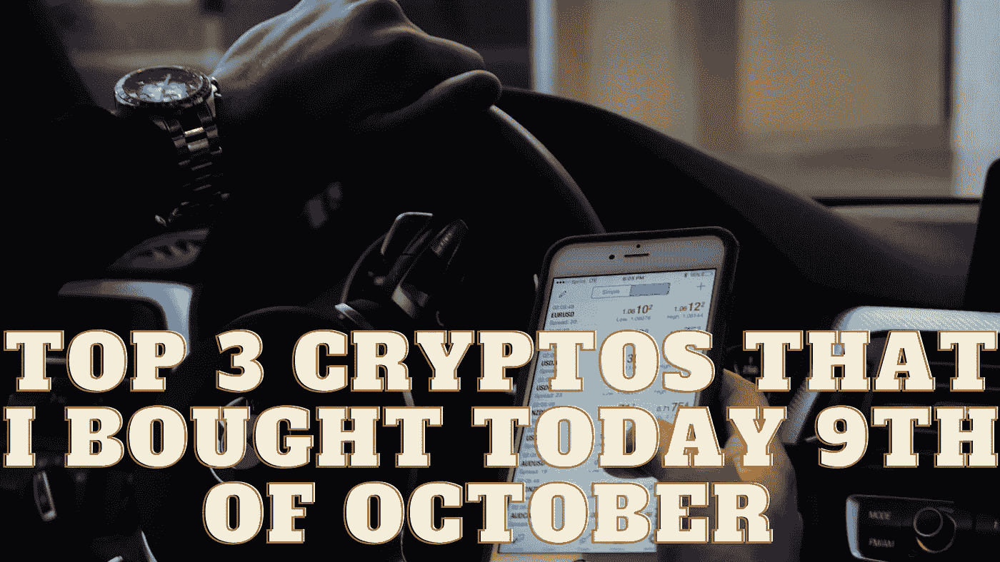

# 我今天，10 月 9 日，买的前 3 个密码

> 原文：<https://medium.com/coinmonks/top-3-cryptos-that-i-bought-today-9th-of-october-c1af3aa0aac?source=collection_archive---------17----------------------->

Source photo Unsplash.com

# 卡尔达诺

Cardano 凭借其创新的方法和突破性的技术，在拥挤的加密货币市场上迅速为自己赢得了声誉。在过去的一年里，它已经成为最受欢迎的数字货币之一。到 2021 年，随着其标志性硬叉子阿隆佐的发布，ADA 的价格涨到了 3.10 美元。叉子包括智能…