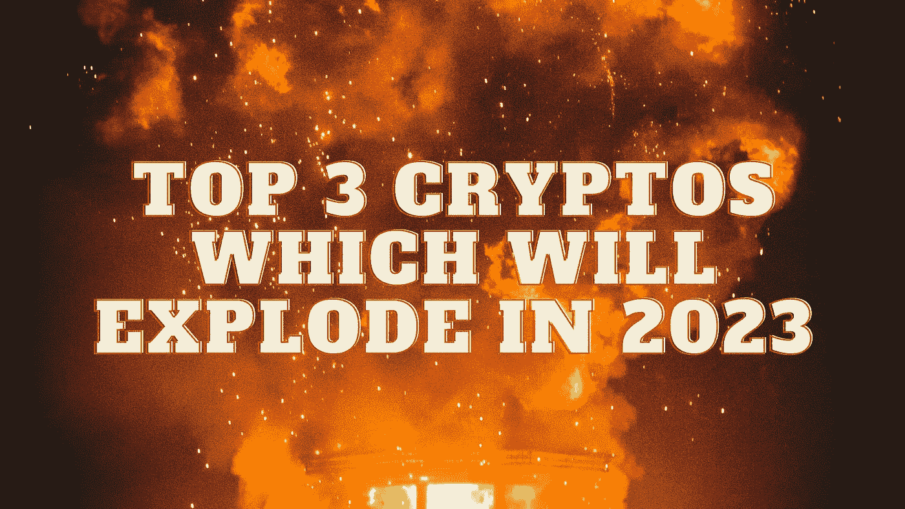

# 将在 2023 年爆发的三大密码

> 原文：<https://medium.com/coinmonks/top-3-cryptos-which-will-explode-in-2023-88b8d93ce47?source=collection_archive---------13----------------------->

Source photo Unsplash.com

# 猿

ApeCoin 具备成功的加密货币的所有要素，具有“meme coin”的潜力。ApeCoin 是一种 ERC-20 硬币，本质上与最昂贵的 NFTs，Bored Ape 游艇俱乐部(BAYC)套装有关。ApeCoin 今年早些时候的推出受到了极大的欢迎，因为一线名人对 BAYC NFTs 产生了广泛的兴趣。