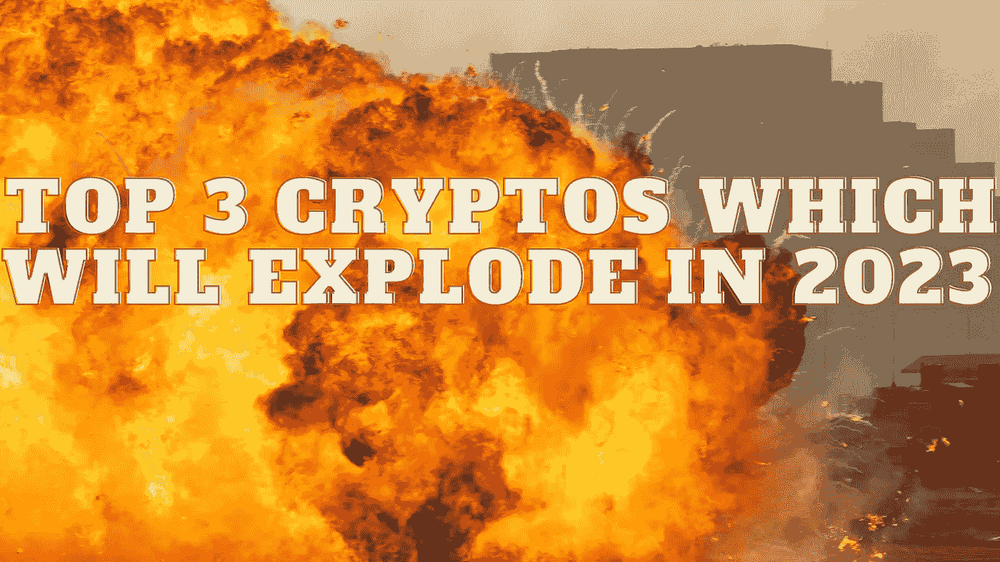

# 将在 2023 年爆发的三大密码

> 原文：<https://medium.com/coinmonks/top-3-cryptos-which-will-explode-in-2023-ac021fdf1390?source=collection_archive---------5----------------------->

Source photo Unsplash.com

# Dogecoin (DOGE)

由杰克逊·帕尔默和中本聪创造的 Dogecoin 是加密货币市场上最受欢迎的迷因货币之一。交易者正在密切关注 DOGE，因为它从最近的下跌中略有回升。

网络即将进行的改造是 DOGE 的主要驱动力，如果改造完成，DOGE 的价格可能会升至 1 美元。我们预计…