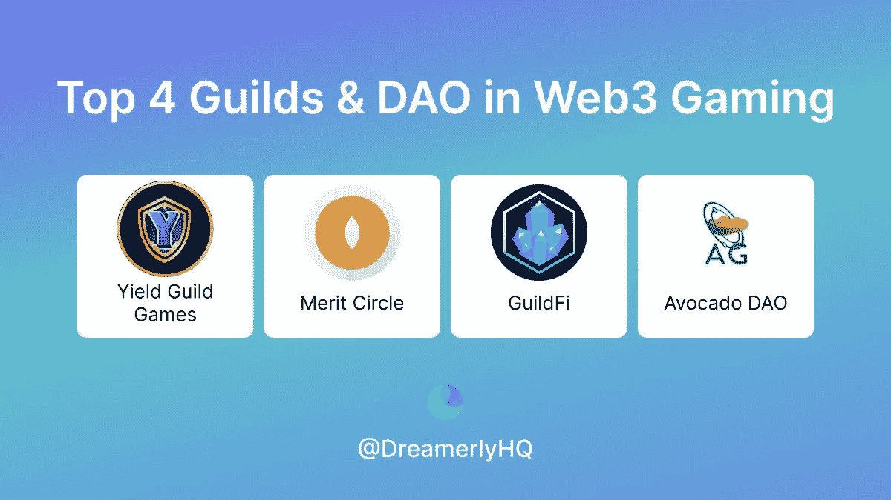
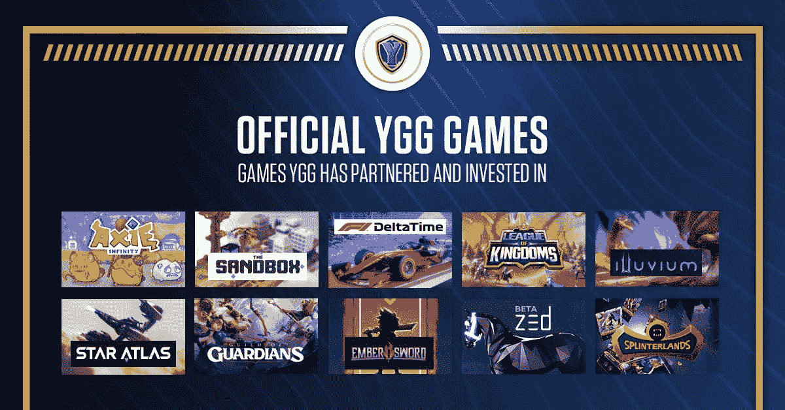
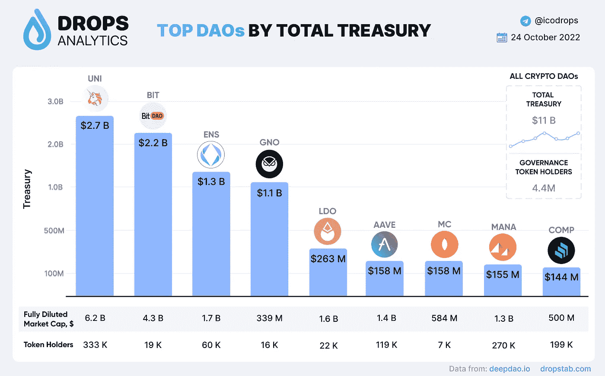
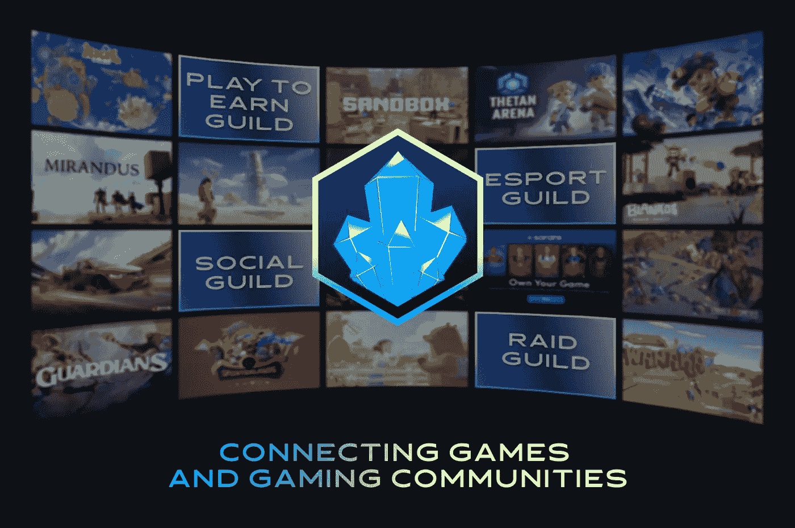
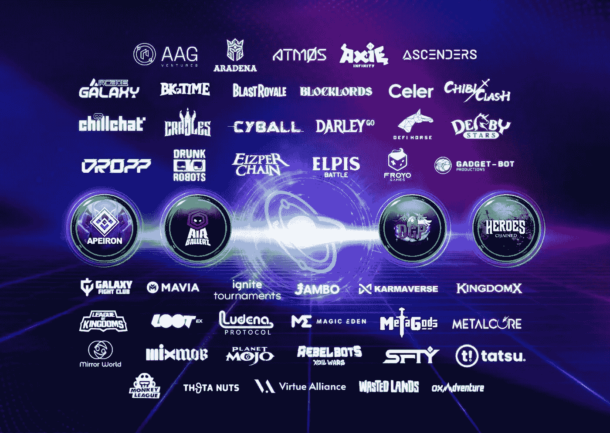

# web3 游戏中排名前三的公会和 Dao

> 原文：<https://medium.com/coinmonks/top-3-guilds-and-daos-in-web3-gaming-9089d77217f4?source=collection_archive---------43----------------------->

公会和 Dao 是 web3 游戏产业的命脉。以下是每个游戏玩家都应该知道的四大 web3 公会。让我们一个一个来看！

Top 4 Guilds & DAOs in Web3 Gaming

但首先，让我自我介绍一下:

**大家好，我是 Linh，Dreamerly(Twitter:**[**@ DreamerlyHQ**](https://twitter.com/DreamerlyHQ)**)的业务拓展。关注我们的 Twitter，了解关于 crypto 最新故事的有趣见解。**

或者，你可以在我们的 Twitter 上阅读这篇文章:

# 1/屈服公会——OG 公会

谈论 P2E 行会而不谈论 YGG 是不可能的。

事实:YGG 推广了奖学金模式，玩家可以借用 NFT 的资产进行游戏，然后与贷方分享奖励。

目前，YGG 财政部持有 2 . 06 亿美元的巨额资金。

YGG Guild

# 2/功绩圈——多面行会

Merit Circle 是最大的 web3 公会之一，拥有 1.58 亿美元的资金，在 Uniswap、Aave 和 Lido 等 DeFi 蓝筹股之后排名第七。精神错乱！

MC 采取多方面的方法，有四个支柱:投资、孵化、游戏和交易。

# 3/GuildFi——web 3 游戏的“网飞”

GuildFi 是一个社交平台，其使命是让 web2 游戏玩家加入 web3。

这是一个有趣的方法，因为它使 GuildFi 领先于 web3 游戏的前沿，而且没有直接的竞争。

超级牛！

# 4/鳄梨行会——行会宇宙中的新星

90K+和 11K 的学者，牛油果刀绝对不是闹着玩的。Avocado DAO 投资游戏中的 NFT，并将 NFT 借给公会成员以优化收益。它的投资组合中有 40 多项游戏投资

**关注我们**[**@ DreamerlyHQ**](https://twitter.com/DreamerlyHQ)**上推特了解更多！**

> 交易新手？尝试[加密交易机器人](/coinmonks/crypto-trading-bot-c2ffce8acb2a)或[复制交易](/coinmonks/top-10-crypto-copy-trading-platforms-for-beginners-d0c37c7d698c)