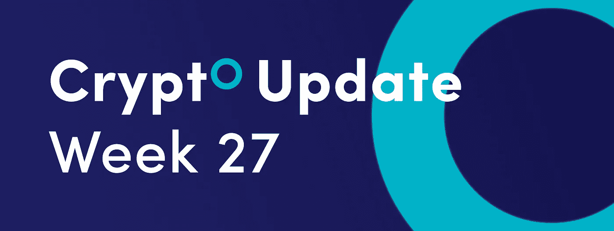
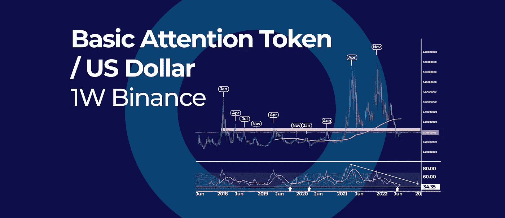
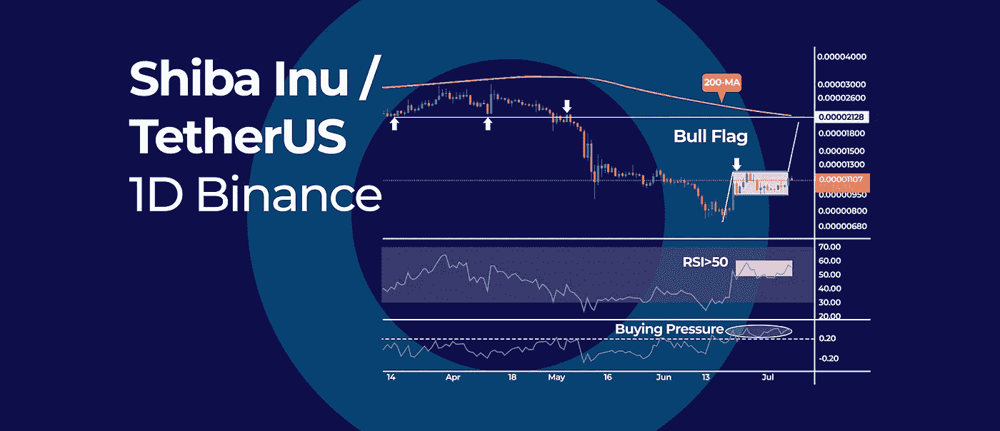
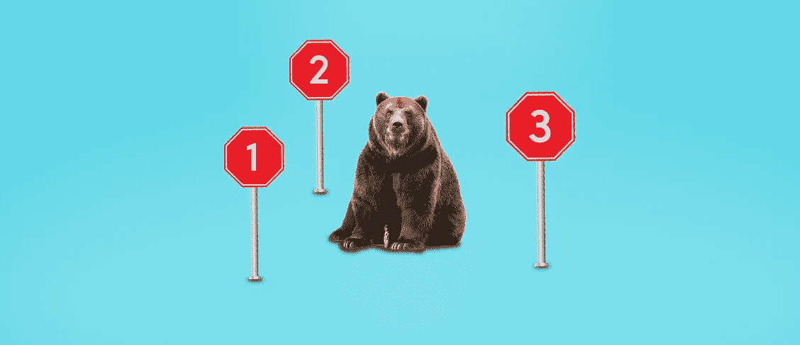

# 识别熊市结束的三大指标|以及本周更多的加密更新。

> 原文：<https://medium.com/coinmonks/top-3-indicators-to-identify-the-end-of-a-bear-market-and-more-in-this-weeks-crypto-update-20556af1e873?source=collection_archive---------12----------------------->

*   基本注意力标志正进入一个强劲的季节性阶段
*   柴犬延长牛市旗呼吁即将突破
*   识别熊市结束的三大指标

## 基本注意力标志正进入一个强劲的季节性阶段

基本注意力标志(BAT)正进入一个强劲的季节性阶段，可能导致价格在 7 月底和 8 月初达到顶峰。季节性趋势只是显示了英美烟草的价格模式在一个日历年中上升或下降。

> 交易新手？试试[加密交易机器人](/coinmonks/crypto-trading-bot-c2ffce8acb2a)或者[复制交易](/coinmonks/top-10-crypto-copy-trading-platforms-for-beginners-d0c37c7d698c)

## 蝙蝠季节性模式

从历史上看，BAT 盈利较多的月份是 1 月、4 月、7 月和 11 月。图表还显示，BAT 价格的这些季节性强势阶段导致了加密货币的顶峰。

同样有趣的是，1 月、4 月和 11 月是 BAT 价格创出新高的关键月份。

虽然这对英美烟草的价格来说是一个极好的季节性模式，但交易者也应该意识到我们将达到一个波动高点。

0.40 美元和 0.50 美元之间的区域是一个强大的支点，在过去既是阻力也是支撑。

## RSI 指标

就周线动能读数而言，我们已经在 35 水平附近的前两个最低 RSI 读数附近触底。然而，由于我们徘徊在 50 的中间水平，我们可以期待更多的整合。

请记住，季节模式可能不会总是重复，但它们是一个很好的指标，告诉我们未来可能会发生什么。

## 柴犬延长牛市旗呼吁即将突破

柴犬(Shiba)过去两周一直在盘整，没有明确的方向。然而，价格走势正在形成一个看涨的旗帜形态，如果得到确认，将会出现上涨。

## 看涨旗形

在牛市标志的情况下，我们有一个盘整期，通常要求价格在标志形成之前继续运动。旗帜整理大致建立在 0.0000121 美元阻力位和 0.0000095 美元支撑位之间。

只有当 SHIBA 价格突破上方水平阻力位时，多头旗形才会得到确认。通常，随后的反弹是与旗杆相同的价格长度。如果我们向上预测同样的价格运动，SHIBA 可以高达 0.00002 美元。

这个水平也很重要，因为它与 200 天简单移动平均线一致，价格可能会重新测试。

## 什么是公牛旗？

牛市标志是一种技术形态，可以在资产的价格图上找到。它类似于旗杆上的旗帜，被认为是一种持续形态，这意味着它通常出现在上升趋势中，预示着趋势将会继续。牛市形态的突破通常发生得很快，这就是为什么许多交易者关注这个形态。

## RSI 振荡器

相对强弱指数(RSI)似乎也保持在 50 的中等水平之上，显示出看涨的势头。与此同时，可以帮助我们监控一段时间内的积累-分配的柴金资金流(CMF)高于零水平，这意味着有更多的购买压力。

## 什么是 RSI 振荡器？

RSI 振荡指标是一种技术指标，用来衡量股价的动力。它用于识别市场中潜在的转折点。该指标基于股票在一定时期内的平均价格与当前价格之间的差异。如果现价高于均价，说明该股处于上升趋势。如果当前价格低于均价，则表明该股处于下跌趋势。

**展望未来:**虽然牛市标志模式尚未得到确认，但向下突破可能会使该模式无效，空头可能会尝试挑战当前在 0.000007 美元附近的低点。

## 识别熊市结束的三大指标

加密市场在其历史上经历了几次主要的熊市，每次都变得更强。在当前的熊市中更好地识别变化的信号。我们需要查看在之前的熊市周期中最准确的技术指标来预测价格底部。

## #1 200 天简单移动平均线

200 天简单移动平均线是全世界投资者和交易者广泛使用的最重要的移动平均线。日线突破并收盘于 200 日均线之上通常意味着熊市已经结束。资产价格在 200 天均线上方停留的时间越长，信号就越强。

## #2 RSI 振荡器

相对强弱指数(RSI)是另一个有用的技术指标，可以帮助投资者评估买卖压力。通常，RSI 反转信号在较长的时间框架内更强有力。

对于更保守的方法来说，周 RSI 突破 50 的中间水平可以确认熊市的结束。

## #3 移动平均乘数

另一个熊市底部指标是使用 4 年期 SMA，它跟踪 4 年减半周期。加密投资者最好使用月图上的 48 期 SMA (4 x 12 个月)。值得注意的是，每次比特币的价格跌破 48-SMA，然后突破 SMA，都标志着熊市的结束。

虽然很难准确指出熊市何时结束，但通过研究以前的熊市周期和价格底部，我们可以更好地评估当前熊市周期何时结束。

订阅我们的媒体每周博客和更新。
在[推特上关注我们](https://twitter.com/cryptohopper) | [脸书](https://www.facebook.com/cryptohopper)|[Reddit](https://www.reddit.com/r/CryptoHopper/)|[insta gram](https://www.instagram.com/cryptohopper/?hl=nl)

在 [Cryptohopper](https://www.cryptohopper.com/) 开始交易！