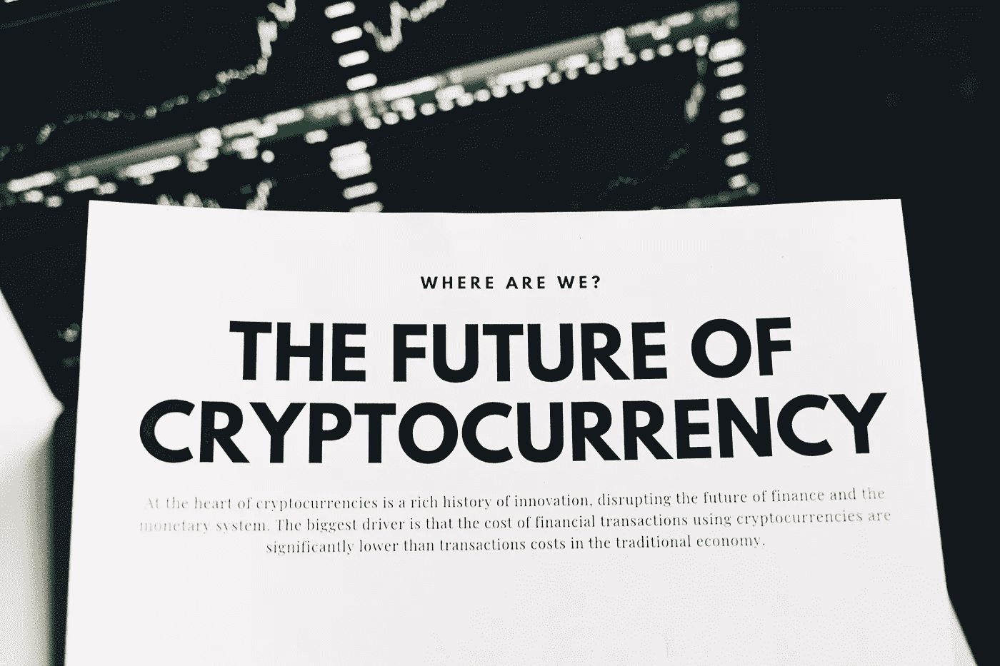

# 2022 年圣诞节前三大投资

> 原文：<https://medium.com/coinmonks/top-3-investments-for-christmas-2022-f252a0be334d?source=collection_archive---------27----------------------->

Source photo [A Cryptocurrency Advertisement on White Paper · Free Stock Photo (pexels.com)](https://www.pexels.com/photo/a-cryptocurrency-advertisement-on-white-paper-6771243/)

# 比特币(BTC)

根据各自市场的价值，比特币现在是最有价值的加密货币。尽管这是一项危险的投资，但这是大多数加密硬币的工作方式。比特币令人瞠目的利润使其极具吸引力，如今比特币的交易量仍然很大。这并不是说这枚硬币没有经历过坎坷。