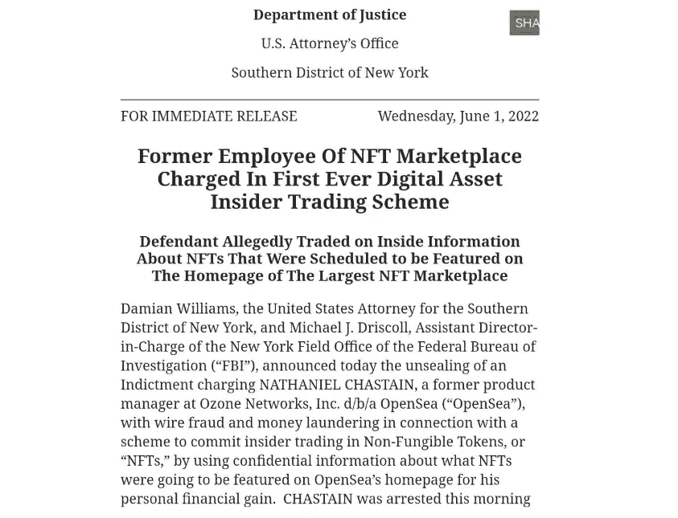
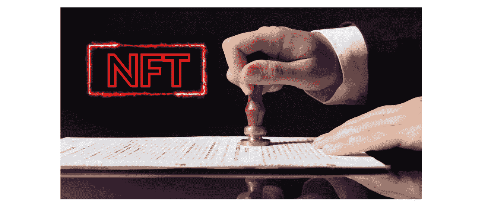

# 2022 年涉及非关税壁垒的三大法律诉讼 EN: 03

> 原文：<https://medium.com/coinmonks/top-3-legal-actions-involving-nfts-in-2022-fb34576bac97?source=collection_archive---------63----------------------->

近年来，不可替代令牌(NFT)的使用越来越受欢迎，NFT 被用于从数字艺术和收藏品到房地产和加密货币的一切领域。虽然大部分注意力都集中在非森林技术的创造性和经济潜力上，但也有一些涉及非森林技术的法律诉讼在很大程度上被忽视了。这里有三个例子:

# NFTs 内幕交易:

在此类首批案件中，一名 Opensea 平台的前经理被指控与 NFTs 进行内幕交易。据称，该个人知道平台上将发布哪些藏品，并会提前购买，以便从随后的价格上涨中获利。

# **扣押和禁运非关税壁垒:**

在英国，三家非关税壁垒被*【冻结】*在所有者被发现逃税达 140 万英镑(190 万美元)后。与此同时，在一起涉及知识产权的案件中，西班牙司法系统查封了属于时尚公司 Grupo Mango 的 NFTs。

该公司拥有实体艺术品，问题是这是否给了他们以 NFT 形式创建虚拟复制品的权利。

> 交易新手？在[最佳加密交易](/coinmonks/crypto-exchange-dd2f9d6f3769)上尝试[加密交易机器人](/coinmonks/crypto-trading-bot-c2ffce8acb2a)或[复制交易](/coinmonks/top-10-crypto-copy-trading-platforms-for-beginners-d0c37c7d698c)

# 带有非功能性食物的法院通知:

在法律案件中，非功能性交易也被用作一种通知手段，例如针对币安的欺诈案和针对 LCX 交易所的黑客攻击。在最后一个案例中，纽约州最高法院针对 LCX 交易所价值 800 万美元的黑客攻击发出了命令。临时禁止令已经通过 NFT 空投送达给了一名匿名黑客。

这些例子表明，虽然 NFTs 可能是一种新的和令人兴奋的技术，但它们也不能避免法律问题和争议。未来几年，围绕非专利技术的法律前景会如何发展，这将是一件有趣的事情。