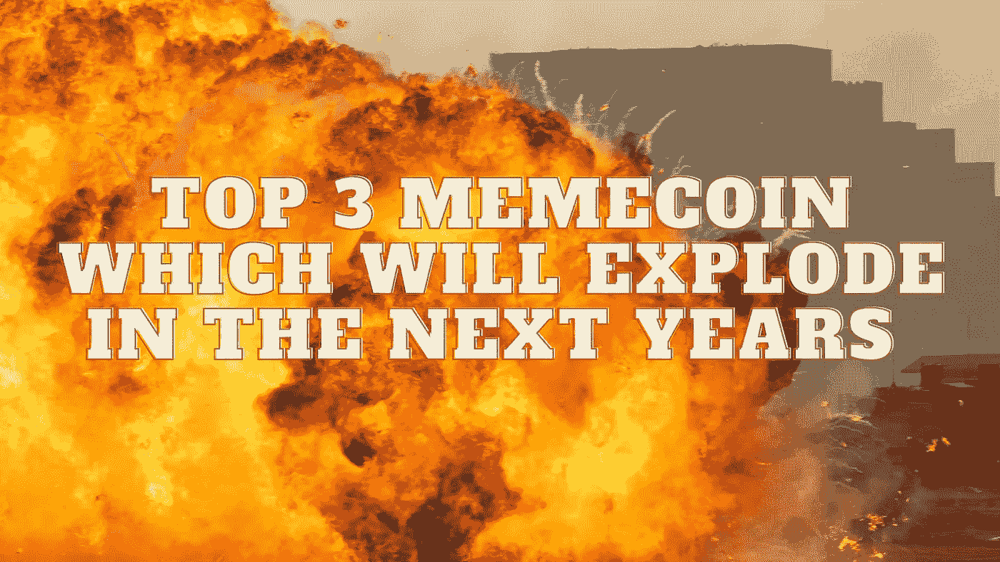

# 未来几年将会爆发的前三名 MemeCoin

> 原文：<https://medium.com/coinmonks/top-3-memecoin-which-will-explode-in-the-next-years-ebb4adb007ec?source=collection_archive---------14----------------------->

Source photo Unsplash.com

# 柴犬(SHIB)

柴犬在 2020 年的推出给 meme 币战增添了一些戏剧性。根据柴犬的秘密发明者 Ryoshi 的说法，这只狗诞生于一项公共实验。这是努力取代 Dogecoin 作为主导的迷因加密货币，并用柴犬取而代之的一部分。