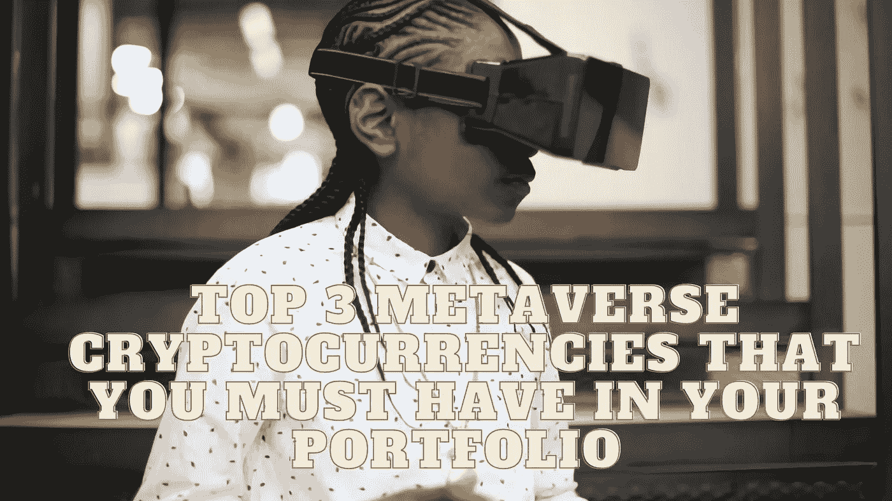

# 你的投资组合中必须拥有的前三种元宇宙加密货币

> 原文：<https://medium.com/coinmonks/top-3-metaverse-cryptocurrencies-that-you-must-have-in-your-portfolio-dea2535827ec?source=collection_archive---------16----------------------->

Source photo Unsplash.com

# 猿

宇迦实验室于 2022 年推出 ApeCoin 这是一个 ERC-20 代币，在 BAYC 和其他元宇宙比赛中使用。宇迦实验室在一次数字财产拍卖中筹集了大约 3.2 亿美元，APE 令牌持有者可以使用令牌在另一边购买土地。这些地块被称为“其他土地”。