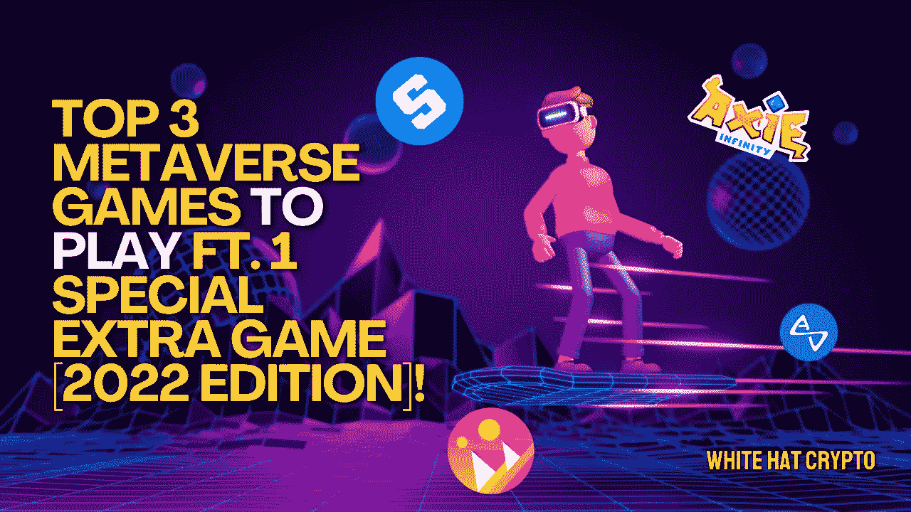

# 玩 ft 的 3 大元宇宙游戏。1 特别额外游戏【2022 版】！

> 原文：<https://medium.com/coinmonks/top-3-metaverse-games-to-play-ft-1-special-extra-game-2022-edition-a4861f720e95?source=collection_archive---------24----------------------->

由于加密冬季，元宇宙现在暂停，但这些是最好的元宇宙游戏！

随着几款由区块链技术支持的元宇宙游戏的推出，在线游戏正呈现出一种新的形式和身份。

元宇宙是一个完全虚拟世界的美好愿景，在这个世界中，人们可以像在现实世界中一样相互交流。在许多方面，视频游戏已经是元宇宙的许多方面的原型，例如化身、数字货币和数字对象的交换。

让我们来看看今年最吸引人的三款元宇宙游戏吧！(**这次多了一个功能！**)

# 分散土地:

[分散王国](https://decentraland.org/)是一款在区块链以太坊(ETH)推出的“玩到赚”(P2E)游戏，基于元宇宙虚拟世界的概念。

在游戏中，你可以购买各种各样的物品，包括虚拟土地，这些土地被恰当地命名为“**土地**”当你购买这些空间，你将获得土地作为 ERC-721 令牌，通常被称为不可替代令牌(NFT)。

因为土地是不可替代的，没有人能生产出它的复制品，即使是分散土地的设计者，你是唯一的所有者。然而，要在分散之地购买土地，你必须使用游戏的官方加密货币 [**法力**](https://coinmarketcap.com/currencies/decentraland/) 。

你可以参与这个游戏，并以多种方式收到钱。例如，你可以拥有一个广告位，并向其他人收取广告费用。你也可以建造设施，比如体育馆，供个人举办活动，或者你可以等待土地升值，然后出售获利。

# 沙盒:

[沙盒](https://www.sandbox.game/en/)只是以太坊网络上开发的另一款知名元宇宙游戏。像史努比·多格这样的明星，他们在游戏中成功举办活动并拥有 NFT 收藏品，为它的名气做出了贡献。

沙盒类似于分散土地，因为它提供了一个数字区块链驱动的世界，人们可以购买数字房地产和其他商品，然后出售或出租它们以获取利润。

在沙盒中，您可以购买空间，举办活动，并在各种 NFT 中进行交易，为您提供边玩边赚钱的机会。游戏的原生令牌叫做[和](https://coinmarketcap.com/currencies/the-sandbox/)，它允许你在玩游戏的同时进行交易。

# 无限轴:

毫无疑问，Axie Infinity 是当今最受欢迎的元宇宙游戏。

Axie Infinity 基于以太坊，允许用户获得、繁殖被称为“Axie”的“怪物”，并与之战斗，axie 是游戏的主要玩家。这个过程也包括收集各种不同的 axis，让他们与其他 axis 战斗，甚至建造一个王国让他们居住。

游戏建立在元宇宙密码 [SLP](https://coinmarketcap.com/currencies/smooth-love-potion/) 和 [AXS](https://coinmarketcap.com/currencies/axie-infinity/) 之上，这是游戏中可以转移到其他加密货币的代币。

当你购买更多的斧头，参加战斗或冒险等等时，这些代币使你能够在游戏中交换和挣钱。你必须至少有 AXS 3 才能玩这个游戏。

# **新兴游戏:输了**

我们在这个博客中展示的特别游戏是[输了](https://losthk.com/metaverse-%e5%85%83%e5%ae%87%e5%ae%99/)！

元宇宙的第一个逃生室游戏是由 LOST 制作的，这是一家总部位于香港的现实生活中的逃生游戏公司。

游戏有现实的冒险任务，可以在线和离线访问，允许你在现实和虚拟世界之间转换。当你这样做的时候，你也可以获得元宇宙代币和某些非功能性货币。

《迷失》的灵感来自虚构、神话和历史事件。你解决谜题和谜语，揭开宝箱，发现秘密和提示，而玩游戏。所有这些都有助于你进入密室。

该游戏的一些最大的功能包括建立小组和共同完成任务的能力，以及玩家在元宇宙创建自己定制的密室的潜力。

此外，这款游戏是通用的，因为它有一个名为“迷失少年”的版本，是为 6 至 14 岁的儿童设计的。当孩子们在《迷失少年》的冒险中前进时，他们开始积极地学习。

这篇文章中提供的内容不是赞助的，据我所知是正确的。这篇文章不是金融建议，我们不对针对这篇文章采取的任何行动负责！

请随时查看我们的社交平台，了解每日加密更新，或通过以下渠道联系我们:

[YouTube](https://www.youtube.com/channel/UCjfinzatswbVaRd89zn5kJQ/featured)

[推特](https://twitter.com/whitehatcrypto)

[Instagram](https://instagram.com/white.hatcrypto?igshid=YmMyMTA2M2Y=)

[Gmail](http://cryptowhitehat@gmail.com/)

信息来源:CoinMarket Cap，Crypto News，Alex Lielacher 等

> 交易新手？试试[密码交易机器人](/coinmonks/crypto-trading-bot-c2ffce8acb2a)或[复制交易](/coinmonks/top-10-crypto-copy-trading-platforms-for-beginners-d0c37c7d698c)