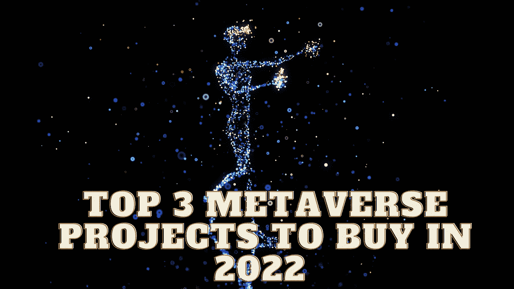

# 2022 年元宇宙三大买入项目

> 原文：<https://medium.com/coinmonks/top-3-metaverse-projects-to-buy-in-2022-c26b9479adb2?source=collection_archive---------24----------------------->

Source photo Unsplash.com

# Sandbox (SAND)

在基于以太坊的视频游戏 Sandbox 中，玩家可以使用不可替换的代币(NFTs)宣称虚拟土地是他们自己的。沙盒的一个显著特点是，即使是很少或没有技术知识的人也可以制造和销售自己的虚拟现实 NFTs。