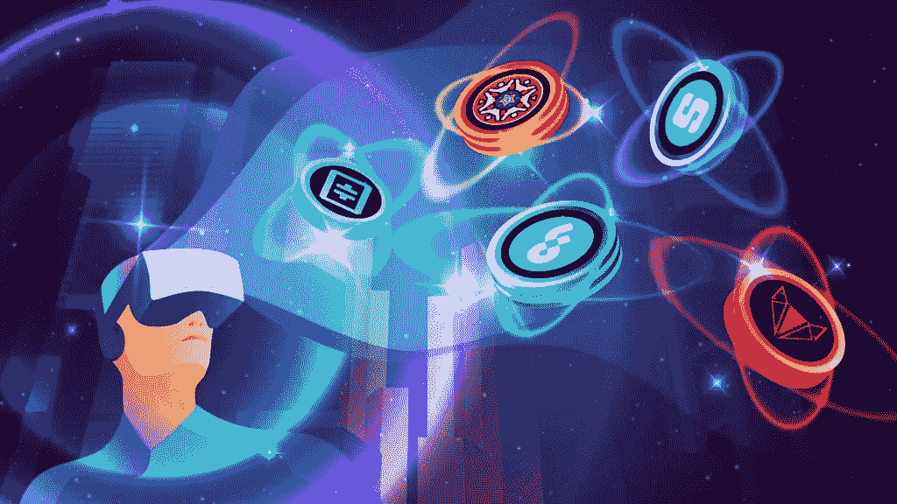
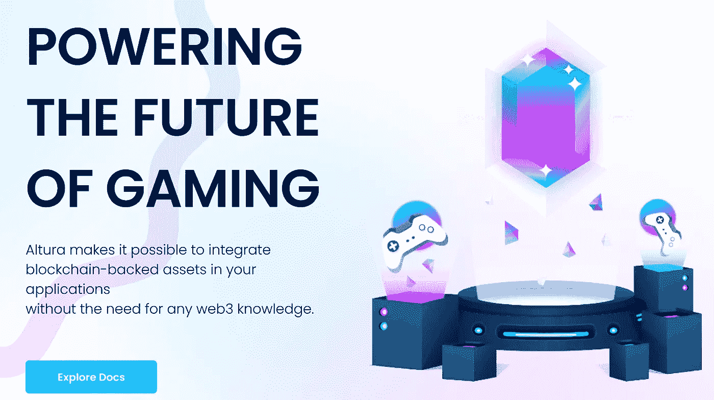
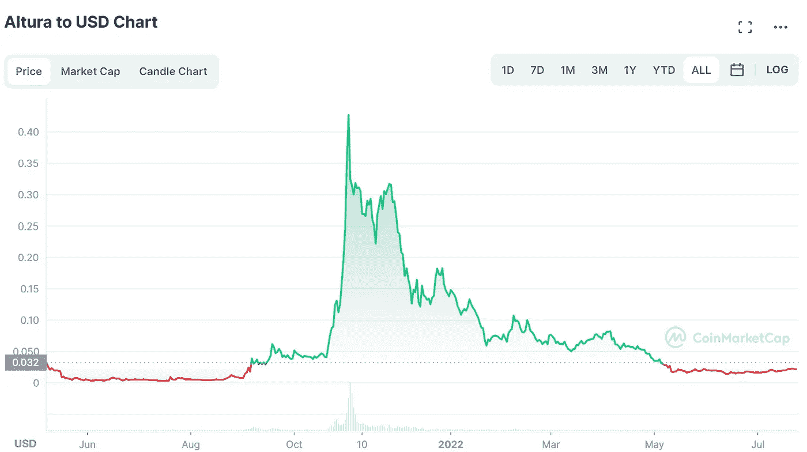
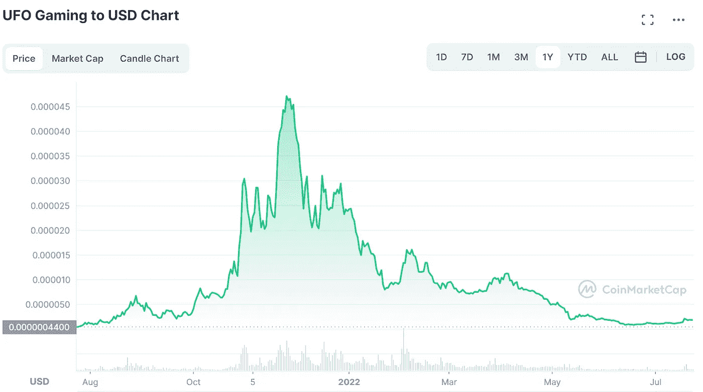
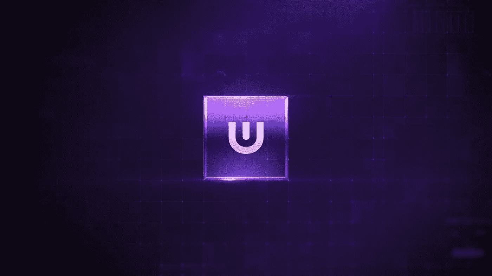
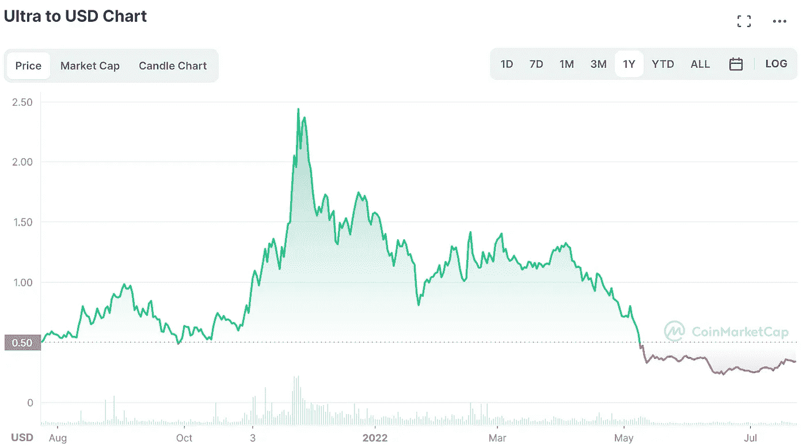

# 我们现在购买的前三个元宇宙项目

> 原文：<https://medium.com/coinmonks/top-3-metaverse-projects-were-buying-right-now-43a0f57989c9?source=collection_archive---------0----------------------->

Many Metaverse cryptos have been soaring significantly over the last 2 weeks. Here are some **great coins** we have our eyes on.

在过去的两周内，加密货币市场经历了一波**小幅缓解反弹**，其中**比特币**上涨 **+20%** 和**以太坊**上涨 **+51%** 。然而，收益最高的加密货币是 GameFi 和元宇宙领域的项目。这主要是因为围绕元宇宙的叙述仍然非常强劲，许多有前途的项目比 T21 的历史高点下跌了 90%。在这里，我们向您展示了过去两周我们在 Crypto Hub 一直在购买的 3 个伟大项目，我们认为这些项目将成为下一轮牛市的主导项目。

# 1.阿尔图拉

Altura aims to disrupt the ownership aspect of in-game items with the help of **Smart NFTs**.

Altura 是区块链的一个项目，旨在彻底改变游戏的所有权。鉴于 2020 年全球有 26.9 亿游戏玩家，分析师估计这一数字将在 2023 年上升至 30.7 亿，Altura 的潜在市场份额是无限的。随着**最新趋势**在被称为“ **GameFi** 或**区块链游戏**的 Cryptoverse 中，游戏内物品将不再归游戏公司所有，而是归玩家自己所有。

Altura 创建了**智能 NFT**，它基本上是具有动态属性的 NFT，可以根据特定条件进行更改。在 Altura 的智能合同平台和他们的智能 NFT 技术的帮助下，游戏开发者会发现**更容易**到**造币**，**分发**和**处理**他们的游戏内物品。该团队目前正在开发一个买卖和发送 NFT 的市场。

Altura has reached a great buying point in our view.

Altura 的本地加密货币 **$ALU** 目前的交易价格约为 **$0.02** ，低于去年 11 月的历史高点 **$0.43** 。他们的市值目前为 1330 万美元。随着 Altura 的**强大的社区**和**对 GameFi 领域有用的应用**，我们相信$ALU 将在下一轮牛市中大幅增长。

# 2.飞碟游戏

UFO Gaming was created as a memecoin and has become a major player in the GameFi sector

**UFO 游戏**最初是作为一个 memecoin 创建的，现在已经成为**区块链游戏**领域最大的玩家之一。

> 他们的**主要目标**是**通过开发和实现新的游戏功能来弥合传统游戏和区块链游戏之间的差距**，这给了游戏玩家**在玩**的同时赚取资产 (NFTs，加密货币)**的机会。**

UFO 游戏的关键发展之一是他们的“**黑暗元宇宙**”，这是一个**虚拟世界**，玩家可以通过玩不同的游戏和进行某些游戏内活动来赚钱。在黑暗的元宇宙推出的第一款游戏是**超级银河**，一款拥有自己的 NFT 系列的 RPG 动作游戏。

Despite the large decline of the $UFO coin, UFO Gaming still has a market cap of $49 million

他们的公用事业权标 **$UFO** 目前的交易价格为 0.0000019 美元，比去年 11 月创下的历史高点**下跌了 96%** 。尽管$UFO 的价格大幅下降，但他们的团队仍在继续建设,UFO 游戏拥有 GameFi 世界中最大的社区之一。凭借 4900 万美元的市值，UFO 有很大的上升空间。

# 3.极端主义者

Ultra tries to be the Steam of the crypto world by offering top rates for game developers

Ultra 是一家旨在借助区块链技术颠覆个人电脑游戏产业的公司。他们与育碧、AMD、雅达利、沙盒等游戏公司有着巨大的合作关系，这使得他们成为 GameFi 领域最大的加密项目之一。

> **Ultra** 正在将**区块链革命**带到**游戏产业**并为游戏发行的未来创造一个公平的生态系统

Ultra 试图解决的问题是给特定游戏的开发者更多的钱。虽然游戏发行商如 **Steam** 、 **Google** 或 **Apple** 从开发者的游戏中抽取 **30%的收入**，但 Ultra 只从收入中抽取 **12%** 。这使得开发者在 Ultra 的平台上托管他们的游戏变得更有吸引力。

Ultra has held the $0.25 support line strong. This might have been the bottom for this bear market

Ultra 的加密货币 **$UOS** 目前的交易价格为 **$0.34** ，低于其 11 月份的**历史高点**的 **$2.44** 。由于 Ultra 已经是加密领域的一个成熟项目，它的市值为**1 . 04 亿美元**，这使它成为**第 15 大**元宇宙项目。我们相信，一旦加密市场开始复苏，Ultra 将打破其旧的历史高点，因为他们的**巨大的合作伙伴关系**、**伟大的团队**和**颠覆传统游戏行业的创新解决方案**。

💰欢迎关注我们 获取更多此类分析

🐦也可以查看我们的 [**推特账号**](https://twitter.com/CryptoHub210?s=20&t=ts3bUBYtX7g0s5_ClYnL_A) 获取更简短的分析

🤑加入我们的 [**电报频道**](https://t.me/officialcryptohub) 与志同道合者互动

🌟订阅我们的 [**YouTube 频道**](https://www.youtube.com/channel/UCprIoxgUXQ0OwXUEBnstpkQ) 获取每日加密相关视频

> 交易新手？尝试[加密交易机器人](/coinmonks/crypto-trading-bot-c2ffce8acb2a)或[复制交易](/coinmonks/top-10-crypto-copy-trading-platforms-for-beginners-d0c37c7d698c)