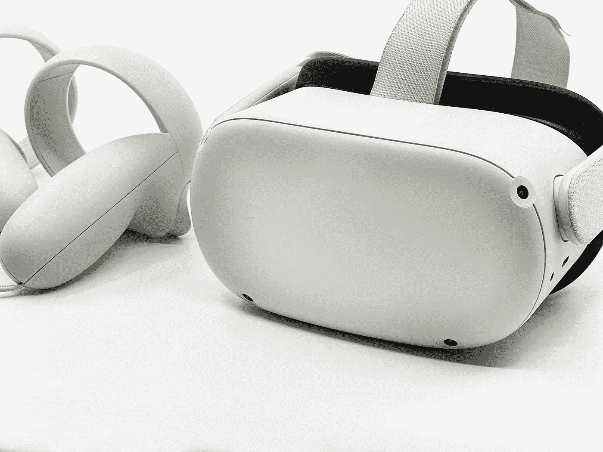

# 2022 年买入的三大元宇宙股票

> 原文：<https://medium.com/coinmonks/top-3-metaverse-stocks-to-buy-in-2022-102e7df6c1c3?source=collection_archive---------21----------------------->

Source photo [HD photo by Mediamodifier (unsplash.com)](https://unsplash.com/photos/xBRtGqIjRG8)

# 元平台

在 2021 年 12 月宣布将更名为元平台后，脸书正式进入了元宇宙时代。该公司已经以 Oculus 的形式发布了一款商业上成功的虚拟现实耳机，并正在对沉浸式技术的进一步发展进行重大投资。