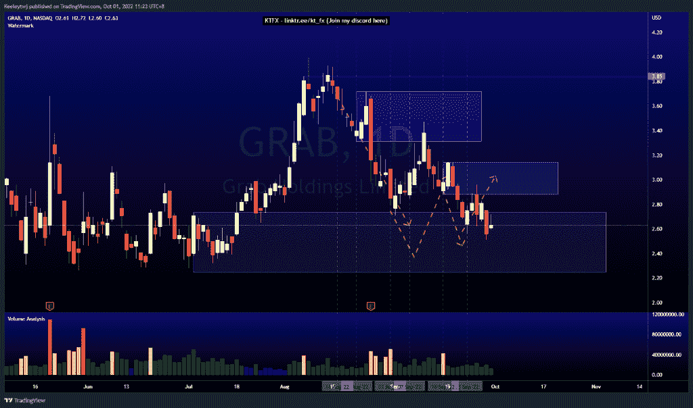
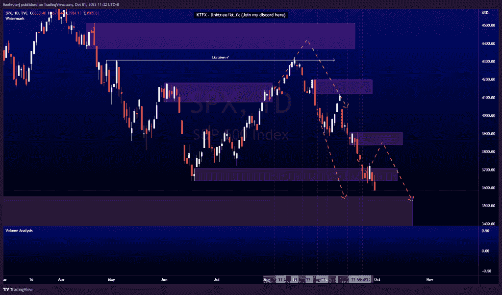
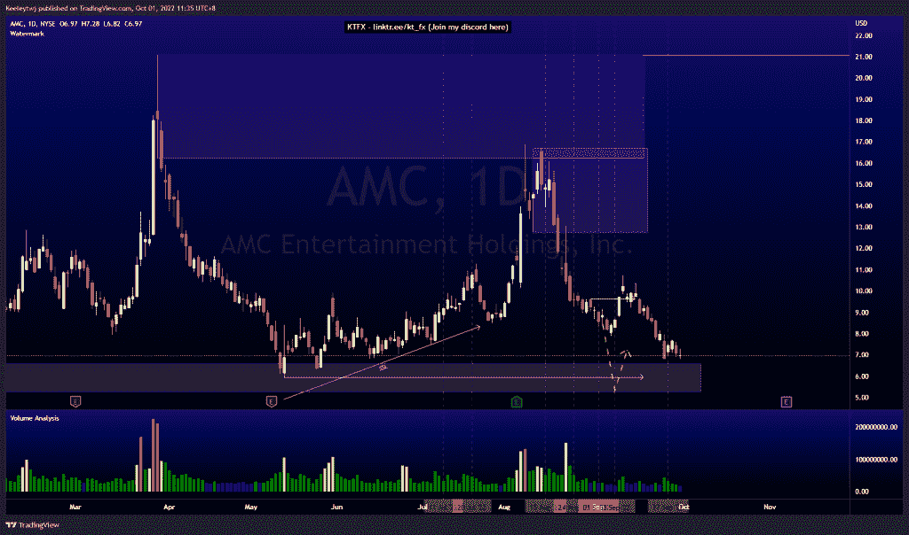

# 前 3 名月度分析—2022 年 9 月#GRAB #SPX #AMC

> 原文：<https://medium.com/coinmonks/top-3-monthly-analysis-september-2022-grab-spx-amc-e5b5b3d966e1?source=collection_archive---------25----------------------->

在这里找到更多关于我的信息(YouTube/Discord/Telegram):[https://www.linktr.ee/keeleytan](https://www.linktr.ee/keeleytan)

如果你觉得我的帖子有帮助，如果你能在这个帖子上给我一个赞，并关注我以后的类似帖子，我将不胜感激。如果您有任何意见/反馈，请随时使用上面的谷歌表单链接。

不和谐的免费信号服务正式启动。如果有兴趣，请到我的不和谐来看看！

#抓取

自 8 月中旬以来，价格在我的分析中表现良好，在选定的 POI 上反弹良好。自 2022 年 8 月 16 日我第一次分析以来，价格已经下跌了 28.14%。

#SPX

根据我 9 月初的分析，价格已经下跌了 10.79%。这符合我看跌的宏观论点，触及 3549.85 点的第一个目标即将实现。

#AMC

自从我在 9 月初进行分析以来，价格表现相当不错，自那以来下跌了 18.76%。我最初在 6.59 降低 POI 的论点仍然成立，并可能在 5.96 消除低点。

希望你已经利用了我这周的分析。喜欢，分享，评论如果你是盈利的！我在考虑尝试在 discord 上提供免费信号服务。

让我知道，如果你有任何你想让我分析的行情。

一定要在其他社交平台上看看我，我在交易、分析和心理学上发布内容。看看我这里:【https://www.linktr.ee/keeleytan】T2

【http://2minutesliteracy.wordpress.com】原载于 2022 年 10 月 1 日**。**

> *交易新手？尝试[加密交易机器人](/coinmonks/crypto-trading-bot-c2ffce8acb2a)或[复制交易](/coinmonks/top-10-crypto-copy-trading-platforms-for-beginners-d0c37c7d698c)*