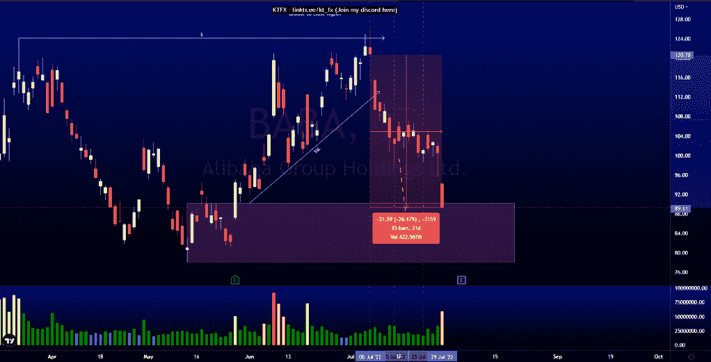
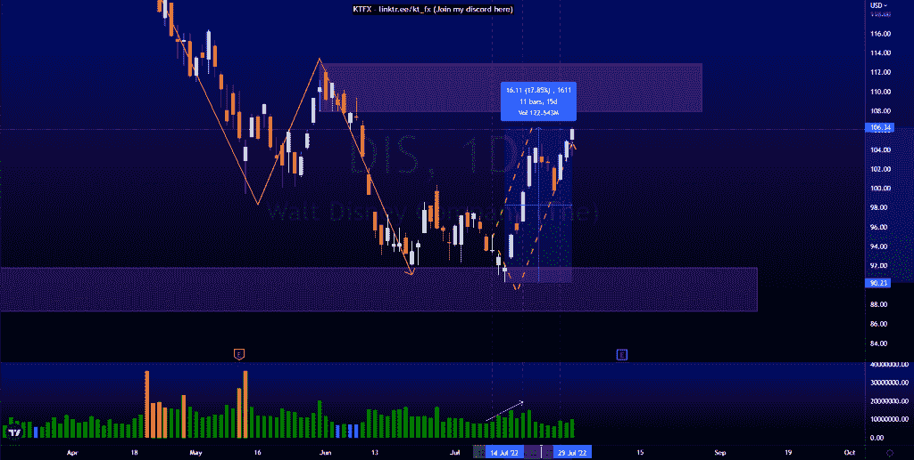
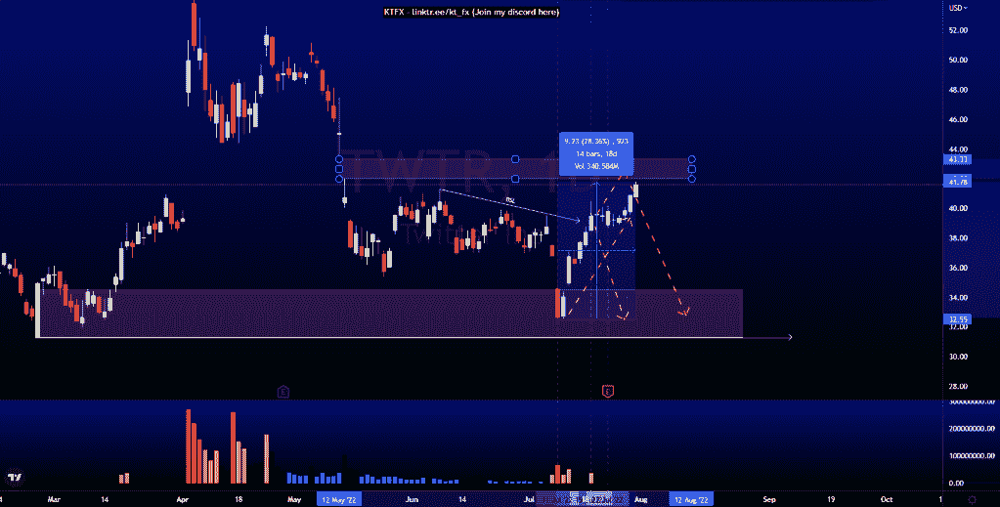

# 前 3 名月度分析$ TWTR $迪斯$巴巴

> 原文：<https://medium.com/coinmonks/top-3-monthly-analysis-twtr-dis-baba-89c231ced043?source=collection_archive---------26----------------------->

在这里找到更多关于我的信息(Youtube/discord):[https://www.linktr.ee/kt_fx](https://www.linktr.ee/kt_fx)

$巴巴

价格完全按照分析做了。要求在 2022 年 7 月 8 日做空，因为价格无法收于 124.11 上方，造成流动性短缺。价格如预期下跌，消除了卖方建立的流动性，目前正在缓解 90.17 的看涨点。自 2022 年 7 月 8 日的电话会议以来，价格已上涨 26.17%。

$DIS

价格完全按照分析做了。在 2022 年 7 月 12 日，我预计价格将触及 91.80 的看涨点，然后反弹到 107.91 的看跌点。价格减轻了看涨的兴趣点，并立即反弹向上。在看涨 POI 的缓解下，价格从低点移动了 17.85%。

$TWTR

价格完全按照分析做了。2022 年 7 月 11 日，我们在 34.53 向下跳空进入看涨 POI。由于普莱斯积累了大量买方流动性，我预计它们会被取出来。正如分析的那样，价格从这个看涨点大幅反弹，我的目标是价格正在接近的 43.33 的公允价值缺口。自 2022 年 7 月 11 日的电话会议以来，价格已上涨 28.36%。

所有的分析都可以在我的简介和不和谐中找到。

让我知道你是否同意和你的想法。如果你持有这些公司中的任何一家，就可以点赞、分享和评论！让我知道，如果你有任何你想让我分析的行情。一定要在其他社交平台上看看我！

*原载于 2022 年 7 月 30 日*[*【http://2minutesliteracy.wordpress.com】*](https://2minutesliteracy.wordpress.com/2022/07/30/top-3-monthly-analysis-twtr-dis-baba/)*。*

> 交易新手？尝试[加密交易机器人](/coinmonks/crypto-trading-bot-c2ffce8acb2a)或[复制交易](/coinmonks/top-10-crypto-copy-trading-platforms-for-beginners-d0c37c7d698c)