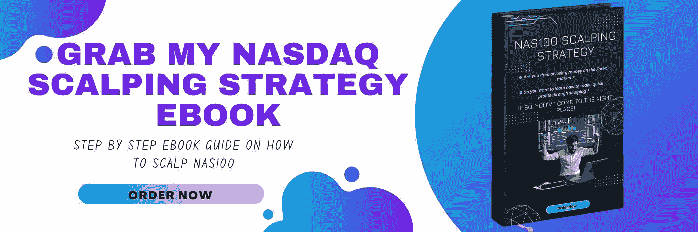
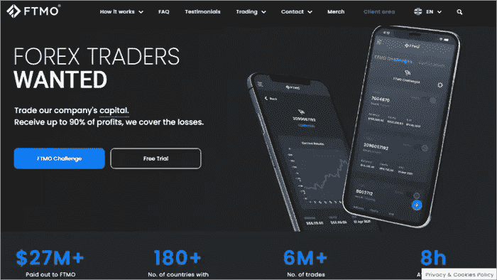
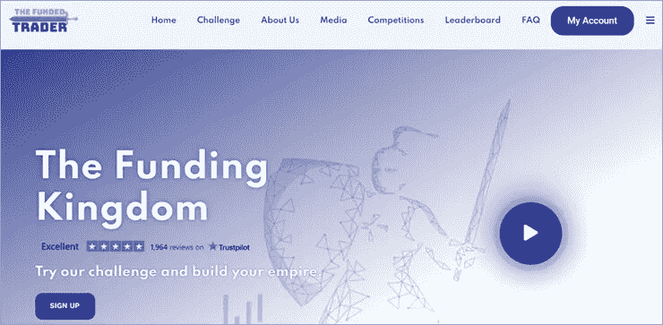

# 2023 年前三大道具交易公司

> 原文：<https://medium.com/coinmonks/top-3-prop-trading-firms-in-2023-9350e9f9bd86?source=collection_archive---------3----------------------->

[自营交易](https://www.nasdaqstrategy.com/2022/12/toptradingfirms.html)是企业或机构将其自有资金投资于股票、债券、商品和其他金融工具的交易活动。自营交易的风险系数高，获利机会也大。选择一家自营交易公司从来都不是一件容易的事情，尤其是如果你是一个初学者，并且想从投资中获得最大收益。为了帮助你，我们列出了一些最好的自营交易提供商。这将使你在网上寻找最好的私有公司的任务变得容易。

以下是精选的[顶级自营交易公司](https://www.nasdaqstrategy.com/2022/12/toptradingfirms.html)名单，以及它们受欢迎的功能和网站链接。

**1-** [**MyForex 基金**](https://myforexfunds.com/?wpam_id=109476)

我的外汇基金为加入交易的交易者提供即时资金。客户不仅可以获得利润分成，还可以获得奖金。[资金计划](https://www.nasdaqstrategy.com/2022/12/toptradingfirms.html)是根据个人的交易经验定制和选择的。交易者可以以较低的进入成本加入该平台，甚至可以在获得更多交易经验的同时赚钱。

该公司专门从事外汇、差价合约或差价合约、指数以及金属等大宗商品的交易。

**利润分割:**高达 85%。

> 交易新手？在[最佳加密交易](/coinmonks/crypto-exchange-dd2f9d6f3769)上尝试[加密交易机器人](/coinmonks/crypto-trading-bot-c2ffce8acb2a)或[复制交易](/coinmonks/top-10-crypto-copy-trading-platforms-for-beginners-d0c37c7d698c)

## 特点:

*   高利润分割使其适合亲自营交易者。
*   通过评估证明你的交易经验。
*   加速交易更适合全职交易者。
*   与 MetaTrader 4 和 5 进行交易。
*   支持交易的工具包括 discord 聊天、博客、见解和 24/7 交易者支持。
*   使用加密支付——BTC、瑞士联邦理工学院、BTC 和 LTC。
*   模拟账户是基于真实的市场条件。
*   第一次支付是在第一次交易后的 30 天。之后，在第 2 阶段支付利润目标的 4 %, 112%作为购买费用退款返还，第一个月利润分成 75%。
*   加速计划为交易者提供资金——从 2，000 美元到 5，000 美元不等，并将您的资本增加到最高 200 万美元。rapid 计划是针对测试人员的，评估计划也有 10，000 到 200，000 美元的资助，尽管客户可以将他们的帐户增加到 600，000 美元。
*   有保证的资金因目标而异。
*   杠杆高达 100 倍，取决于选择的计划。
*   对于超过 5 天的帐户，每周获得 50%的帐户利润。通过 PayPal、银行、TransferWise 或 crypto 付款。

## 优点:

*   该账户为初级、中级和专业交易者提供保障。
*   经济实惠的评估成本—在同等资本水平下，比 FTMO 便宜 25%。
*   高利润分割、即时融资、低利润目标——第一阶段 8 %, 5%进入资金账户。
*   120 个国家的 40，000 笔交易。

## 缺点:

*   缓慢的客户服务。
*   提款是基于权益，而不是账户余额。

**成立日期:** 2020 年

**总部:**加拿大安大略省多伦多市。

**收入:不可用**

**员工:**不可用

**费用/成本:**$ 2000 到$ 50000 交易账户目标的一次性注册费为$499 到$ 2450。

> [**访问我的外汇基金**](https://myforexfunds.com/?wpam_id=109476)

**2-**[**FTMO**](https://trader.ftmo.com/?affiliates=QHNQhLPBbGjwgAlXarjx)

[FTMO](https://trader.ftmo.com/?affiliates=QHNQhLPBbGjwgAlXarjx) 让人们通过 FTMO 挑战和验证课程来学习和发现他们的[外汇交易](https://www.nasdaqstrategy.com/)才能，之后他们会被邀请加入自营交易公司并管理公司的交易账户。此外，一旦客户开始交易，该公司会聘请绩效教练，进行账户分析以及其他工作，以帮助他们。

作为一个交易者，你 90%的利润来自与公司及其工具的交易。客户也接受如何管理交易风险的培训。因此，它被列为最佳自营交易公司之一。

**利润分成:**高达 90%。

**功能:**

*   最高资本 40 万美元。
*   周末或微观经济发布期间没有持仓限制的摇摆账户。
*   账户余额限额每四个月增加 25%。扩展计划确保了长期的业务关系。
*   80:20 的支付比率。当 FTMO 帐户余额限额增加时，它调整到 90:10。
*   为交易者开发的定制应用。有些帮助他们自律，有些是用来写日志的，还有一些是用来分析市场的。
*   1:100 的杠杆交易使其成为最好的外汇自营交易公司之一。
*   低利差。
*   一次性费用使其成为初学者最好的自营交易公司之一。
*   支出每月一次。

**优点:**

*   包括散户在内的客户可以使用 MT4、MT5 和 CTrader 交易工具。
*   流动性提供商向客户提供数据，为渴望在交易中赚更多钱的交易者模拟真实的市场环境。
*   该平台支持交易加密以及外汇、指数、商品、股票和债券。
*   大约有七种支付方式可供选择，包括银行转账和 Skrill。

**缺点:**

*   与其他选项相比，成本更高。
*   你不能在市场周末收盘时持有交易，除非你使用摇摆交易者挑战。

**成立:** 2014 年

总部:捷克共和国普拉哈

收入:1400 万美元

员工人数:51-200 人

**费用/成本:从免费到 155 英镑不等。**

> [**拜访 FTMO**](https://trader.ftmo.com/?affiliates=QHNQhLPBbGjwgAlXarjx)

[**3-资金交易员**](https://dashboard.thefundedtraderprogram.com/?sl=3309)

资助交易者计划完全是另一个怪物。众所周知，FTP 不规范你的交易风格。他们也给予交易者持有隔夜交易、新闻交易和周末交易的特权。prop 公司向其交易员提供了两种融资方案。

首先，有标准的挑战账户，旨在识别熟练的交易者。然后，这些交易员会根据他们在两阶段评估期间的一致性获得奖励。评估计划帐户允许交易者以 1:200 的杠杆进行交易。

然后是快速挑战账户，它的目的也是识别认真的交易者，并奖励他们在两阶段评估期间的一致性。唯一不同的是，这里允许交易者以 1:100 的杠杆进行交易。这一点，再加上宽松的交易规则，使得基金交易项目成为最好的自营交易公司。

**利润分割:**高达 90%

**功能:**

*   标准的最大资本:60 万美元
*   高达 200:1 的杠杆比率
*   允许新闻交易
*   允许周末交易和隔夜交易
*   最高资本:1，500，000 美元，含扩展计划。

**优点:**

*   非常宽松的交易规则。
*   他们的缩放计划具有诱人的好处，允许交易者持有高达 1，500，000 美元的最大余额和 90%的利润分成。
*   支持多种交易工具，如外汇对、指数、加密货币等。

**缺点:**

*   客户支持需要工作。

**成立:【2021 年 5 月**

**总部:**美国佛罗里达州劳德代尔堡

**收益:NA**

**员工规模:**1-10 人

**费用:50K 美元账户 315 美元。**

> [**拜访基金交易员**](https://dashboard.thefundedtraderprogram.com/?sl=3309)

