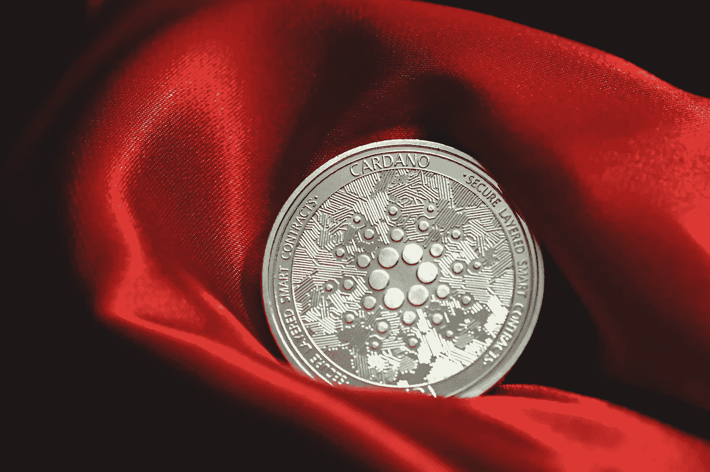

# 2022 年购买卡达诺(ADA)的三大理由

> 原文：<https://medium.com/coinmonks/top-3-reasons-for-buying-cardano-ada-in-2022-6147cacf7733?source=collection_archive---------18----------------------->

Source photo Unsplash.com

卡尔达诺区块链发行的代币用 ADA 符号表示。吉罗拉莫·卡尔达诺是在这里获得荣誉的意大利数学家，而阿达·洛芙莱斯是加密货币名称的灵感来源。

查尔斯·霍金森在离开之前与维塔利克·布特林发生了分歧，他帮助建造了以太坊，并创建了卡尔达诺。2017 年，卡尔达诺区块链推出了一般…