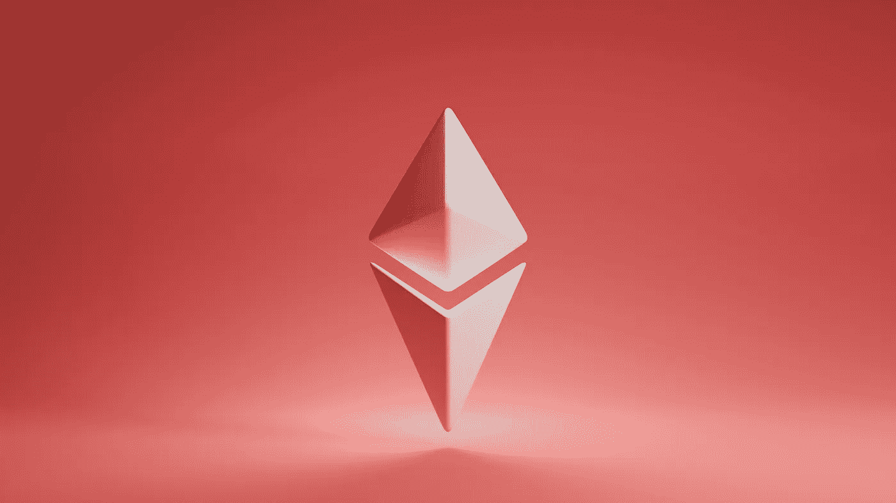

# 2022 年购买以太坊(ETH)的三大理由

> 原文：<https://medium.com/coinmonks/top-3-reasons-for-buying-ethereum-eth-in-2022-2dbba5af279?source=collection_archive---------22----------------------->

Source photo Unsplash.com

与不允许创建智能合约的比特币不同，程序员 Vitalik Buterin 在 2013 年提出了以太坊区块链的概念。一个总部位于区块链的智能合约软件从用户那里获得指令，并根据预先设定的参数执行指令。以太坊的区块链于 2015 年 7 月 30 日推出，此前该团队成功众筹了该项目。