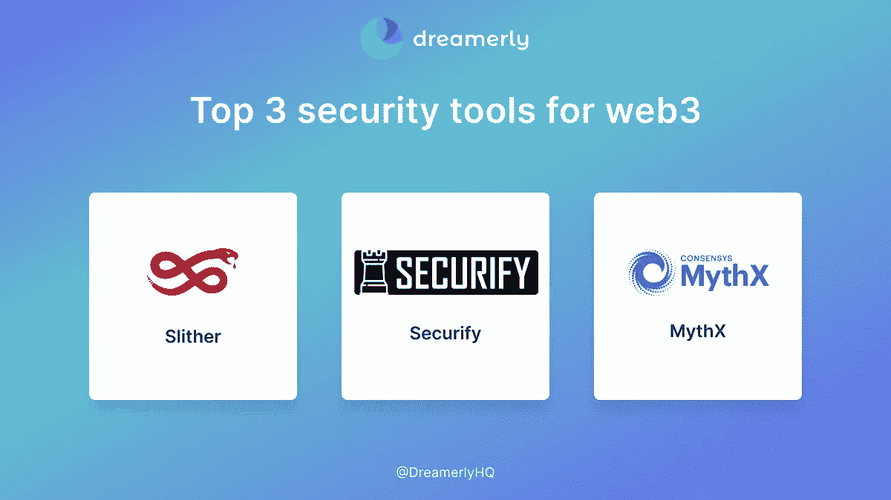
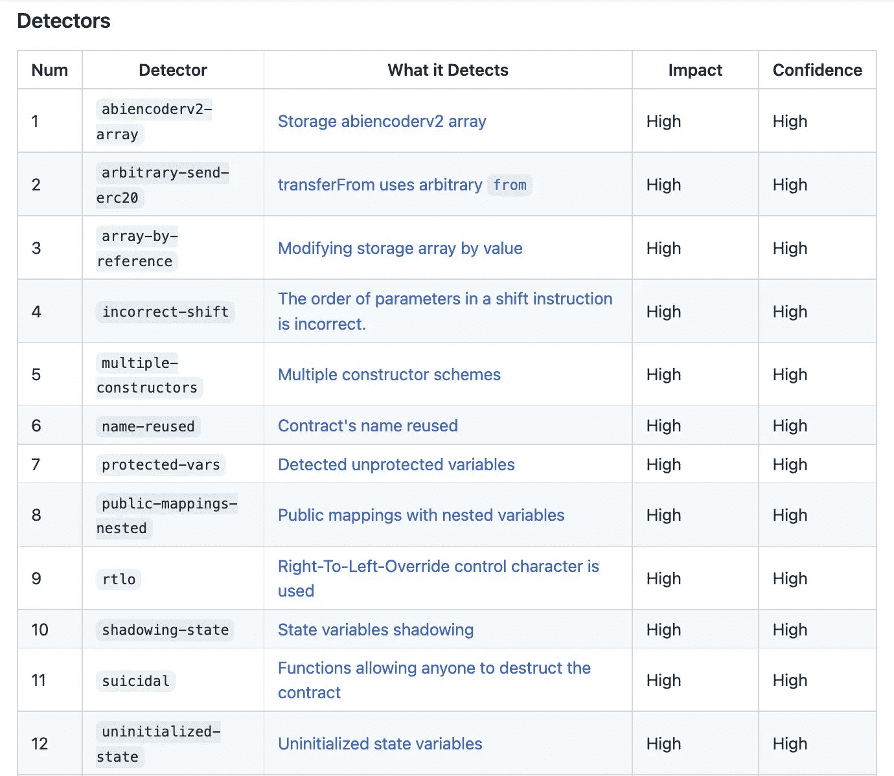
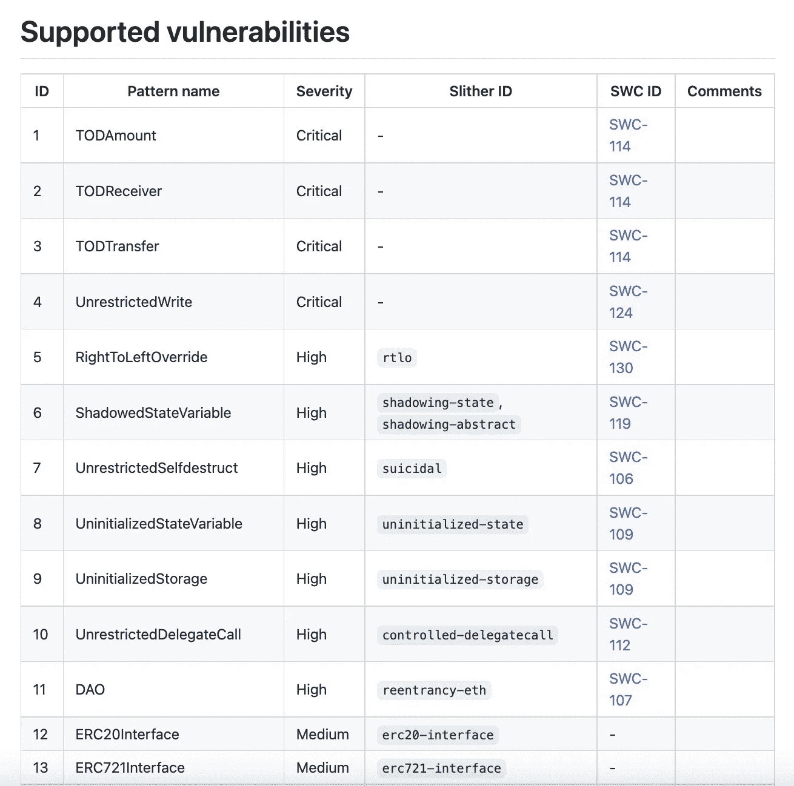
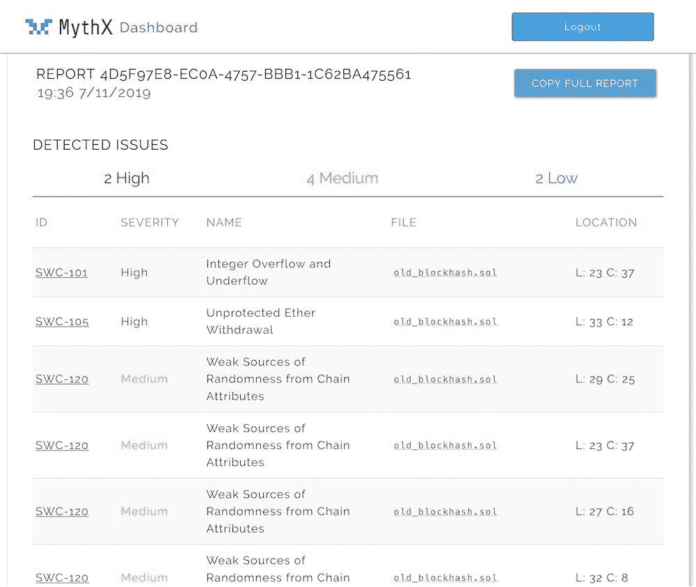

# 2022 年 web3 的三大安全工具

> 原文：<https://medium.com/coinmonks/top-3-security-tools-for-web3-in-2022-cab603b2d9df?source=collection_archive---------27----------------------->

最近有这么多的骗局和黑客，安全和审计在 web3 中变得越来越重要。对于正在寻找安全解决方案的 web3 开发者来说，这里有你需要知道的 3 个最好的工具。

Top 3 security tools for web3

但首先，让我自我介绍一下:

**大家好，我是 Linh，Dreamerly(Twitter:**[**@ DreamerlyHQ**](https://twitter.com/DreamerlyHQ)**)的业务拓展。关注我们的 Twitter，了解关于 crypto 最新故事的有趣见解。**

或者，你可以在我们的 Twitter 上阅读这篇文章:

# 1/ Slither —静态分析的首选工具🐍

Slither 由 Trail of Bits 构建，是一个开源的 Solidity 静态分析框架。

您喜欢 Slither 的原因:
—不到 1 秒钟分析一份合同
—误报率低
—轻松集成到 CI/CD 管道中

# 2/通过链安全来确保安全—特定漏洞的检测器

为什么您会喜欢 Securify:

—支持 37 个漏洞
—实现新颖的上下文相关静态分析
—开源

# 3/ MythX —以太坊智能合约的全方位安全服务

为什么你会喜欢 MythX:

—整个开发周期的深入分析

—世界级集成合作伙伴:Truffle、Remix、Embark 和 Visual Studio

再见重入、溢出和竞争条件！

**在推特上关注我们**[**@ DreamerlyHQ**](https://twitter.com/DreamerlyHQ)**了解更多！**

> 交易新手？试试[加密交易机器人](/coinmonks/crypto-trading-bot-c2ffce8acb2a)或[复制交易](/coinmonks/top-10-crypto-copy-trading-platforms-for-beginners-d0c37c7d698c)