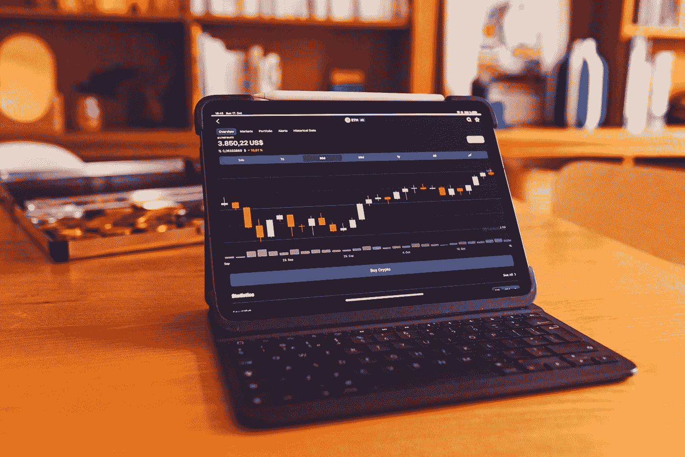

# 今天，7 月 27 日，我买的前三只股票

> 原文：<https://medium.com/coinmonks/top-3-stocks-that-i-bought-today-27th-of-july-364dc423eee8?source=collection_archive---------52----------------------->

Source photo Unsplash.com

# 英特尔公司(INTC)

作为世界顶级芯片制造商之一，英特尔公司(纳斯达克股票代码:INTC)以其卓越的计算机芯片设计而闻名。63.5%的 CPU 市场被这家公司的产品控制。

与同行 17.7 倍的平均水平相比，该公司目前的预期市盈率为 11.6 倍。对…有利的回报