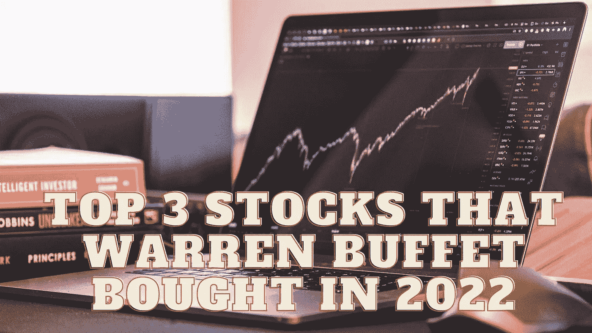

# 沃伦·巴菲特 2022 年买入的前三只股票

> 原文：<https://medium.com/coinmonks/top-3-stocks-that-warren-buffet-bought-in-2022-f7c3632c424a?source=collection_archive---------28----------------------->

Source photo Unsplash.com

# 苹果公司(AAPL)

尽管其 2.7 万亿美元的市值令人印象深刻，但这并不是苹果(纳斯达克代码:AAPL)成为沃伦巴菲特最大投资的唯一原因。它占伯克希尔在美国上市公司总投资的 40.8%。

巴菲特上个季度继续增持伯克希尔哈撒韦公司的 AAPL 股票，额外购买了…