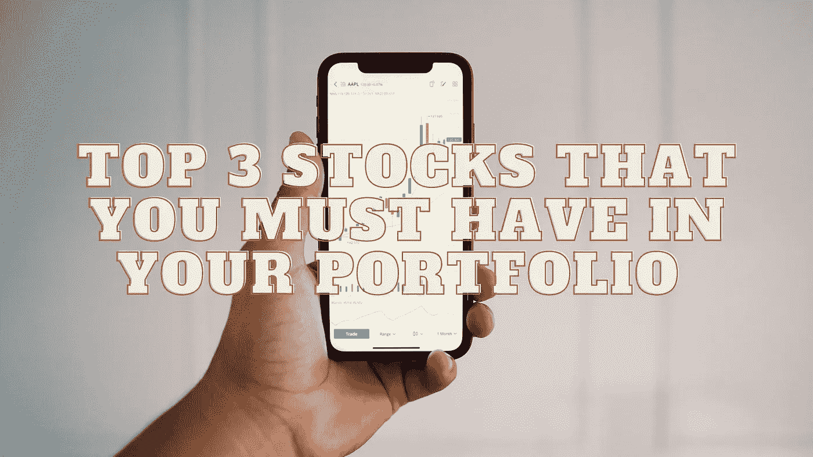

# 你投资组合中必须持有的前三只股票

> 原文：<https://medium.com/coinmonks/top-3-stocks-that-you-must-have-in-your-portfolio-18e1fd1a8fe9?source=collection_archive---------29----------------------->

Source photo Unsplash.com

# 百事可乐

百事可乐(NASDAQ:PEP)仍然是我在 6 月份写的两大可乐公司的优先股。在汽水中，可口可乐可能是最知名的。沃伦·巴菲特对该公司的长期投资可能是一个额外的好处。然而，对于那些还没有持有 PEP 股票的人来说，PEP 股票仍然是更好的选择。