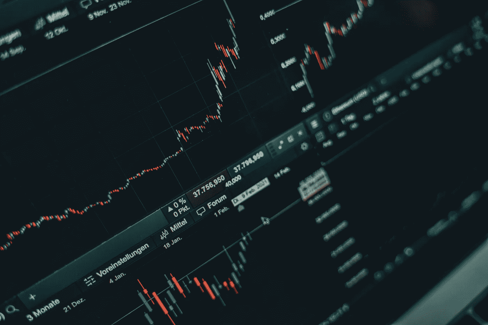

# 现在应该买入的前三只股票

> 原文：<https://medium.com/coinmonks/top-3-stocks-to-buy-right-now-eab3a611c2a4?source=collection_archive---------34----------------------->

Source photo [Multiple Graphs on a Laptop Screen · Free Stock Photo (pexels.com)](https://www.pexels.com/photo/multiple-graphs-on-a-laptop-screen-6770610/)

# 洛克希德·马丁公司

我对洛克希德·马丁(纽约证券交易所代码:LMT)股票的支持是众所周知的，我认为这是目前市场上最伟大的大盘股之一。

著名的航空航天和国防公司洛克希德公司生产从黑鹰直升机到 F-16、F-22 和 F-35 战斗机以及爱国者导弹防御系统的所有产品。