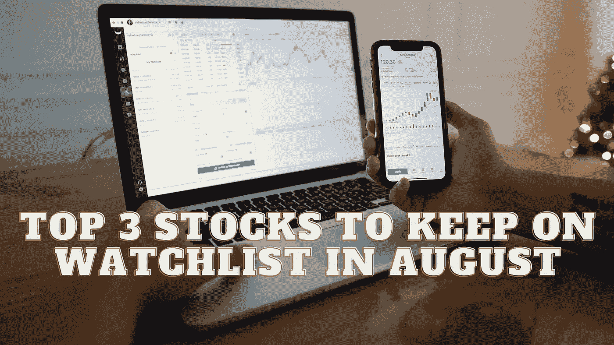

# 8 月份观察名单上的前三只股票

> 原文：<https://medium.com/coinmonks/top-3-stocks-to-keep-on-watchlist-in-august-e3c5c8c32cd2?source=collection_archive---------47----------------------->

Source photo Unsplash.com

# 百事可乐公司

百事公司(NASDAQ:PEP)的零食和饮料品牌继续与消费者保持良好的联系，正如今年的强劲业绩所示。

有机收入增长 13%，营业利润增长 10%，为该公司又一个令人印象深刻的季度画上了圆满的句号。面对不断上升的通货膨胀率，百事公司表现得非常好…