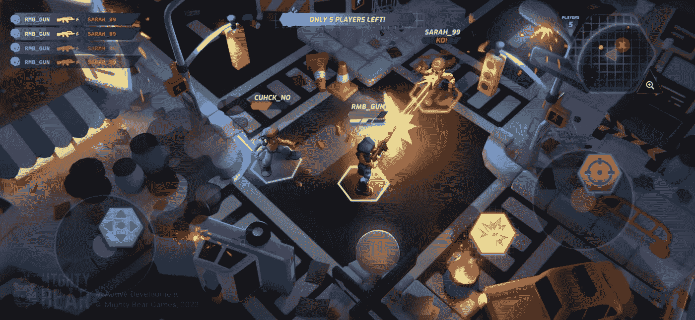
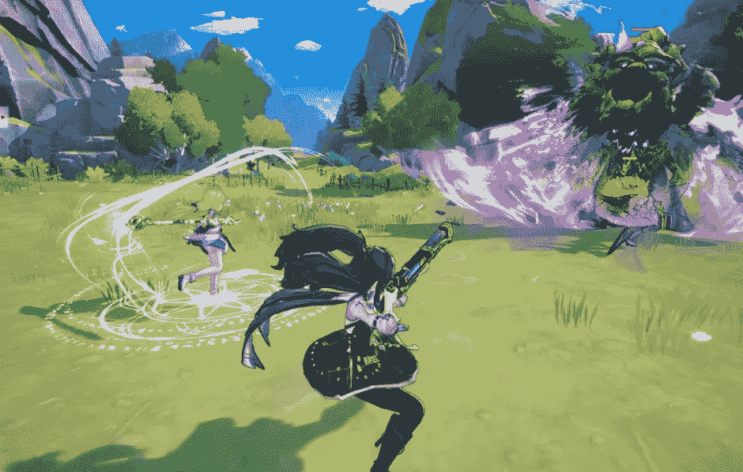
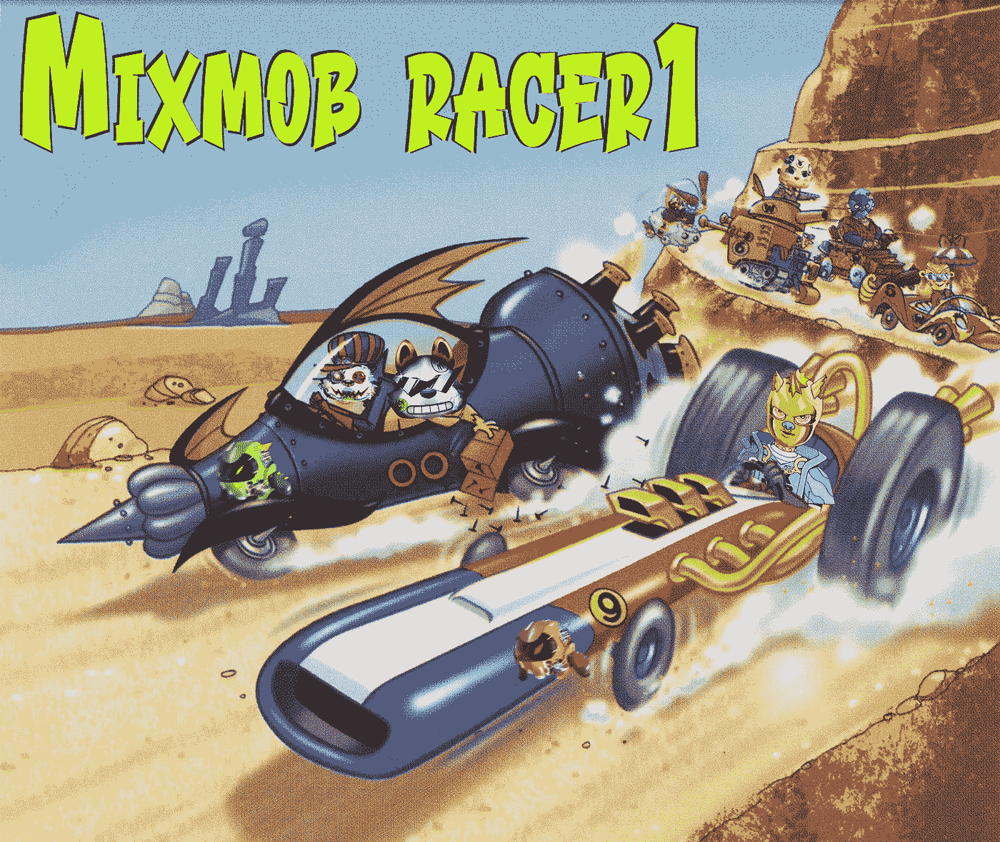

# 2023 年最有前途的三款 web3 游戏

> 原文：<https://medium.com/coinmonks/top-3-up-and-coming-web3-games-in-2023-418e0939ece7?source=collection_archive---------19----------------------->

现在不是玩 web3 游戏的最佳时机，但在接下来的 12 个月里，一些超级有趣和吸引人的游戏很有可能会问世，给市场带来惊喜。以下是我们下注的 3 场 NFT 比赛，以及我们看好它们的原因。让我们一起探索吧！

Top 3 up-and-coming web3 games in 2023

但首先，让我自我介绍一下:

**大家好，我是 Linh，Dreamerly(Twitter:**[**@ DreamerlyHQ**](https://twitter.com/DreamerlyHQ)**)的业务拓展。关注我们的 Twitter，了解关于 crypto 最新故事的有趣见解。**

或者，你可以在我们的 Twitter 上阅读这篇文章:

# 1/强大的动作英雄

[强大的动作英雄](https://twitter.com/PlayMightyHero)是一个实时多人第三人称 web 3 royale 战斗，强调乐趣、技能和混乱。

它由新加坡领先的游戏工作室 Mighty Bear Games 开发。游戏在多边形上运行。

为什么英雄无敌:

—由经验丰富的团队打造，他们知道如何制作有趣的游戏，来自 King、育碧和迪士尼
—免费游戏选项
—高质量图形
—80 年代动作英雄主题&90 年代
—与顶级公会和 DAO 合作:PathDAO、IndiGG 和 Yield Guild

Mighty Action Heroes preview

# 2/斯特拉幻想

[Stella Fantasy](https://twitter.com/rStellaFantasy) 是一款全新的动漫 RPG 嘎查游戏。用户可以征服深渊裂缝，狩猎，收集，工艺，并在一个充满美丽的 waifus 动画启发的世界战斗。

为什么我们喜欢 Stella Fantasy:

—令人惊叹的角色设计和流畅的动画。它太棒了，一开始我们不相信这是一个 web3。
—PC 和移动端跨平台兼容(移动端稍后发布)
—大牌回归:Animoca 品牌、Avocado DAO、GuildFi

# 3/ MixMob

如果你喜欢激动人心的多人游戏体验，你不能错过 MixMob。

这是一款由 Solana 开发的 P2E 元宇宙游戏，包括卡牌赛车战斗游戏(Racer 1)到完整的 MMO 以及更远的地方。

赛车 1 阿尔法 V2 刚刚关闭，但请继续关注更多的比赛！

为什么我们看好 MixMob:

——由来自《光环》、《国际足联》和《战地》
的经验丰富的游戏老手打造——独特的游戏和流畅的比赛体验
——由顶级加密投资者&公会支持，包括迪法恩斯&索拉纳风险投资公司。

在这个过度饱和的市场中完全是一颗宝石！

**关注我们**[**@ DreamerlyHQ**](https://twitter.com/DreamerlyHQ)**上推特了解更多！**

> 交易新手？试试[加密交易机器人](/coinmonks/crypto-trading-bot-c2ffce8acb2a)或者[复制交易](/coinmonks/top-10-crypto-copy-trading-platforms-for-beginners-d0c37c7d698c)