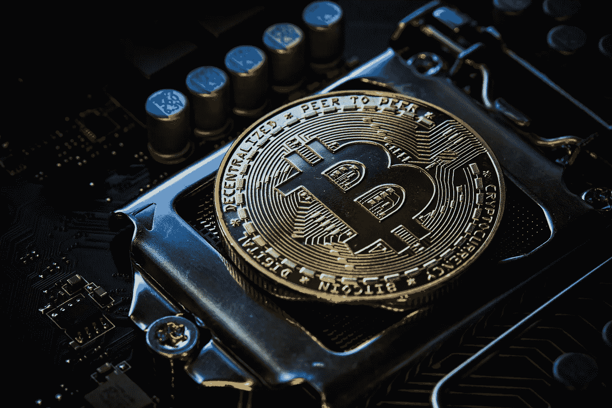

# 可能影响比特币价格的三大变量

> 原文：<https://medium.com/coinmonks/top-3-variables-which-may-influence-the-price-of-bitcoin-e33e0f59618e?source=collection_archive---------25----------------------->

Source photo Unsplash.com

## 1.规章制度

萨尔瓦多等国家承认加密货币为合法现金，而中国则完全禁止加密交易。如果对某个政府的反加密货币行动感到担忧，BTC 的价格可能会下跌。此外，监管的不确定性会引起投资者的恐惧，导致比特币的价值甚至下跌…