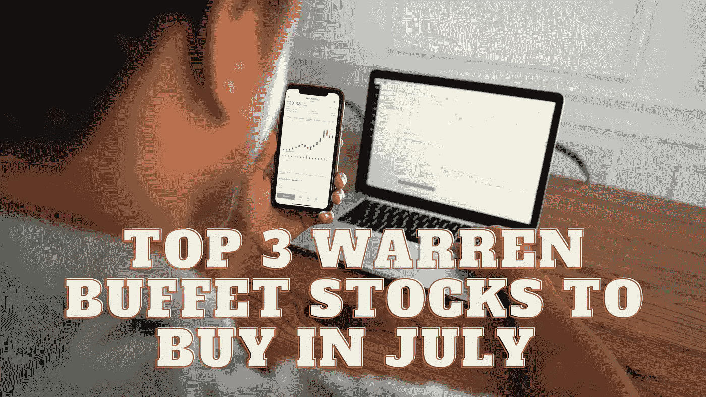

# 7 月份买入的三大沃伦巴菲特股票

> 原文：<https://medium.com/coinmonks/top-3-warren-buffet-stocks-to-buy-in-july-770427e6aa88?source=collection_archive---------19----------------------->

Source photo Unsplash.com

# 美国银行

美国最大的金融公司之一，美国银行(纽约证券交易所代码:BAC)占沃伦·巴菲特投资组合的 13.6%。就资产而言，它是仅次于摩根大通(纽约证券交易所代码:JPM)的第二大银行。

7 月 18 日公布了今年第二季度的业绩。按年计算，收入…