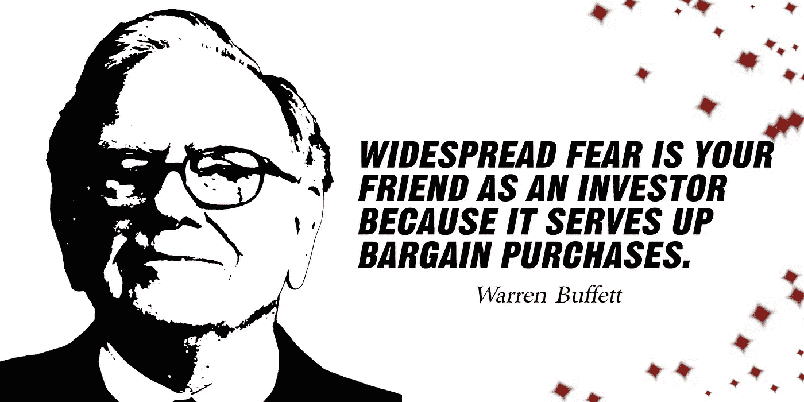

# 我将在 2022 年底前买入的前三只沃伦·巴菲特股票

> 原文：<https://medium.com/coinmonks/top-3-warren-buffett-stocks-that-i-will-buy-till-the-end-of-2022-9ea880b22236?source=collection_archive---------29----------------------->

Source photo [Warren Buffett Bogat Bani — Imagine gratuită pe Pixabay](https://pixabay.com/ro/illustrations/warren-buffett-bogat-bani-miliardar-5000311/)

# 可口可乐公司

沃伦巴菲特的顶级股票之一是可口可乐(纽约证券交易所代码:KO)，这是伯克希尔股票组合中上市时间最长的公司。

1987 年股灾后，巴菲特于 1988 年开始投资股票。当时，他说:“当我们拥有好的股票时…